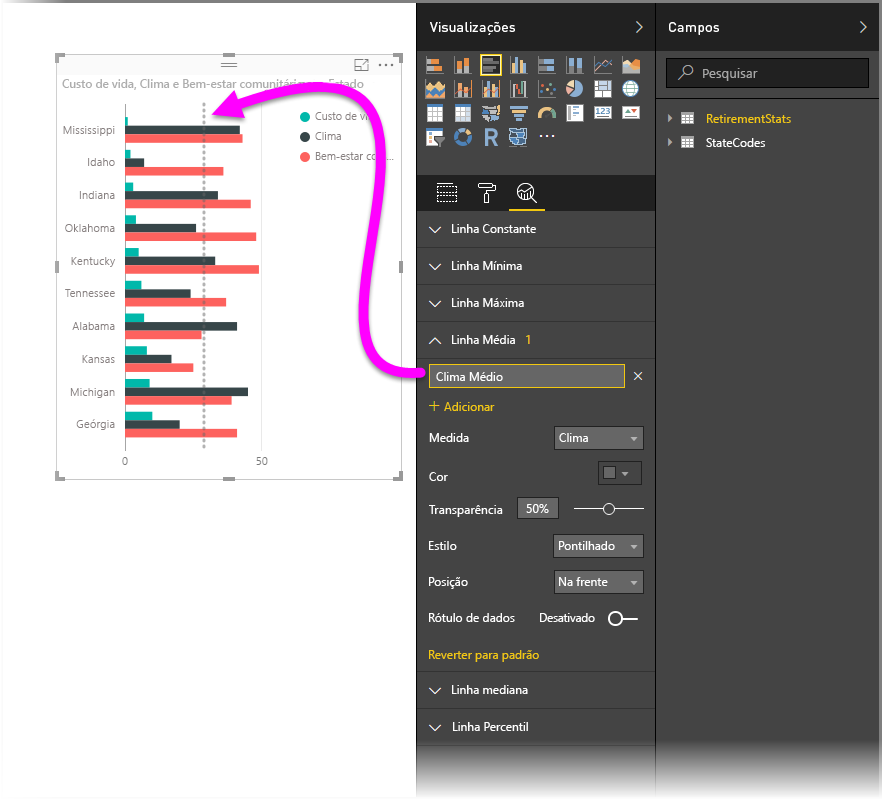
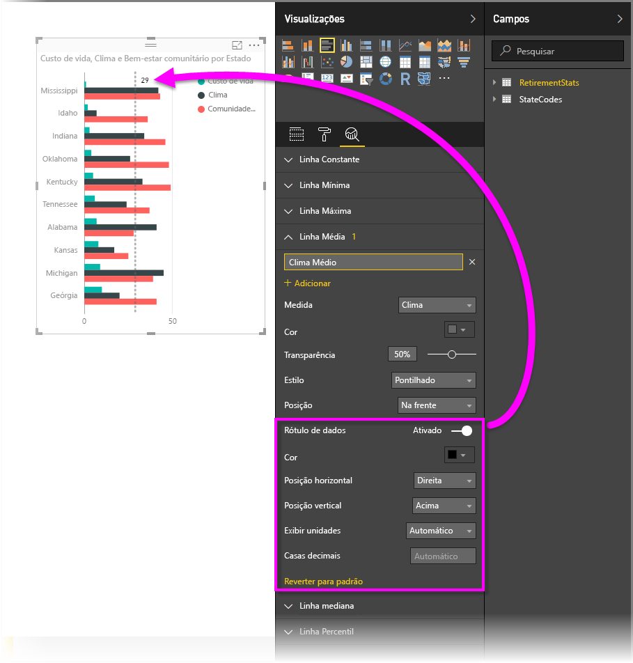
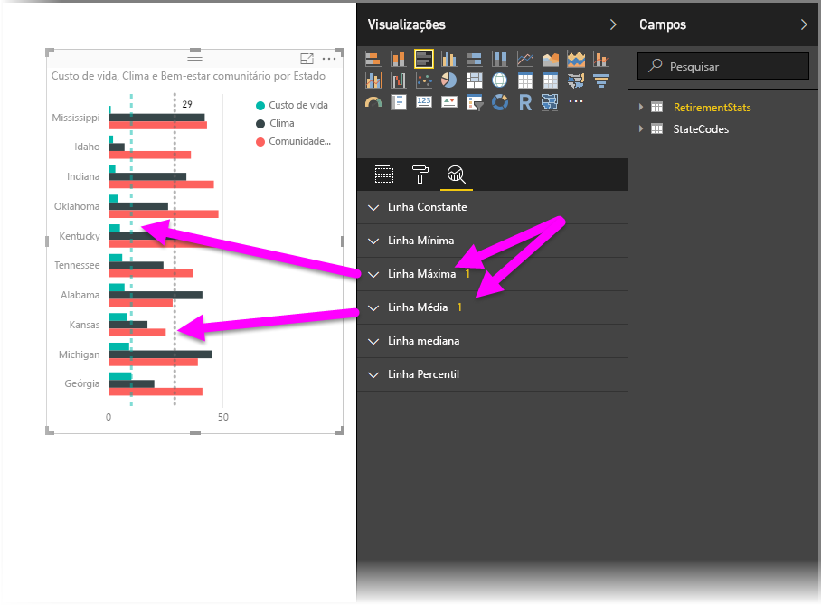
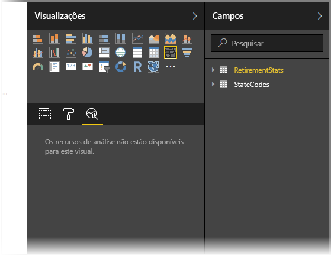
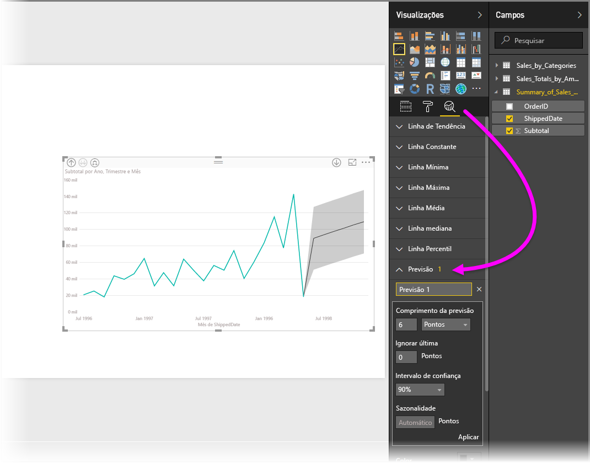

# Usando o painel Análise no Power BI Desktop
Com o painel **Análise** no **Power BI Desktop**, você pode adicionar *linhas de referência* dinâmica para visuais e destacar tendências ou ideias importantes. O painel **Análise** é localizado na área **Visualizações** do Power BI Desktop.

> [!NOTE]
> O painel **Análise** só aparece quando você seleciona um visual na tela do Power BI Desktop.

## Pesquisar no painel de análise
A partir da versão de fevereiro de 2018 do **Power BI Desktop** (versão 2.55.5010.201 ou posterior), você poderá pesquisar dentro do painel **Análise**, que é uma subseção do painel **Visualizações**. Conforme mostrado na imagem abaixo, a caixa de pesquisa aparece quando o painel **Análise** está selecionado.

## Usando o painel Análise
Com o painel **Análise**, você pode criar os seguintes tipos de linhas de referência dinâmica (nem todas as linhas estão disponíveis para todos os tipos de visual):

* Linha constante do eixo X
* Linha constante do eixo Y
* Linha mínima
* Linha máxima
* Linha média
* Linha mediana
* Linha percentil

As seções a seguir mostram como você pode usar o painel **Análise** e as linhas de referência dinâmica em suas visualizações.

Para exibir as linhas de referência dinâmica disponíveis para um visual, siga estas etapas:

1. Escolha ou crie um visual e, então, selecione o ícone **Análise** na seção **Visualizações**.
   
   
2. Selecione a seta para baixo para o tipo de linha que você deseja criar para expandir suas opções. Nesse caso, selecionaremos a **Linha Média**.
   
   
3. Para criar uma nova linha, selecione **+ Adicionar**. Em seguida, você pode especificar um nome para a linha clicando duas vezes na caixa de texto e, em seguida, digitando seu nome.
   
   Você tem todos os tipos de opções para a linha, como selecionar a *cor*, *transparência*, *estilo* e *posição* (relativa aos elementos de dados do visual), e se deseja incluir o rótulo. E, principalmente, você pode selecionar em qual **Medida** no visual você deseja que sua linha seja baseada ao selecionar a lista suspensa **Medida**, que é preenchida automaticamente com os elementos de dados do visual. Nesse caso, selecionaremos *Clima* como a medida, colocaremos *Clima Médio* como o rótulo e personalizaremos algumas das outras opções, conforme mostrado abaixo.
   
   
4. Se você deseja que um rótulo de dados seja exibido, mova o controle deslizante **Rótulo de dados**. Ao fazer isso, você obterá uma vasta gama de opções adicionais para o rótulo de dados, conforme mostrado na imagem a seguir.
   
   
5. Observe o número que aparece ao lado do item **Linha média** no painel **Análise**. Que indica quantas linhas dinâmicas você tem atualmente no visual e qual o tipo delas. Se adicionarmos uma **Linha máxima** no *Custo de Vida*, você poderá ver que o painel **Análise** mostrará que agora também temos uma linha de referência dinâmica da **Linha máxima** aplicada neste visual.
   
   

Se o visual que você selecionou não puder ter linhas de referência dinâmica aplicadas a ele (neste caso, um visual de **Mapa**), você verá o seguinte quando selecionar o painel **Análise**.

Há muitas ideias interessantes que você pode destacar ao criar linhas de referência dinâmica com o painel **Análise**.

Estamos planejando mais recursos e funcionalidades, incluindo a expansão dos elementos visuais que podem ter linhas de referência dinâmica aplicadas a eles. Portanto, verifique frequentemente para saber o que há de novo.

## Aplicar a Previsão
Você pode usar o recurso **Previsão** ao selecionar um elemento visual e ao expandir a seção **Previsão** no painel **Análise**. Você pode especificar várias entradas para modificar a previsão, como o *Tamanho da previsão*, o *Intervalo de confiança* etc. A imagem a seguir mostra um elemento visual de linha básica com a previsão aplicada, mas você pode usar sua imaginação (e brincar com o recurso *previsão*) para ver como ele pode ser aplicado aos seus modelos.

## Limitações
A capacidade de usar linhas de referência dinâmica baseia-se no tipo de visual que está sendo usado. A seguinte lista mostra quais linhas dinâmicas estão atualmente disponíveis para os visuais:

Uso total de linhas dinâmicas estão disponíveis nos seguintes elementos visuais:

* Gráfico da área
* Gráfico de linhas
* Gráfico de dispersão
* Gráfico de colunas agrupadas
* Gráfico de barras agrupadas

Os elementos visuais a seguir só podem usar uma *linha constante* do painel **Análise**:

* Área empilhada
* Barra empilhada
* Coluna empilhada
* Barra 100% empilhada
* Coluna 100% empilhada

Para os seguintes elementos visuais, uma *linha de tendência* atualmente é a única opção:

* Linha não empilhada
* Gráfico de colunas agrupadas

Por fim, elementos visuais não cartesianos atualmente não podem aplicar linhas dinâmicas do painel **Análise**, como:

* Matriz
* Gráfico de pizza
* Donut
* Table

## Próximas etapas
Há inúmeras coisas que você pode fazer com o Power BI Desktop. Para obter mais informações sobre seus recursos, consulte as seguintes fontes:

* [Novidades no Power BI Desktop](desktop-latest-update.md)
* [Baixe o Power BI Desktop](desktop-get-the-desktop.md)
* [Introdução ao Power BI Desktop](desktop-getting-started.md)
* [Visão geral de Consulta com o Power BI Desktop](desktop-query-overview.md)
* [Tipos de dados no Power BI Desktop](desktop-data-types.md)
* [Formatar e combinar dados com o Power BI Desktop](desktop-shape-and-combine-data.md)
* [Tarefas comuns de consulta no Power BI Desktop](desktop-common-query-tasks.md)    

