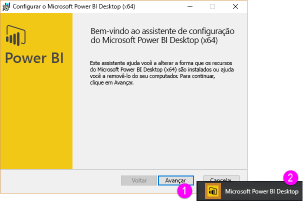
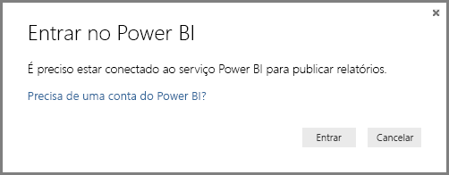

# Introdução ao Power BI Desktop
Bem-vindo ao **Guia de Introdução ao Power BI Desktop**. Esse breve tour do Power BI Desktop apresentará como ele funciona, demonstrará o que ele pode fazer e acelerará sua capacidade de criar modelos de dados robustos – juntamente com relatórios incríveis – que potencializam seus esforços de business intelligence. 

Preferir assistir em vez de ler? Fique à vontade para [assistir ao nosso vídeo de introdução](desktop-videos.md). Se desejar acompanhar o vídeo com dados de exemplo correspondentes, [baixe esta pasta de trabalho de exemplo do Excel](http://go.microsoft.com/fwlink/?LinkID=521962).

O Power BI Desktop permite criar uma coleção de consultas, conexões de dados e relatórios que podem ser facilmente compartilhados com outras pessoas. O Power BI Desktop integra tecnologias comprovadas da Microsoft – o poderoso mecanismo de Consulta, visualizações e modelagem de dados – e funciona perfeitamente com o[**serviço do Power BI**](https://app.powerbi.com/)online.

Com a combinação do **Power BI Desktop** (no qual analistas e outros podem criar conexões de dados, modelos e relatórios poderosos) e do[**serviço do Power BI**](https://preview.powerbi.com/)(no qual os relatórios do Power BI Desktop podem ser compartilhados para que os usuários possam exibi-los e interagir com eles), novas informações do mundo dos dados são mais fáceis de modelar, criar, compartilhar e estender.

Os analistas de dados descobrirão no Power BI Desktop uma ferramenta poderosa, flexível e altamente acessível para se conectar com o mundo dos dados e formatá-los, criar modelos robustos e elaborar relatórios bem-estruturados.

## Como usar este guia
Você pode usar este guia de duas maneiras – examiná-lo para obter uma visão geral rápida ou ler cada seção, para ter uma compreensão sólida que como o Power BI Desktop funciona.

Se estiver com pressa, você pode dar uma olhada rápida neste guia em poucos minutos e obter uma boa noção de como o Power BI Desktop funciona e de como usá-lo. A maior parte deste guia consiste em telas que mostram visualmente como o Power BI Desktop funciona.

Para obter uma compreensão mais detalhada, você pode ler cada seção, realizar as etapas e sair com seu próprio arquivo do Power BI Desktop pronto para publicá-lo no serviço do **Power BI** e compartilhá-lo com outras pessoas.

>[!NOTE]
>Também há uma versão especializada e separada do **Power BI** chamada [**Servidor de Relatórios do Power BI**](report-server/get-started.md), para clientes que precisam manter os seus dados e relatórios localmente. Para uso com essa versão especializada, também há uma versão especializada e separada do **Power BI Desktop** chamada **Power BI Desktop para o Servidor de Relatórios do Power BI**, que funciona somente com a versão do Servidor de Relatórios do Power BI. Este artigo descreve o padrão **Power BI Desktop**.

## Como o Power BI Desktop funciona
Com o Power BI Desktop, você *se conecta a dados* (geralmente várias fontes de dados), *formata esses dados* (com consultas que criam modelos de dados atraentes e criteriosos) e usa esse modelo para *criar relatórios* (que outras pessoas podem aproveitar, utilizar e compartilhar).

Quando concluir satisfatoriamente as etapas (conectar, formatar e relatar), você pode salvar esse trabalho no formato de arquivo do Power BI Desktop, que tem a extensão .pbix. Os arquivos do Power BI Desktop podem ser compartilhados como qualquer outro arquivo, mas a maneira mais atraente de compartilhar arquivos do Power BI Desktop é carregá-los (compartilhá-los) no [**serviço do Power BI**](https://preview.powerbi.com/). 

O Power BI Desktop centraliza, simplifica e agiliza o que seria um processo árduo, disperso e desconexo de design e criação de relatórios e repositórios de business intelligence.

Pronto para experimentar? Vamos começar.

## Instalar e executar o Power BI Desktop
É possível baixar o Power BI Desktop no serviço do **Power BI** , selecionando primeiro o ícone de **engrenagem** e depois **Power BI Desktop**.

O Power BI Desktop é instalado como um aplicativo e executado na sua área de trabalho.

Ao executar o Power BI Desktop, uma tela de *Boas-vindas* é exibida.

Você pode **Obter Dados**, ver as **Fontes Recentes**ou **Abrir Outros** **Relatórios** diretamente na tela de *Boas-vindas* (dos links no painel esquerdo). Se você fechar a tela (selecione o **x** no canto superior direito), a exibição de **Relatório** do Power BI Desktop será exibida.

Há três exibições no Power BI Desktop: **Relatório** , **Dados** e **Relações** . O Power BI Desktop também inclui o **Editor de Consultas**, que é aberto em uma janela separada. No **Editor de Consultas**, é possível criar consultas e transformar dados e, em seguida, carregar esse modelo de dados refinado no Power BI Desktop, além de criar relatórios.

A tela a seguir mostra os três ícones de exibições à esquerda do Power BI Desktop: **Relatório**, **Dados**e **Relações**, de cima para baixo. A exibição atualmente exibida é indicada pela barra amarela à esquerda. Nesse caso, a exibição **Relatório** é atualmente exibida. Você pode alterar as exibições clicando em qualquer um desses três ícones.

Com o Power BI Desktop instalado, você está pronto para se conectar a dados, formatá-los e criar relatórios (geralmente nessa ordem). Nas próximas seções, faremos um tour por cada uma dessas etapas individualmente.

## Conectar-se a dados
Com o Power BI Desktop instalado, você está pronto para se conectar ao mundo dos dados, que está em constante expansão. Há *todos os tipos* de fontes de dados disponíveis na janela Consulta. A imagem a seguir mostra como conectar-se a dados selecionando a faixa de opções **Página Inicial** e, em seguida, **Obter Dados \> Mais**.

 

Para este tour rápido, nós nos conectaremos a duas fontes de dados da **Web** diferentes.

Imagine que você está se aposentando – você deseja morar onde há muito sol, uma quantia interessante de impostos e uma boa assistência médica – ou talvez você seja um analista de dados e deseje essas informações para ajudar seus clientes. Por exemplo, talvez você queira ajudar um varejista de óculos de sol a direcionar suas vendas onde o sol brilha com mais frequência.

De qualquer modo, o recurso da Web a seguir tem dados interessantes sobre esses tópicos e muito mais:

[*http://www.bankrate.com/finance/retirement/best-places-retire-how-state-ranks.aspx*](http://www.bankrate.com/finance/retirement/best-places-retire-how-state-ranks.aspx)

Selecione **Obter Dados \> Web** e cole o endereço.

 

Ao selecionar **OK**, a funcionalidade **Consulta** do Power BI Desktop começa a trabalhar. A Consulta entra em contato com o recurso da Web e a janela **Navegador** retorna o que encontrou nessa página da Web. Nesse caso, ela encontrou uma tabela (*Tabela 0*) e o Documento da Web geral. Estamos interessados na tabela, então vamos selecioná-la na lista. A janela **Navegador** exibe uma visualização.

 

Neste ponto, podemos editar a consulta antes de carregar a tabela selecionando **Editar** na parte inferior da janela, ou podemos carregar a tabela.

Ao selecionarmos **Editar**, o Editor de Consultas é iniciado e uma exibição representativa da tabela é exibida. O painel **Configurações de Consulta** é exibido (se não for, é possível selecionar **Exibição** na faixa de opções e, em seguida, **Exibir \> Configurações de Consulta** para exibir o painel **Configurações de Consulta**). Eis aqui a aparência que isso tem.

 

Para obter mais informações sobre como se conectar a dados, veja [Conectar-se a dados no Power BI Desktop](desktop-connect-to-data.md).

Na próxima seção, vamos ajustar os dados para que eles atendam às nossas necessidades. O processo de ajustar dados aos quais se está conectado é chamado de *formatação* de dados.

## Formatar e combinar dados
Agora que nos conectamos a uma fonte de dados, é necessário ajustar os dados para que atendam às nossas necessidades. Às vezes, o ajuste dos dados significa a *transformação* destes – como renomear colunas ou tabelas, converter texto em números, remover linhas, definir a primeira linha como títulos e assim por diante.

O Editor de Consultas no Power BI Desktop faz uso abundante de menus de atalho, além de disponibilizar tarefas na faixa de opções. A maioria das opções que você pode selecionar na faixa de opções **Transformar** também está disponível com um clique do botão direito do mouse em um item (como uma coluna) e a seleção no menu que é exibido.

## Formatar dados
Ao formatar dados no **Editor de Consultas**, você fornece instruções passo a passo (que o **Editor de Consultas** executa para você) para ajustar os dados conforme são carregados e apresentados pelo **Editor de Consultas** . A fonte de dados original não é afetada; apenas esta exibição específica dos dados é ajustada, ou *formatada*.

As etapas especificadas (como renomear uma tabela, transformar um tipo de dados ou excluir colunas) são registradas pelo **Editor de Consultas**. Sempre que essa consulta se conectar à fonte de dados, essas etapas serão executadas para que os dados sejam sempre formatados da maneira especificada. Esse processo ocorre sempre que você usa a consulta no Power BI Desktop, ou para qualquer pessoa que usa sua consulta compartilhada, como no serviço do **Power BI**. Essas etapas são capturadas sequencialmente no painel **Configurações de Consulta**, em **Etapas Aplicadas**.

A imagem a seguir mostra o painel **Configurações de Consulta** para uma consulta que foi formatada – abordaremos cada uma dessas etapas nos próximos parágrafos.

 

Vamos voltar ao nossos dados de aposentadoria, que encontramos nos conectando a uma fonte de dados da Web e formatando esses dados para se adequarem às nossas necessidades.

Para os iniciantes, a maioria das classificações foi colocada no **Editor de Consultas** como números inteiros, mas nem todos eles (uma coluna continha texto e números, então ela não foi convertida automaticamente). É necessário que os dados sejam números. Sem problemas – basta clicar com o botão direito do mouse no título da coluna e selecionar **Alterar Tipo \> Número Inteiro** para alterar o tipo de dados. Se precisássemos escolher mais de uma coluna, poderíamos primeiro selecionar uma coluna, manter pressionada a tecla **SHIFT**, selecionar colunas adjacentes adicionais e clicar com o botão direito do mouse em um título de coluna para alterar todas as colunas selecionadas. Você também pode usar **CTRL** para selecionar colunas não adjacentes.

 

Você também pode alterar, ou *transformar* , essas colunas de texto em título usando a faixa de opções **Transformar** . Esta é a faixa de opções **Transformar** , com uma seta apontando para o botão **Tipo de Dados** , que permite transformar o tipo de dados atual em outro.

 

Observe que em **Configurações de Consulta**, as **Etapas Aplicadas** refletem as alterações feitas. Se eu desejar remover qualquer etapa do processo de formatação, basta eu selecionar essa etapa e depois o **X** à esquerda dela.

 

Precisamos fazer mais algumas alterações para obtermos a consulta onde desejamos:

* *Remover a primeira coluna* – ela não é necessária e inclui apenas linhas redundantes que indicam “Verifique qual a classificação do seu estado em relação à aposentadoria”, o que é um artefato por esta ser uma tabela baseada na Web

<!-- -->

* *Corrigir alguns erros* – na página da Web, uma coluna tinha texto misturado com os números (alguns estados empatados em uma categoria). Isso funciona bem no site, mas não para nossa análise de dados. Isso é fácil (neste caso) de corrigir e mostra alguns recursos e capacidades interessantes do **Editor de Consultas** e suas **Etapas Aplicadas**

<!-- -->

* *Alterar o Nome da Tabela* – **Tabela 0** não é um descritor útil, mas é simples modificá-lo

Cada uma dessas etapas é demonstrada em **[Formatar e combinar dados no Power BI Desktop](desktop-shape-and-combine-data.md)**. Fique à vontade para verificar essa página, ou prossiga neste documento para ver o que você faria em seguida. A próxima seção retoma após a aplicação das alterações acima.

## Combinar dados
Esses dados sobre vários estados são interessantes e serão úteis para a criação de consultas e esforços de análise adicionais. Mas há um problema: a maioria dos dados usam uma abreviação de duas letras para códigos de estado, em vez de utilizar o nome completo do estado. Precisamos de alguma maneira de associar os nomes de estado às suas abreviações.

Estamos com sorte: há outra fonte de dados pública que faz exatamente isso, mas ela também precisa de um tanto considerável de formatação antes que possamos conectá-la à nossa tabela de aposentadoria. Eis o recurso da Web para abreviações de estado:

<http://en.wikipedia.org/wiki/List_of_U.S._state_abbreviations>

Na faixa de opções **Página Inicial** no **Editor de Consultas**, selecionamos **Obter Dados \> Web** e digitamos o endereço, selecionamos **OK**, e a janela **Navegador** mostra o que ela encontrou nessa página da Web.

 

Selecionamos **Tabela[editar]** porque isso inclui os dados que queremos, mas será necessária bastante formatação para que os dados da tabela sejam equivalentes ao que desejamos. Cada uma dessas etapas também é demonstrada em **[Formatar e combinar dados no Power BI Desktop](desktop-shape-and-combine-data.md)**. Para resumir essas etapas, eis aqui o que fazemos:

Selecionamos **Editar**e depois:

* *Remover as duas primeiras linhas* – elas são resultado do modo como a tabela da página da Web foi criada e não precisamos delas.

<!-- -->

* *Remover as últimas 26 linhas* – elas são todas referentes a territórios, que não precisamos incluir.

<!-- -->
* *Filtrar Washington, D.C.* – a tabela de estatísticas de desativação não inclui o D.C.; portanto, o excluiremos de nossa lista.

<!-- -->

* *Remover algumas colunas desnecessárias* – precisamos apenas do mapeamento do estado para a sua abreviação oficial de duas letras para que possamos remover as outras colunas.

<!-- -->

* *Usar a primeira linha como títulos* – já que removemos as três primeiras linhas, a primeira linha atual é a que desejamos para o título.

    >[!NOTE]
    >Esse é um bom momento para destacar que a *sequência* de etapas aplicadas no **Editor de Consultas** é importante e pode afetar o modo de formatação dos dados. Também é importante considerar como uma etapa pode afetar outra etapa subsequente; se você remover uma etapa das **Etapas Aplicadas**, as etapas subsequentes podem não se comportar como pretendido originalmente, devido ao impacto da sequência de etapas da consulta.

* *Renomear as colunas e a própria tabela* – como de costume, há duas maneiras para renomear uma coluna e você pode escolher a que preferir.

Com a tabela *StateCodes* formatada, podemos combinar essas duas tabelas ou consultas em uma; como as tabelas que agora temos são o resultado das consultas que aplicamos aos dados, elas são geralmente designadas como *consultas*.

Há duas maneiras principais de combinar consultas – *mesclando* e *acrescentando*.

Quando você tem uma ou mais colunas que deseja adicionar a outra consulta, você **mescla** as consultas. Quando você tem linhas adicionais de dados que deseja adicionar a uma consulta existente, você **acrescenta** a consulta.

Nesse caso, desejamos mesclar consultas. Para começar, selecionamos a consulta *à qual* desejamos mesclar a outra consulta; em seguida, selecionamos **Mesclar Consultas** na guia **Página Inicial** na faixa de opções.

 

A janela **Mesclar** é exibida, solicitando que você selecione qual tabela gostaria de mesclar à tabela selecionada e, em seguida, as colunas correspondentes a serem usadas para a mesclagem. Selecione *State* na tabela*RetirementStats* (consulta) e selecione a consulta *StateCodes* (fácil nesse caso, já que há somente mais uma consulta – quando você se conectar a várias fontes de dados, existirão muitas consultas entre as quais escolher). Quando selecionamos as colunas correspondentes corretas – *State* de *RetirementStats*, e *State Name* de *StateCodes* – a janela **Mesclar** tem a aparência semelhante à mostrada a seguir e o botão **OK** é habilitado.

 

Uma **NewColumn** é criada no final da consulta, que consiste no conteúdo da tabela (consulta) que foi mesclada com a consulta existente. Todas as colunas da consulta mesclada são condensadas na **NewColumn**, mas você pode optar por **Expandir** a tabela e incluir quaisquer colunas que desejar. Para expandir a tabela mesclada e selecionar quais colunas você deseja incluir, selecione o ícone de expansão (). A janela **Expandir** é exibida.

 

Nesse caso, como só queremos a coluna *State Code* , selecionamos apenas essa coluna e, em seguida, selecionamos **OK**. Desmarcamos a caixa de seleção **Usar nome da coluna original como prefixo** , porque não precisamos nem desejamos essa opção; se deixarmos essa opção selecionada, a coluna mesclada será nomeada *NewColumn.State Code* (o nome da coluna original ou *NewColumn*, seguido de um ponto e do nome da coluna que está sendo introduzida na consulta).

>[!NOTE]
>Quer experimentar como inserir a tabela *NewColumn*? Você pode experimentar um pouco e, se não gostar dos resultados, basta excluir essa etapa da lista **Etapas Aplicadas** no painel **Configurações de Consulta** ; sua consulta retornará ao estado anterior à aplicação dessa etapa **Expandir** . Você pode refazer essas ações livremente, quantas vezes desejar, até que o processo de expansão tenha a aparência desejada.

Agora temos uma única consulta (tabela) que combinou duas fontes de dados, cada uma das quais foi desenvolvida para atender às nossas necessidades. Essa consulta pode servir como base para muitas conexões de dados adicionais interessantes – como estatísticas de custo de moradia, dados demográficos ou oportunidades de trabalho em qualquer estado.

Para obter uma descrição mais completa de cada uma dessas etapas de formatação e combinação de dados, veja [Formatar e combinar dados no Power BI Desktop](desktop-shape-and-combine-data.md).

Por enquanto, temos dados suficientes para criar alguns relatórios interessantes, tudo no Power BI Desktop. Como esse é um marco, vamos salvar esse arquivo do Power BI Desktop – vamos chamá-lo de **Introdução ao Power BI Desktop**. Para aplicar as alterações no **Editor de Consultas** e carregá-las no Power BI Desktop, selecione **Fechar e Aplicar** na faixa de opções **Página Inicial**.

## Criar relatórios
Outras alterações podem ser feitas depois que a tabela for carregada, e você pode recarregar um modelo para aplicar as alterações feitas. Mas, por enquanto, isso será suficiente. Na exibição de **Relatório** do Power BI Desktop, você pode começar a criar relatórios.

A exibição **Relatório** tem quatro áreas principais:

1. A faixa de opções, que exibe tarefas comuns associadas a relatórios e visualizações
2. A exibição, ou tela, de **Relatório** , em que as visualizações são criadas e organizadas
3. A área da guia **Páginas** na parte inferior, que permite selecionar ou adicionar uma página de relatório
4. O painel **Visualizações** , em que é possível alterar visualizações, personalizar cores ou eixos, aplicar filtros, arrastar campos e muito mais
5. O painel **Campos** , em que os elementos e filtros de consulta podem ser arrastados até a exibição de **Relatório** ou até a área **Filtros** do painel **Visualizações**
   
   

Os painéis **Visualizações** e **Campos** podem ser ocultados selecionando a pequena seta ao longo da borda, oferecendo mais espaço na exibição de **Relatório** para a criação de visualizações interessantes. Ao modificar visualizações, você também verá essas setas apontando para cima ou para baixo, o que significa que você pode expandir ou recolher essa seção de acordo.

 

Para criar uma visualização, basta arrastar um campo da lista **Campos** até a exibição de **Relatório** . Neste caso, vamos arrastar o campo *State* de *RetirementStats* e ver o que acontece.

 

Veja só... O Power BI Desktop criou automaticamente uma visualização baseada em mapa, porque ele reconheceu que o campo *Estado* continha dados de localização geográfica.

Observe que no painel **Visualizações** , posso selecionar diferentes tipos de visualizações, e na área abaixo desses ícones, posso arrastar campos para diferentes áreas para aplicar uma Legenda ou modificar a visualização.

 

Vamos avançar um pouco e ver qual é a aparência da exibição de **Relatório** depois que uma série de visualizações foram adicionadas, além de algumas novas páginas de Relatório. Para obter mais informações sobre relatórios, veja [Exibição de Relatório no Power BI Desktop](desktop-report-view.md).

A primeira página do Relatório fornece uma perspectiva dos dados com base na *Classificação geral*. Quando selecionamos uma das visualizações, o painel **Campos e Filtros** mostra quais campos são selecionados e a estrutura da visualização (quais campos são aplicados ao **Eixo Compartilhado**, **Valores de Coluna**e **Valores de Linha**).

 

Há seis **Páginas** neste Relatório, cada uma visualizando determinados elementos de nossos dados.

1. A primeira página, exibida acima, mostra todos os estados com base na *Classificação geral*.
2. A segunda página enfoca os dez primeiros estados com base na *Classificação geral*.
3. Na terceira página, são visualizados os dez melhores estados em termos de custo de vida (e dados associados).
4. Meteorologia é o foco da quarta página, filtrada para apresentar os 15 estados mais ensolarados.
5. Na quinta página, o Bem-estar comunitário é exibido em um gráfico e visualizado para os 15 estados mais bem classificados nessa categoria.
6. Por último, as estatísticas de crime são visualizadas, mostrando os melhores (e também os piores) dez estados nessa categoria.

A página de Relatório voltado para o custo de vida é semelhante ao apresentado a seguir.

 

Há todos os tipos de relatórios e visualizações interessantes que você pode criar.

## Compartilhar seu trabalho
Agora que temos um relatório do Power BI Desktop razoavelmente concluído, podemos compartilhá-lo com outras pessoas no **serviço do Power BI** . Existem algumas maneiras de compartilhar seu trabalho no Power BI Desktop. É possível publicar o serviço do **Power BI** , carregar o arquivo .pbix diretamente do serviço do Power BI ou salvar o arquivo .pbix e enviá-lo como qualquer outro arquivo.

Primeiro, vamos dar uma olhada na publicação para o serviço do **Power BI** diretamente do Power BI Desktop. Na faixa de opções **Página Inicial** , selecione **Publicar**.

Você poderá ser solicitado a entrar no Power BI.

Depois de entrar e o processo de publicação estiver concluído, você verá a caixa de diálogo a seguir.

Ao entrar no Power BI, você verá o arquivo do Power BI Desktop que você acabou de carregar nas seções **Painéis**, **Relatórios**e **Conjuntos de Dados** do serviço.

Outra maneira de compartilhar seu trabalho é carregá-lo de dentro do serviço do **Power BI** . O seguinte link abre o serviço do **Power BI** em um navegador:

`https://app.powerbi.com`

Selecione **Obter Dados** para iniciar o processo de carregamento do seu relatório do Power BI Desktop.

 

A página **Obter Dados** é exibida, na qual é possível selecionar o local por meio do qual você obterá seus dados. Nesse caso, selecionamos **Obter** na caixa **Arquivos** .

A exibição de **Arquivos** é exibida. Nesse caso, selecionamos **Arquivo Local**.

Ao selecionar o arquivo, o Power BI o carrega.

Depois que o arquivo é carregado, é possível selecionar o arquivo em **Relatórios** no painel esquerdo do serviço do Power BI.

O serviço do **Power BI** exibe a primeira página do relatório. Na parte inferior da página, é possível selecionar qualquer guia para exibir uma página específica do relatório.

 

É possível fazer alterações em um relatório no serviço do **Power BI** selecionando **Editar Relatório** na parte superior da tela do relatório.

Para salvar o relatório, selecione **Arquivo \> Salvar Como** no serviço. Há todos os tipos de elementos visuais interessantes que você pode criar no serviço do **Power BI** por meio do seu relatório, que você pode anexar a um *painel*. Para saber mais sobre painéis no serviço do **Power BI****[, confira Dicas para criar um ótimo painel](service-dashboards-design-tips.md)**.

 

Depois de salvo, selecione o ícone de **Compartilhamento** na página principal.

 

Aqui, você pode enviar um email para colegas com quem você gostaria de compartilhar o painel.

 

Para obter mais informações sobre como criar, compartilhar e modificar dashboards, veja [Compartilhar um dashboard](service-share-dashboards.md).

Há inúmeras combinações e visualizações atraentes relacionadas a dados que você pode criar com o Power BI Desktop e com o serviço do Power BI. Consulte a próxima seção para obter mais informações.

## Próximas etapas
Há inúmeras coisas que você pode fazer com o Power BI Desktop. Para obter mais informações sobre seus recursos, consulte as seguintes fontes:

* [Visão geral de Consulta com o Power BI Desktop](desktop-query-overview.md)
* [Fontes de dados no Power BI Desktop](desktop-data-sources.md)
* [Conectar-se a dados no Power BI Desktop](desktop-connect-to-data.md)
* [Formatar e combinar dados com o Power BI Desktop](desktop-shape-and-combine-data.md)
* [Tarefas comuns de consulta no Power BI Desktop](desktop-common-query-tasks.md)   

