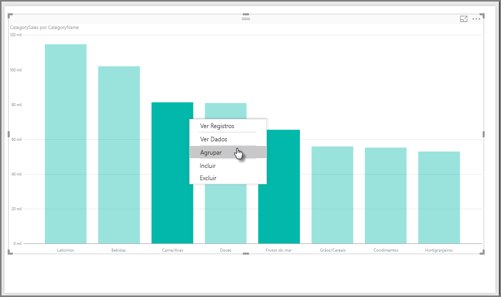
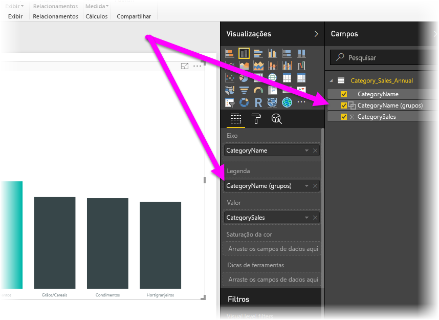
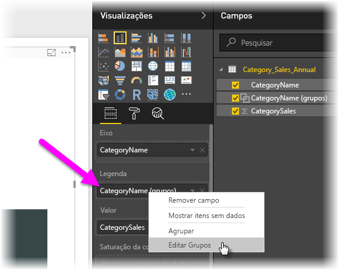
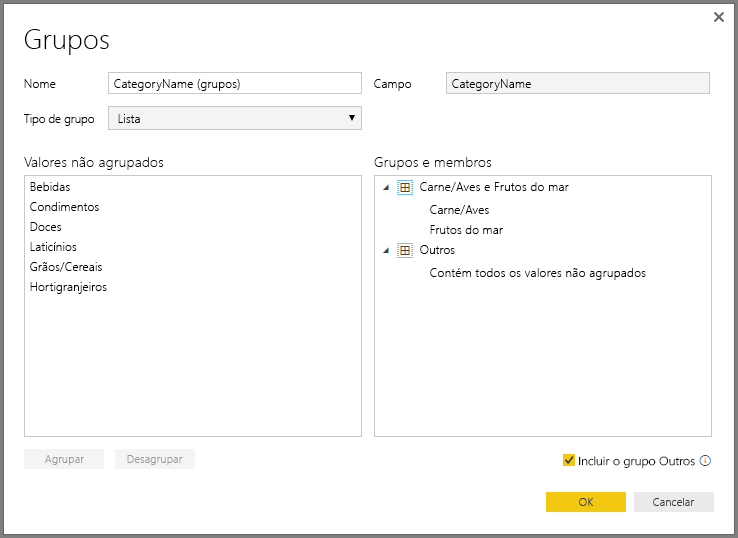

# Usar agrupamento e compartimentalização no Power BI Desktop
Quando o **Power BI Desktop** cria elementos visuais, ele agrega os dados em partes (ou **grupos**) com base nos valores encontrados nos dados subjacentes. Geralmente isso fica bom, mas pode haver ocasiões nas quais você deseja refinar a maneira como essas partes são apresentadas. Por exemplo, você pode querer colocar três categorias de produtos em uma categoria maior (um *grupo*). Ou talvez você queira ver valores de vendas colocadas em compartimentos de 1.000.000 dólares, em vez de valores divididos uniformemente de 923.983 dólares.

No Power BI Desktop, você pode **agrupar** pontos de dados para ajudá-lo a exibir, analisar e explorar com mais clareza os dados e tendências nos seus elementos visuais. Você também pode definir o **tamanho do compartimento**, muitas vezes chamado de **compartimentalização**, para colocar valores em grupos de mesmo tamanho, o que permite melhor visualização dos dados de maneiras que sejam significativas.

### Usando o agrupamento
Para usar o **agrupamento**, selecione dois ou mais elementos em um visual usando CTRL + CLIQUE para selecionar vários elementos. Em seguida, clique com o botão direito do mouse em um dos elementos da seleção múltipla e selecione *Agrupar* no menu exibido.

Depois de criado, o grupo é adicionado ao bucket **Legenda** do elemento visual e também aparece na lista de **Campos**.

Uma vez que um grupo é criado, você pode editar facilmente os membros desse grupo clicando com botão direito do mouse no campo do bucket **Legenda** ou na lista de **Campos** e, em seguida, selecionar *Editar grupos*.

Na janela **Grupos** exibida, é possível criar novos grupos ou modificar os grupos existentes. Também é possível *renomear* qualquer grupo clicando duas vezes no título **Grupo** na caixa **Grupos e membros** e digitando um novo nome.

Há inúmeras coisas que você pode fazer com grupos nesta janela. É possível adicionar itens da lista **Valores não agrupados** em um novo grupo ou em um dos grupos existentes. Para criar um novo grupo, selecione dois ou mais itens (usando CTRL + clique) na caixa **Valores não agrupados** e, em seguida, clique no botão **Grupo** embaixo dessa caixa.

É possível adicionar um valor não agrupado em um grupo existente: basta selecionar o Valor não agrupado e selecione o grupo existente ao qual você deseja adicioná-lo e clique no botão **Agrupar**. Para remover um item de um grupo, selecione-o na caixa **Grupos e membros** e, em seguida, clique em **Desagrupar**. Você também pode selecionar se categorias desagrupadas devem ser colocadas no grupo **Outros** ou devem permanecer desagrupadas.

> [!NOTE]
> É possível criar grupos para qualquer campo em **Campos**, sem necessidade de fazer seleção múltipla em um elemento visual existente. É só clicar com o botão direito do mouse no campo e selecionar **Agrupar** no menu exibido.
> 
> 

### Usando a compartimentalização
Você pode definir o tamanho do compartimento para campos numéricos e de tempo no **Power BI Desktop.** Você pode usar a compartimentalização para dar o tamanho correto aos dados que o **Power BI Desktop** exibe.

Para aplicar um tamanho de compartimento, clique com o botão direito do mouse em **Campo** e selecione **Grupos**.

Na janela **Grupos**, defina o **Tamanho do compartimento** com o tamanho desejado.

Quando você seleciona **OK**, você observará que um novo campo aparecerá no painel **Campos** com *(compartimentos)* acrescentado. Você pode arrastar esse campo para a tela para usar o tamanho do compartimento em um elemento visual.

Para ver a **compartimentalização** em ação, dê uma olhada neste [vídeo](https://youtu.be/UXEYSvgvMaQ?t=12m17s).

E isso é tudo sobre o uso de **agrupamento** e **compartimentalização** para garantir que os elementos visuais em seus relatórios mostrem seus dados exatamente na forma desejada.

