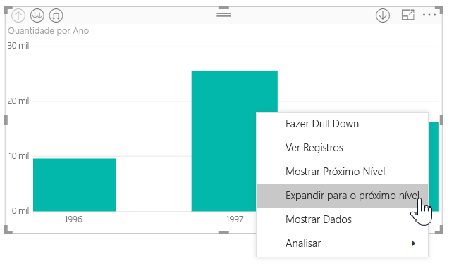
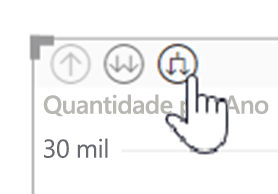
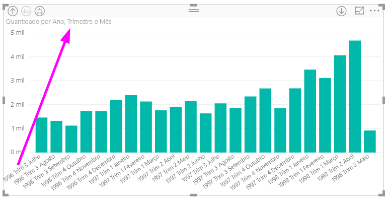
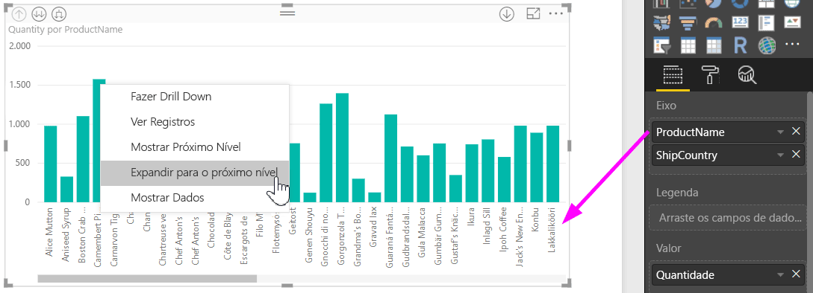
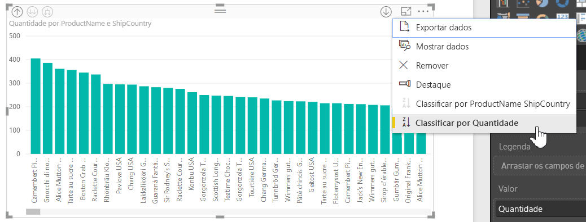
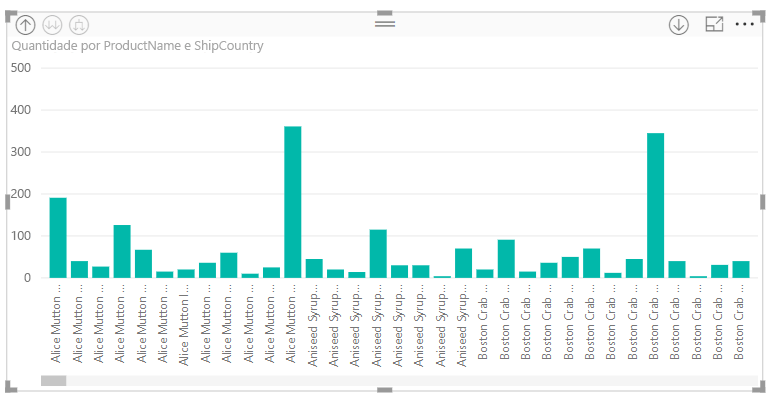

# Usar rótulos de hierarquia embutida no Power BI Desktop
O **Power BI Desktop** dá suporte para o uso de **rótulos de hierarquia embutida**, que são o primeiro de dois recursos para melhorar a análise hierárquica. O segundo recurso, que atualmente está em desenvolvimento, é a capacidade de usar rótulos de hierarquia aninhados (fique atento – nossas atualizações ocorrem com frequência).   

## Como os rótulos de hierarquia em linha funcionam
Com os rótulos de hierarquia em linha, você pode ver os rótulos de hierarquia quando expande visuais usando o recurso **Expandir Tudo**. Um grande benefício de ver os rótulos de hierarquia é que você também pode optar por **classificar** de acordo com esses diferentes rótulos de hierarquia quando expandir seus dados hierárquicos.

### Usando o recurso interno Expandir (sem classificar por rótulos de hierarquia)
Antes de vermos os rótulos de hierarquia embutidos em ação, vamos examinar o comportamento padrão do recurso **Expandir para o próximo nível**. Fazer isso nos ajudará a compreender (e apreciar) o quanto os rótulos de hierarquia em linha podem ser úteis.

A imagem a seguir mostra um visual de gráfico de barras representando vendas anuais. Ao clicar com o botão direito do mouse em uma barra, você pode escolher **Expandir para o próximo nível**.

> [!NOTE]
> Como alternativa ao clique com o botão direito do mouse em uma barra, você pode selecionar o botão *Expandir* no canto superior esquerdo da visualização.

  

Quando **Expandir para o próximo nível** está selecionado, o visual expande a hierarquia de datas de *Ano* para *Trimestre*, conforme é mostrado na imagem a seguir.

Observe que os rótulos *Ano* e *Trimestre* são exibidos juntos embutidos. Esse esquema de rotulação continua conforme você **Expande Tudo** até o final da hierarquia.

É assim que a hierarquia interna de *Data*, associada a campos que têm um tipo de dados *data/hora*, se comporta. Vamos para a próxima seção para ver como o novo recurso de rótulos de hierarquia em linha é diferente.

### Usando rótulos de hierarquia em linha
Agora vamos examinar um gráfico diferente – usando dados com hierarquias informais. No visual a seguir, temos um gráfico de barras com **Quantidade**, usando *ProductName* como o eixo. Nesses dados, *ProductName* e *ShipCountry* formam uma hierarquia informal. Aqui você pode selecionar novamente *Expandir para o próximo nível* para fazer uma busca detalhada na hierarquia.

Selecionar **Expandir para o próximo nível** mostra o próximo nível com a exibição embutida dos rótulos de hierarquia. Por padrão, as hierarquias embutidas são classificadas pelo valor de medida que, nesse caso, é **Quantidade**. Com os rótulos de hierarquia embutida habilitados, você também pode optar por classificar os dados pela hierarquia selecionando as reticências (**...**) no canto superior direito e, em seguida, selecionando **Classificar por ProductName ShipCountry**, conforme é mostrado na imagem a seguir.

Depois que **ShipCountry** é selecionado, os dados são classificados com base na seleção da hierarquia informal, conforme é mostrado na imagem a seguir.

> [!NOTE]
> O recurso de rótulo de hierarquia embutido ainda não permite que a hierarquia de tempo interna seja classificada por valor; ela é classificada somente pela ordem da hierarquia.
> 
> 

## Solução de problemas
É possível que os visuais fiquem travados em um estado de nível de hierarquia em linha expandida. Em alguns casos, você pode perceber que alguns de seus visuais estão travados no modo em que foram expandidos, e nesse caso fazer o drill up não funciona. Isso pode acontecer se você tiver seguido as etapas seguintes (a solução está *abaixo* das etapas):

Etapas que podem fazer com que os visuais fiquem travados em um estado expandido:

1. Você habilita o recurso **rótulo de hierarquia em linha**
2. Você cria alguns visuais com hierarquias
3. Em seguida, você **Expande Tudo** e salva o arquivo
4. Depois, você *desabilita* o **rótulo de hierarquia em linha** e reinicia o Power BI Desktop
5. Você abre o arquivo novamente

Se você tiver executado essas etapas e seus visuais tiverem travado no modo expandido, você pode fazer o seguinte para solucionar o problema:

1. Habilite novamente o recurso **rótulo de hierarquia em linha** e reinicie o Power BI Desktop
2. Abra novamente o arquivo e faça o drill up até a parte superior dos visuais afetados
3. Salve o arquivo
4. Desabilite o recurso **rótulo de hierarquia em linha** e reinicie o Power BI Desktop
5. Abra o arquivo novamente

Você também pode excluir seu visual e criá-lo novamente.

