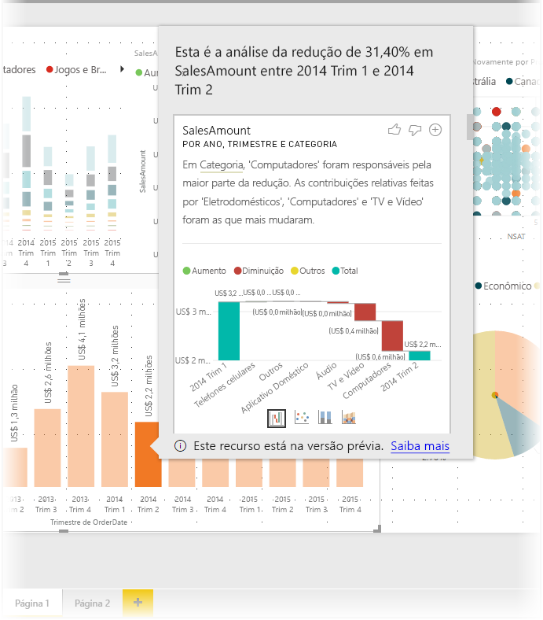
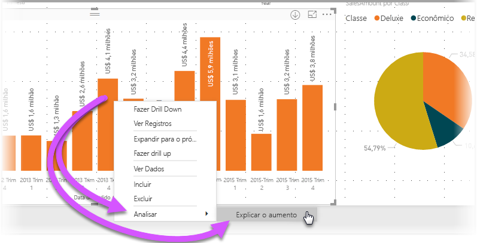
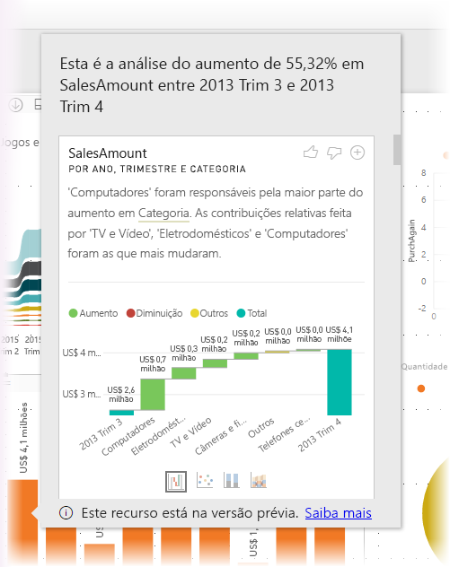
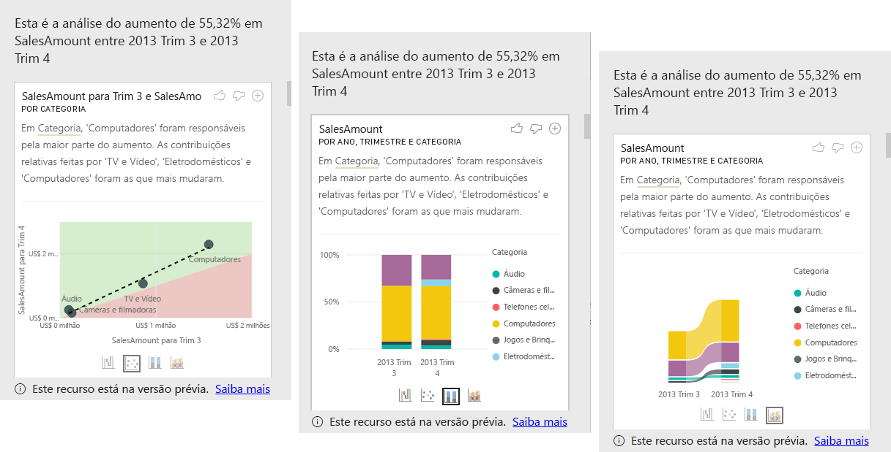

# Usar os insights no Power BI Desktop (Versão Prévia)
Você pode informar o **Power BI Desktop** para explicar os aumentos ou as diminuições em gráficos e obter uma análise rápida, automatizada e repleta de insights sobre seus dados. Basta clicar com o botão direito do mouse em um ponto de dados e selecionar **Analisar > Explicar a diminuição** (ou o aumento, se a barra anterior era menor) e o insight será fornecido em uma janela de fácil de usar.

O recurso de insights é contextual e baseia-se no ponto de dados imediatamente anterior – como a coluna ou a barra anterior.

> [!NOTE]
> Esse recurso está em versão prévia e sujeito a alterações. O recurso de insights está habilitado e ativado por padrão (não é necessário marcar uma caixa Versão Prévia para habilitá-lo) a partir da versão de setembro de 2017 do **Power BI Desktop**.
> 
> 

## Usando insights
Para usar os insights, basta clicar com o botão direito do mouse em qualquer ponto de dados em uma barra ou linha visual e selecionar **Analisar > Explicar o aumento** (ou *Explicar a diminuição*, pois todos os insights se baseiam na alteração do ponto de dados anterior).

Em seguida, o **Power BI Desktop** executa seus algoritmos de aprendizado de máquina sobre os dados e popula uma janela com um visual e uma descrição que indica quais categorias influenciaram mais o aumento ou a diminuição. Por padrão, os insights são fornecidos como um visual de *cascata*, conforme mostrado na imagem a seguir.

Selecionando os ícones pequenos na parte inferior do visual de cascata, você pode optar por fazer com que os insights exibam um gráfico de dispersão, gráfico de colunas empilhadas ou gráfico de faixa de opções.

Os ícones *polegar para cima* e *polegar para baixo* na parte superior da página são fornecidos para que você possa fornecer comentários sobre o visual e o recurso.

Além disso, o mais importante é o botão **+** na parte superior do visual, que permite adicionar o visual selecionado ao relatório, como se você tivesse criado o visual manualmente. Em seguida, você pode formatar ou, de outro modo, ajustar o visual adicionado exatamente como faria em qualquer outro visual do relatório. Você só pode adicionar um visual de insight selecionado quando estiver editando um relatório no **Power BI Desktop**.

Use os insights quando o relatório estiver no modo de leitura ou de edição, tornando-o versátil para a análise de dados e para a criação de visuais que podem ser adicionados com facilidade aos relatórios.

## Considerações e limitações
Como os insights são baseados na alteração do ponto de dados anterior, eles não estarão disponíveis ao selecionar o primeiro ponto de dados em um visual. 

A seguinte lista é uma coleção de cenários atualmente sem suporte em **insights**:

* Filtros TopN
* Filtros Incluir/excluir
* Filtros de medida
* Medidas e agregações não aditivas
* Mostrar valor como
* Medidas filtradas (é a novidade que usamos para o gráfico de dispersão nos insights)
* Colunas categóricas no eixo X, a menos que ele defina uma classificação por coluna que seja escalar. Se você estiver usando uma hierarquia, todas as colunas na hierarquia ativa deverão corresponder a essa condição
* Medidas não numéricas

Além disso, atualmente, não há suporte para os seguintes tipos de modelo e fontes de dados em insights:

* DirectQuery
* Live Connect
* Reporting Services local
* Inserção

## Próximas etapas
Para obter mais informações sobre o **Power BI Desktop** e como começar, confira os artigos a seguir.

* [Introdução ao Power BI Desktop](desktop-getting-started.md)
* [Visão geral de Consulta com o Power BI Desktop](desktop-query-overview.md)
* [Fontes de dados no Power BI Desktop](desktop-data-sources.md)
* [Conectar-se a dados no Power BI Desktop](desktop-connect-to-data.md)
* [Formatar e combinar dados com o Power BI Desktop](desktop-shape-and-combine-data.md)
* [Tarefas comuns de consulta no Power BI Desktop](desktop-common-query-tasks.md)   

