# Usar o visual Matriz no Power BI Desktop
Com o visual **Matriz**, você pode criar visuais de matriz (às vezes mencionados como *tabelas*) nos relatórios do **Power BI Desktop** e elementos de realce cruzado na matriz com outros visuais. Além disso, você pode selecionar linhas, colunas e até mesmo células individuais e realce cruzado. Por fim, para fazer melhor uso do espaço de layout, o visual de matriz dá suporte a um layout de nível.

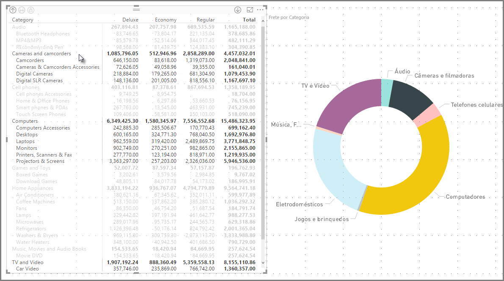

Há muitos recursos associados à matriz e vamos abordá-los nas próximas seções deste artigo.

> [!NOTE]
> A partir do lançamento de julho de 2017 do **Power BI Desktop**, visuais de matriz e tabela refletem o estilo (incluindo cores) do **Tema de Relatório** aplicado. Talvez essa não seja as cores que você espera para o seu visual de matriz, que você pode alterar em sua configuração **Tema de Relatório**. Consulte [**Usar Temas de Relatório no Power BI Desktop**](desktop-report-themes.md) para obter informações sobre temas.
> 
> 

## Noções básicas sobre como o Power BI calcula totais

Antes de ir para como usar o elemento visual **Matriz**, é importante entender como o Power BI calcula valores totais e subtotais em tabelas e matrizes. Para linhas de totais e subtotais, a medida é avaliada em todas as linhas nos dados subjacentes – *não* é apenas uma simples adição dos valores nas linhas visíveis ou exibidas. Isso significa que você pode acabar com valores diferentes na linha de total do que o esperado. 

Observe os seguintes elementos visuais de **Matriz**. 

Neste exemplo, cada linha no elemento visual **Matriz** mais à direita mostra a *Quantidade* para cada combinação de vendedor/data. No entanto, como um vendedor aparece em várias datas, os números podem aparecer mais de uma vez. Assim, o total preciso dos dados subjacentes e uma simples adição de valores visíveis não são iguais. Este é um padrão comum quando o valor que você está somando está no lado 'um' de uma relação de um para muitos.

Ao examinar o total e os subtotais, lembre-se de que esses valores são baseados nos dados subjacentes e não apenas nos valores visíveis. 

## Usando o drill down com o visual Matriz
Com o visual **Matriz**, é possível fazer todos os tipos de atividades de drill down interessantes que antes não estavam disponíveis. Isso inclui a capacidade de fazer drill down usando linhas, colunas e até mesmo células e seções individuais. Vamos dar uma olhada em como cada uma delas funciona.

### Drill down nos cabeçalhos de linha
No painel **Visualizações**, ao adicionar vários campos na seção **Linhas** sob **Campos**, você habilita o drill down nas linhas do visual de matriz. Isso é semelhante à criação de uma hierarquia, o que permite fazer drill down (e, em seguida, drill up) nessa hierarquia e analisar os dados em cada nível.

Na imagem a seguir, a seção **Linhas** contém *Categoria* e *Subcategoria*, criando um agrupamento (ou uma hierarquia) nas linhas em que é possível fazer drill down.

Quando o visual tiver algum agrupamento criado na seção **Linhas**, o próprio visual exibirá os ícones *analisar* e *expandir* no canto superior esquerdo do visual.

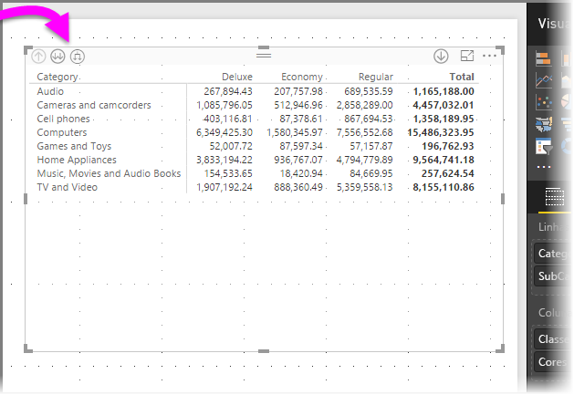

Semelhante ao comportamento de analisar e expandir nos outros visuais, selecionar esses botões permite fazer drill down (ou drill up) na hierarquia. Nesse caso, podemos fazer drill down de *Categoria* para *Subcategoria*, conforme é mostrado na imagem a seguir, em que o ícone de fazer drill down de um nível (a forquilha) foi selecionado.

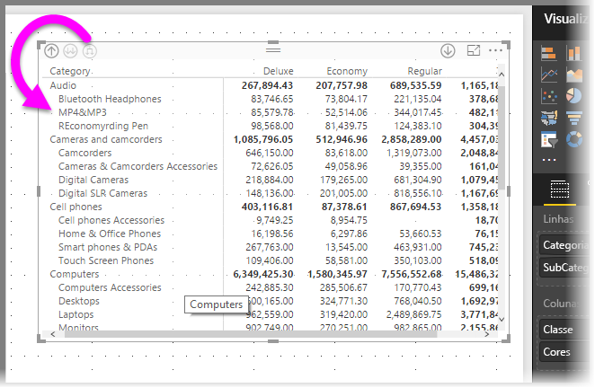

Além de usar esses ícones, você pode clicar com o botão direito do mouse em qualquer um desses cabeçalhos de linha e fazer drill down selecionando no menu que aparece.

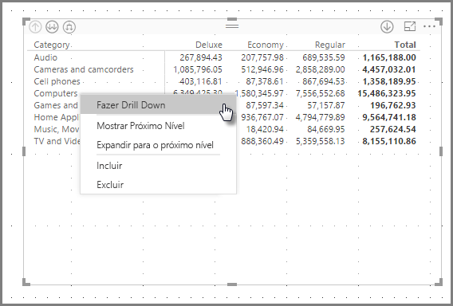

Observe que há algumas opções no menu que aparece, que geram resultados diferentes:

Selecionar **Drill Down** expande a matriz no nível *dessa* linha, *excluindo* todos os outros cabeçalhos de linha, exceto o cabeçalho de linha que foi clicado. Na imagem a seguir, *Computadores* foi clicado com o botão direito do mouse e **Drill Down** foi selecionado. Observe que as outras linhas de nível superior não aparecem mais na matriz. Esse é um recurso útil que fica ainda mais interessante quando chegamos à seção de **realce cruzado**.

Podemos clicar no ícone **Drill up** para voltar à exibição de nível superior anterior. Se, em seguida, selecionarmos **Mostrar Próximo Nível** no menu acionado com um clique do botão direito do mouse, aparecerá uma lista alfabética de todos os itens do próximo nível (nesse caso, o campo *Subcategoria*), sem a categorização de hierarquia de nível superior.

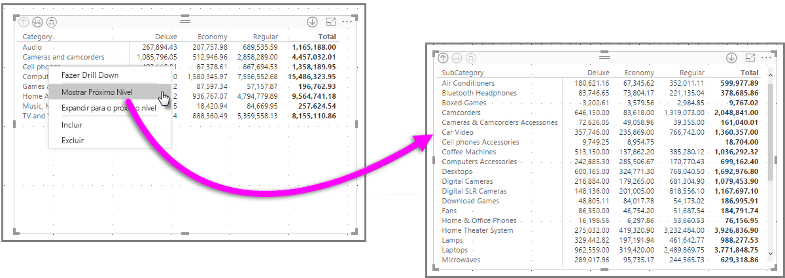

A clicar no ícone **Drill up** no canto superior esquerdo para que a matriz mostre todas as categorias de nível superior, clicar com botão direito do mouse novamente e selecionar **Expandir para o próximo nível**, poderemos ver o seguinte:

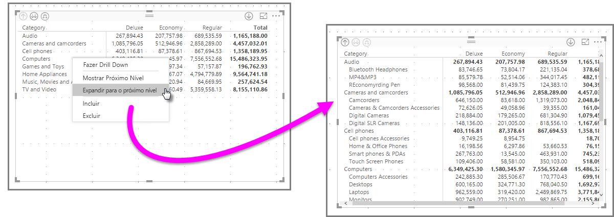

Você também pode usar os itens de menu **Incluir** e **Excluir** para manter (ou remover, respectivamente) a linha clicada com o botão direito do mouse (e todas as subcategorias) da matriz.

### Drill down nos cabeçalhos de coluna
Semelhante à capacidade de fazer drill down em Linhas, você pode também pode fazer drill down em **Colunas**. Na imagem a seguir, você pode ver que há dois campos sob o campo **Colunas**, criando uma hierarquia semelhante à que já usamos para as linhas neste artigo. Sob o campo **Colunas**, temos *Classe* e *Cor*.

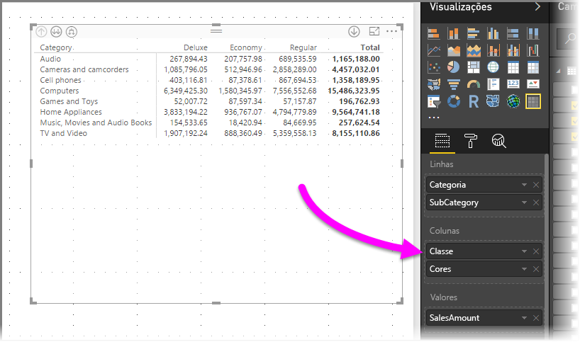

No visual **Matriz**, ao clicar com o botão direito do mouse em uma coluna, aparece a opção para fazer drill down. Na imagem a seguir, clicamos com o botão direito do mouse em *Deluxe* e selecionamos **Fazer Drill Down**.

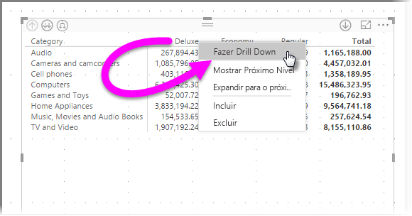

Quando **Fazer Drill Down** é selecionado, o próximo nível da hierarquia de coluna para *Deluxe* é exibido, que nesse caso é *Cor*.

O restante dos itens do menu acionado com um clique do botão direito do mouse funcionam nas Colunas da mesma maneira que nas linhas (Consulte a seção anterior, **Drill down nos cabeçalhos de linha**). Você pode **Mostrar Próximo Nível**, **Expandir para o próximo nível** e **Incluir** ou **Excluir** colunas, como faz com as linhas.

> [!NOTE]
> Os ícones de drill up e drill down no canto superior esquerdo do visual de matriz aplicam-se apenas a linhas. Para fazer drill down nas colunas, você deve usar o menu acionado com um clique do botão direito do mouse.
> 
> 

## Layout de nível com visuais de matriz
O visual **Matriz** recua automaticamente as subcategorias em uma hierarquia abaixo de cada pai, chamado de **layout de nível**.

Na versão *original* do visual de matriz, as subcategorias foram mostradas em uma coluna inteiramente diferente, ocupando muito mais espaço no visual. A imagem a seguir mostra a tabela no visual de **matriz** original. Observe as subcategorias em uma coluna totalmente separada.

Na imagem a seguir, há um visual **Matriz** com o **layout de nível** em ação. Observe que a categoria *Computadores* tem suas subcategorias (Acessórios de Computadores, Desktops, Laptops, Monitores e assim por diante) ligeiramente recuadas, fornecendo um visual mais limpo e muito mais compacto.

Você pode ajustar facilmente as configurações do **layout de nível**. Com o visual **Matriz** selecionado, na seção **Formatar** (o ícone de rolo de pintura) do painel **Visualizações**, expanda a seção **Cabeçalhos de linha**. Aqui estão duas opções: a opção (que habilita ou desabilita) **Layout de nível** e o **Recuo do layout de nível** (especifica a quantidade de recuo, em pixels).

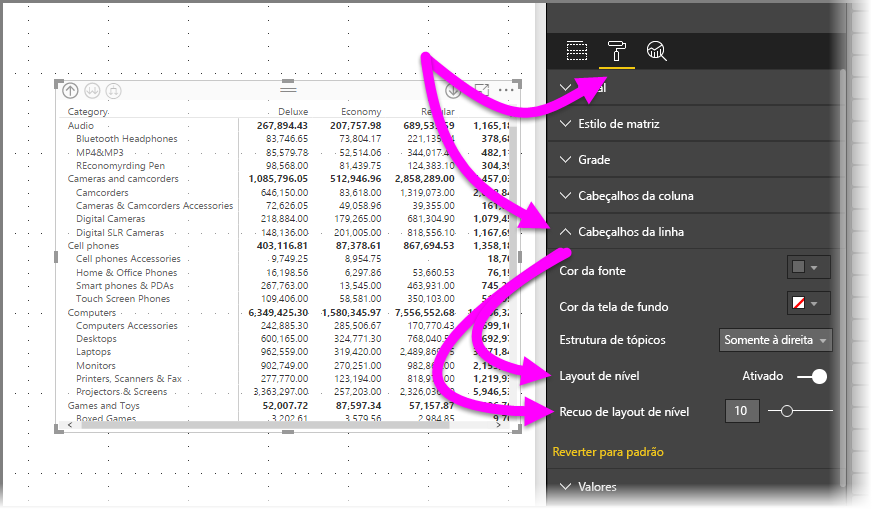

Se você desligar **Layout de nível**, as subcategorias serão mostradas em outra coluna em vez de recuadas abaixo da categoria pai.

## Subtotais com visuais de matriz
Ative ou desative os subtotais em visuais de matriz, linhas e colunas. Na imagem a seguir, veja que os subtotais da linha são definidos como **ativados**.

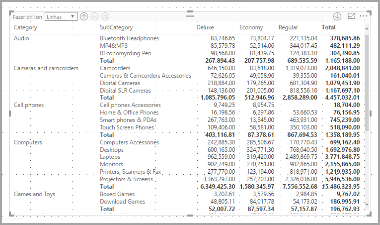

Na seção **Formato** do painel **Visualizações**, expanda o cartão **Subtotais** e defina o controle deslizante **Subtotais da Linha** como **Desativado**. Quando você fizer isso, os subtotais não serão mostrados.

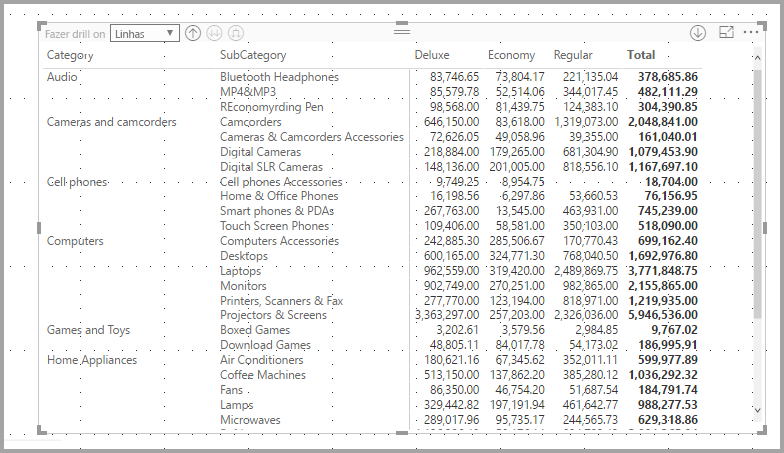

O mesmo processo se aplica aos subtotais da coluna.

## Realce cruzado com visuais de matriz
Com o visual **Matriz**, os elementos na matriz podem ser selecionados como a base para o realce cruzado. Selecione uma coluna em uma **Matriz** e essa coluna será realçada, assim como quaisquer outros visuais na página do relatório. Isso era um recurso comum de outros visuais e da seleção de um ponto de dados e agora o visual **Matriz** pode participar.

Além disso, usar CTRL + clique também funciona para o realce cruzado. Por exemplo, na imagem a seguir, uma coleção de subcategorias foi selecionada no visual **Matriz**. Observe como os itens que não foram selecionados no visual estão esmaecidos e como os outros visuais na página refletem as seleções feitas no visual **Matriz**.

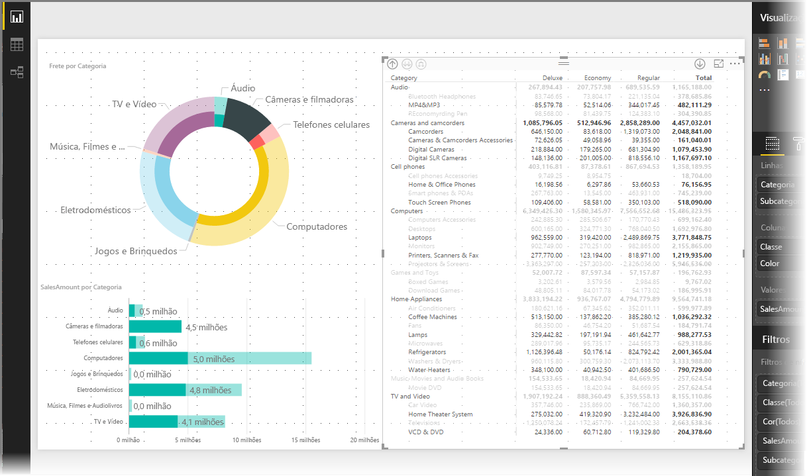

## Sombreamento e cores da fonte com visuais de matriz
Com o visual **Matriz**, você pode aplicar a **formatação condicional** (cores e sombreamento) à tela de fundo das células dentro da matriz e aplicar a formatação condicional ao próprio texto e aos valores.

Para aplicar a formatação condicional, realize uma das seguintes etapas quando um visual de matriz estiver selecionado:

* No painel **Campos**, clique com o botão direito do mouse no Campo e selecione **Formatação condicional** no menu.
  
  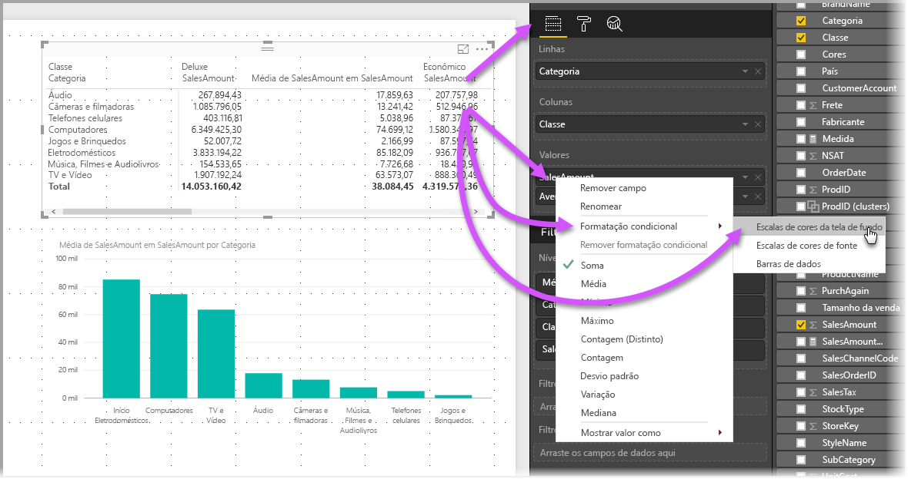
* Se preferir, no painel **Formato**, expanda o cartão **Formatação condicional** e, em **Escalas de cores da tela de fundo** ou **Escalas de cores da fonte**, defina o controle deslizante como **Ativado**. A ativação de uma dessas opções exibe um link para *Controles avançados*, que permite personalizar as cores e os valores da formatação de cores.
  
  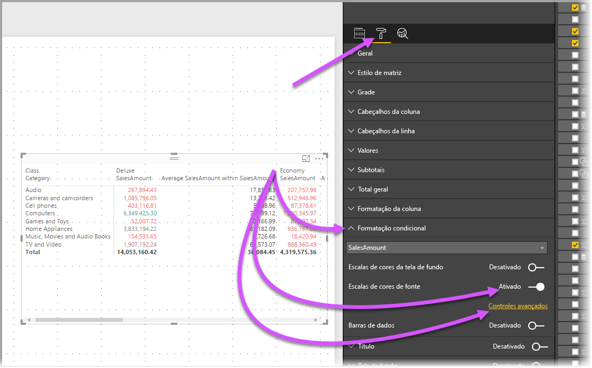

Qualquer uma dessas abordagem atinge o mesmo resultado. A seleção de *Controles avançados* exibe a seguinte caixa de diálogo, que permite fazer ajustes:

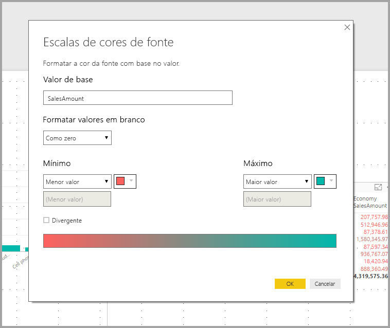

## Próximas etapas

Você também pode estar interessado nos seguintes artigos:

* [Use linhas de grade e ajuste de grade em relatórios do Power BI Desktop](desktop-gridlines-snap-to-grid.md)
* [Fontes de dados no Power BI Desktop](desktop-data-sources.md)
* [Tipos de dados no Power BI Desktop](desktop-data-types.md)

 