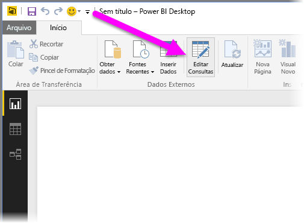
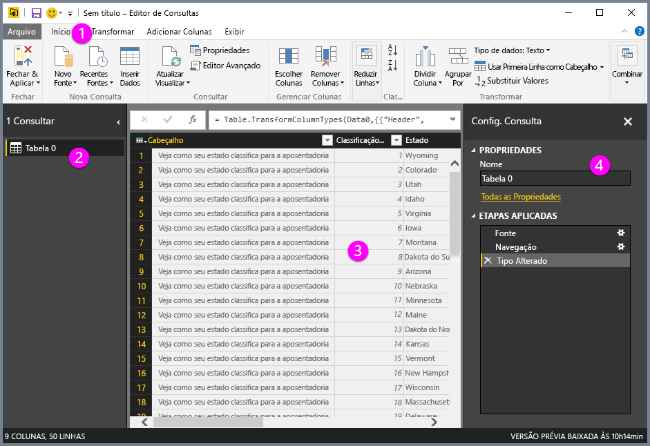

# Visão geral de Consulta no Power BI Desktop
Com o **Power BI Desktop** você pode se conectar ao mundo dos dados, criar relatórios atraentes e fundamentais e compartilhar seus esforços com outras pessoas — que poderão se basear em seu trabalho e expandir seus esforços de business intelligence.

O Power BI Desktop tem três modos de exibição:

* Exibição de **Relatório** – em que você usa as consultas que cria para elaborar visualizações atraentes, organizadas como você deseja que elas apareçam e com várias páginas, que você pode compartilhar com outras pessoas
* Exibição de **Dados** – consulte os dados em seu relatório no formato de modelo de dados, em que você pode adicionar medidas, criar novas colunas e gerenciar relações
* Exibição de **Relações** – obtenha uma representação gráfica das relações que foram estabelecidas no seu modelo de dados e gerencie-as ou modifique-as conforme necessário.

Esses modos de exibição são acessados selecionando um dos três ícones no lado esquerdo do Power BI Desktop. Na imagem a seguir, a Exibição de relatório é selecionada, indicada pela faixa amarela ao lado do ícone.  

O Power BI Desktop também vem com o **Editor de Consultas**, no qual você pode se conectar a uma ou várias fontes de dados, formatar e transformar os dados para atender às suas necessidades e, em seguida, carregar esse modelo no Power BI Desktop.

Este documento fornece uma visão geral do trabalho com dados no **Editor de Consultas**. É claro que há mais para aprender e sendo assim, no final deste documento, você encontrará links para diretrizes detalhadas sobre os tipos de dados para os quais há suporte, conexão a dados, formatação de dados, criação de relações e como começar.

Mas primeiro, vamos nos familiarizar com o **Editor de Consultas**.

## O Editor de Consultas
Para ir até o **Editor de Consultas**, selecione **Editar Consultas** na guia **Página Inicial** do Power BI Desktop.  

Sem conexões de dados, o **Editor de Consultas** é exibido como um painel em branco, pronto para receber dados.  

Quando uma consulta é carregada, a exibição do **Editor de Consultas** torna-se mais interessante. Se nos conectarmos à fonte de dados da Web a seguir, o **Editor de Consultas** carrega informações sobre os dados, que você pode começar a formatar em seguida.

[*http://www.bankrate.com/finance/retirement/best-places-retire-how-state-ranks.aspx*](http://www.bankrate.com/finance/retirement/best-places-retire-how-state-ranks.aspx)

Eis como o **Editor de Consultas** aparece após o estabelecimento de uma conexão de dados:

1. Na faixa de opções, muitos botões agora estão ativos para interagir com os dados na consulta
2. No painel esquerdo, as consultas são listadas e ficam disponíveis para seleção, visualização e formatação
3. No painel central, dados da consulta selecionada são exibidos e estarão disponíveis para formatação
4. A janela **Configurações de Consulta** é exibida, listando as propriedades da consulta e as etapas aplicadas  
   
   

Vamos examinar cada uma destas quatro áreas – a faixa de opções, o painel de consultas, a exibição de dados e o painel de configurações de consulta – nas seções a seguir.

## A faixa de opções de consulta
A faixa de opções no **Editor de Consultas** consiste em quatro guias – **Página Inicial**, **Transformar**, **Adicionar Coluna** e **Exibição**.

A guia **Home** contém as tarefas comuns de consulta, incluindo a primeira etapa em qualquer consulta, que é **Obter Dados.** A imagem a seguir mostra a faixa de opções **Home**  

Para conectar-se a dados e começar a processo de criação de consultas, selecione o botão **Obter Dados** . Um menu é exibido, fornecendo as fontes de dados mais comuns.  

Para obter mais informações sobre as fontes de dados disponíveis, consulte **Fontes de Dados**. Para obter informações sobre como se conectar a dados, inclusive exemplos e etapas, consulte **Conectar-se a Dados**.

A guia **Transformar** fornece acesso a tarefas comuns de transformação de dados, como adicionar ou remover colunas, alterar os tipos de dados, dividir colunas e outras tarefas direcionadas a dados. A imagem a seguir mostra a guia **Transformar** .  

Para obter mais informações sobre como transformar dados, incluindo exemplos, consulte **Combinar e Formatar Dados**.

A guia **Adicionar Coluna** fornece tarefas adicionais associadas à adição de uma coluna, formatação de dados da coluna e adição de colunas personalizadas. A imagem a seguir mostra a guia **Adicionar Coluna** .  

A guia **Exibição** na faixa de opções é usada para ativar ou desativar a exibição de determinados painéis ou janelas. Ela também é usada para exibir o Editor Avançado. A imagem a seguir mostra a guia **Exibição** .  

É útil saber que muitas das tarefas disponíveis na faixa de opções também estão disponíveis clicando com o botão direito do mouse em uma coluna ou em outros dados, no painel central.

## O painel esquerdo
O painel esquerdo exibe o número de consultas ativas, bem como o nome da consulta. Quando você seleciona uma consulta no painel à esquerda, seus dados são exibidos no painel central, no qual você pode formatar e transformar os dados para atender às suas necessidades. A imagem a seguir mostra o painel à esquerda com várias consultas.  

## O painel central (dados)
No painel central ou painel Dados, os dados da consulta selecionada são exibidos. É ali que muito do trabalho da Visualização da Consulta é realizado.

Na imagem a seguir, a conexão de dados da Web estabelecida anteriormente é exibida, a coluna **Pontuação geral** está selecionada e seu cabeçalho foi clicado com o botão direito do mouse para exibir os itens de menu disponíveis. Observe que muitos desses itens de menu de atalho são os mesmos botões nas guias da faixa de opções.  

Quando você seleciona um item de menu de clique com o botão direito do mouse (ou um botão da faixa de opções), a Consulta aplica a etapa aos dados e salva-a como parte da própria consulta. As etapas são registradas no painel **Configurações de Consulta** em ordem sequencial, conforme descrito na próxima seção.  

## O painel de configurações de consulta
O painel de **Configurações de Consulta** é o local onde todas as etapas associadas a uma consulta são exibidas. Por exemplo, na imagem a seguir, a seção **Etapas Aplicadas** do painel **Configurações de Consulta** reflete o fato de que acabamos de alterar o tipo da coluna **Pontuação geral** .

Conforme as etapas de formatação adicionais são aplicadas à consulta, elas são capturadas na seção **Etapas Aplicadas** .

É importante saber que os dados subjacentes *não* são alterados; em vez disso, o Editor de Consultas ajusta e formata sua exibição dos dados, sendo que qualquer interação com os dados subjacentes ocorre com base no modo de exibição formatado e modificado do Editor de Consultas para esses dados.

No painel **Configurações de Consulta** , você pode renomear etapas, excluir etapas ou reordenar as etapas conforme necessário. Para fazer isso, clique com o botão direito do mouse na seção **Etapas Aplicadas** e selecione uma opção no menu que aparece. Todas as etapas de consulta são executadas na ordem em que aparecem no painel **Etapas Aplicadas** .

## O Editor Avançado
Se você quiser ver o código que a Consulta está criando a cada etapa ou criar seu próprio código de formatação, você pode usar o **Editor Avançado**. Para iniciar o editor avançado, selecione **Exibição** na faixa de opções, então selecione **Editor Avançado**. Uma janela aparece, mostrando o código de consulta existente.  

Você pode editar o código diretamente na janela **Editor Avançado** . Para fechar a janela, selecione o botão **Concluído** ou **Cancelar** .  

## Salvando seu trabalho
Quando sua consulta está onde você deseja, é possível fazer com que o Editor de Consulta aplique as alterações ao modelo de dados no Power BI Desktop e feche o Editor de Consulta. Para fazer isso, selecione **Fechar e Aplicar** no menu **Arquivo** do Editor de Consultas.  

Conforme registramos progresso, o Power BI Desktop fornece uma caixa de diálogo para exibir seu status.  

Uma vez que a consulta esteja onde você quer, ou se você apenas desejar certificar-se de que seu trabalho seja salvo, o Power BI Desktop pode salvar seu trabalho na forma de um arquivo .pbix.

Para salvar seu trabalho, selecione **Arquivo \> Salvar** (ou **Arquivo \> Salvar Como**), conforme mostrado na imagem a seguir.  

## Próximas etapas
Há inúmeras coisas que você pode fazer com o Power BI Desktop. Para obter mais informações sobre seus recursos, consulte as seguintes fontes:

* [Introdução ao Power BI Desktop](desktop-getting-started.md)
* [Fontes de dados no Power BI Desktop](desktop-data-sources.md)
* [Conectar-se a dados no Power BI Desktop](desktop-connect-to-data.md)
* [Formatar e combinar dados com o Power BI Desktop](desktop-shape-and-combine-data.md)
* [Tarefas comuns de consulta no Power BI Desktop](desktop-common-query-tasks.md)   

