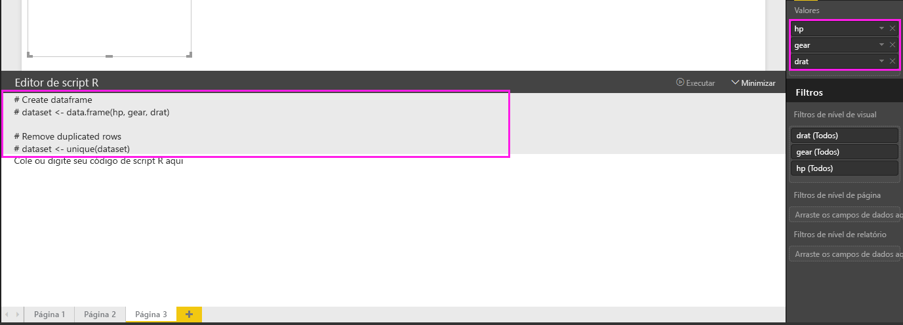
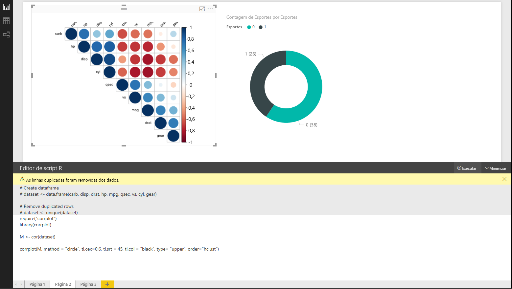
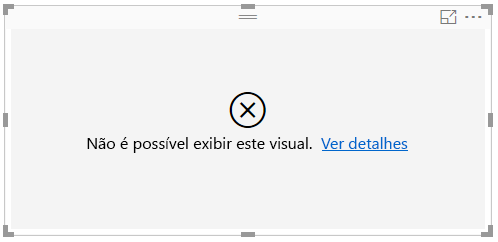

# Criar visuais do Power BI usando o R
Com o **Power BI Desktop**, é possível usar o **R** para visualizar seus dados.

## Instalar o R
O **Power BI Desktop** não inclui, implanta ou instala o mecanismo **R**. Para executar scripts R no **Power BI Desktop**, é necessário instalar o **R** em seu computador local separadamente. É possível baixar e instalar o **R** gratuitamente em vários locais, incluindo a [página de download do Revolution Open](https://mran.revolutionanalytics.com/download/) e o [Repositório CRAN](https://cran.r-project.org/bin/windows/base/). A versão atual do script R no **Power BI Desktop** dá suporte a caracteres Unicode, bem como espaços (caracteres vazios) no caminho de instalação.

## Habilitar visuais do R
Para habilitar visuais do R, selecione **Arquivo > Opções e configurações > Opções** e, na página **Opções** exibida, verifique se sua instalação local do R está especificada na seção **Script do R** da janela **Opções**, conforme mostrado na imagem a seguir. Na imagem a seguir, a instalação local do caminho de R é **C:\Program Files\R\R-3.2.0** e esse caminho é explicitamente fornecido na caixa de texto. Verifique se o caminho que ele exibe reflete corretamente a instalação local do R que você deseja que o **Power BI Desktop** use.
   
   

Depois de especificar a instalação do R, você estará pronto para começar a criar visuais do R.

## Criar visuais R no Power BI Desktop
1. Selecione o ícone **Visual do R** no painel **Visualização**, como mostrado na imagem a seguir para adicionar um visual do R.
   
   

   Quando você adiciona um visual do R a um relatório, o **Power BI Desktop** faz o seguinte:
   
   - Uma imagem do visual do R no espaço reservado aparece na tela de relatório.
   
   - O **editor de script R** aparece na parte inferior do painel central.
   
   

2. Em seguida, adicione os campos que deseja consumir no seu script R à seção **Valores** em **Campos** também, como faria com qualquer outro visual do **Power BI Desktop**. 
    
    Somente os campos que foram adicionados aos **Campos** estão disponíveis para seu script R. Você pode adicionar novos campos ou remover campos desnecessários de **Campos** enquanto trabalha em seu script R no **editor de scripts R do Power BI Desktop**. O **Power BI Desktop** detecta automaticamente os campos que você adicionou ou removeu.
   
   > [!NOTE]
   > O tipo de agregação padrão para visuais R é *não resumir*.
   > 
   > 
   
3. Agora você pode usar os dados selecionados para plotar. 

    Ao selecionar campos, o **editor de script R** gera um código de associação de script R com suporte com base em suas seleções na seção cinza na parte superior do painel do editor. Ao selecionar ou remover campos adicionais, o suporte de código no editor de script R é automaticamente gerado ou removido adequadamente.
   
   No exemplo mostrado na imagem a seguir, três campos foram selecionados: hp, preparar e drat. Como resultado dessas seleções, o editor de script R gerou o seguinte código de associação:
   
   * Um dataframe chamado **dataset** foi criado
     * Esse dataframe é composto por diferentes campos selecionados pelo usuário
   * A agregação padrão é *não resumir*
   * Semelhantes aos elementos visuais de tabela, os campos são agrupados e as linhas duplicadas aparecem somente uma vez
   
   
   
   > [!TIP]
   > Em certos casos, talvez você não queira que ocorra um agrupamento automático, ou talvez queira exibir todas as linhas, incluindo duplicatas. Nesse caso, você pode adicionar um campo de índice ao conjunto de dados que faz com que todas as linhas sejam consideradas exclusivas, impedindo o agrupamento.
   > 
   > 
   
   O dataframe gerado é chamado de **conjunto de dados**, e você pode acessar as colunas selecionadas por seus respectivos nomes. Por exemplo, acesse o campo de engrenagem escrevendo *dataset$gear* em seu script R. Para campos com espaços ou caracteres especiais, use aspas simples.

4. Com o dataframe gerado automaticamente pelos campos selecionados, você está pronto para escrever um script R que resulta em plotar ao dispositivo padrão R. Quando o script for concluído, selecione **Executar** na barra de título **editor de script R** (**Executar** está no lado direito da barra de título).
   
    Ao selecionar **Executar**, o **Power BI Desktop** identifica a plotagem e a apresenta na tela. Uma vez que o processo é executado em sua instalação local do R, certifique-se de pacotes necessários estão instalados.
   
   O **Power BI Desktop** plota novamente o visual quando qualquer um dos seguintes eventos ocorre:
   
   * Ao selecionar **Executar** na barra de título **Editor de script R**
   * Sempre que ocorre uma alteração de dados, devido à atualização de dados, filtragem ou realce

    A imagem a seguir mostra um exemplo de código de plotagem a correlação, e plota as correlações entre atributos de tipos diferentes de carros.

    

5. Para obter uma exibição ampliada das visualizações, você pode minimizar a **editor de script R**. E, claro, como outros visuais no **Power BI Desktop**, é possível cruzar o filtro da plotagem de correlação ao selecionar somente carros do tipo esporte no visual de rosca (o visual redondo à direita, na imagem de exemplo acima).

    

6. Você também pode modificar o script de R para personalizar o visual e aproveitar o poder do R, adicionando parâmetros ao comando de plotagem.

    O comando original de plotagem era o seguinte:

    corrplot(M, method = "color",  tl.cex=0.6, tl.srt = 45, tl.col = "black")

    Com poucas alterações no script R, o comando agora é o seguinte:

    corrplot(M, method = "circle", tl.cex=0.6, tl.srt = 45, tl.col = "black", type= "upper", order="hclust")

    Como resultado, o visual R agora plota círculos, só considera na metade superior e reorganiza a matriz para atributos correlacionados de cluster, como mostrado na imagem a seguir.

    

    Ao executar um script R que resulta em um erro, o visual R não é plotado e uma mensagem de erro é exibida na tela. Para obter detalhes sobre o erro, selecione **Ver detalhes** no erro do visual R na tela.

    

    > **Segurança de scripts R:** visuais R são criados a partir de scripts R, que podem conter códigos com riscos de segurança ou privacidade. Ao tentar exibir ou interagir com um visual R pela primeira vez, o usuário recebe uma mensagem de aviso de segurança. Habilite visuais R somente se você confiar no autor e na fonte ou após examinar e compreender o script R.
    > 
    > 

## Limitações conhecidas
Os visuais do R no **Power BI Desktop** apresentam algumas limitações:

* Limitações de tamanho de dados – os dados usados pelo visual R para plotar são limitados a 150.000 linhas. Se mais de 150.000 linhas forem selecionadas, somente as primeiras 150.000 linhas serão usadas e uma mensagem será exibida na imagem.
* Limite de tempo de cálculo – se um cálculo do visual R exceder 5 minutos, a execução atinge o tempo limite, resultando em um erro.
* Relacionamentos – assim como acontece com outros visuais do Power BI Desktop, se os campos de dados de tabelas diferentes sem uma relação definida entre eles forem selecionados, ocorrerá um erro.
* Visuais R são atualizados após atualizações de dados, filtragem e realce. No entanto, a própria imagem não é interativa e não pode ser a origem da filtragem cruzada.
* Visuais R respondem ao realce de outros elementos visuais, mas você não pode clicar em elementos no visual R para fazer filtragem cruzada de outros elementos.
* Somente plotagens realizadas no dispositivo de vídeo padrão R são exibidos corretamente na tela. Evite o uso explícito de um dispositivo de vídeo diferente do R.
* Nesta versão, as instalações do RRO não são automaticamente identificadas pela versão de 32 bits do Power BI Desktop; portanto, é necessário fornecer manualmente o caminho para o diretório de instalação do R em **Opções e configurações > Opções > Script do R**.

## Próximas etapas
Analise as informações adicionais a seguir sobre o R no Power BI.

* [Executando scripts do R no Power BI Desktop](desktop-r-scripts.md)
* [Usar um IDE R externo com o Power BI](desktop-r-ide.md)

