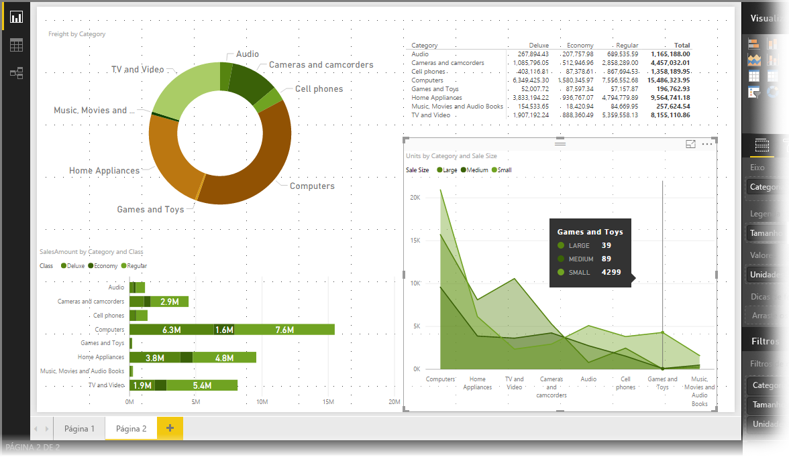
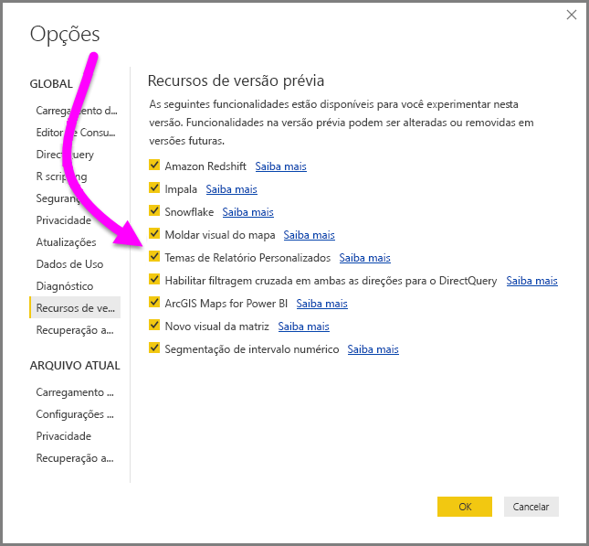
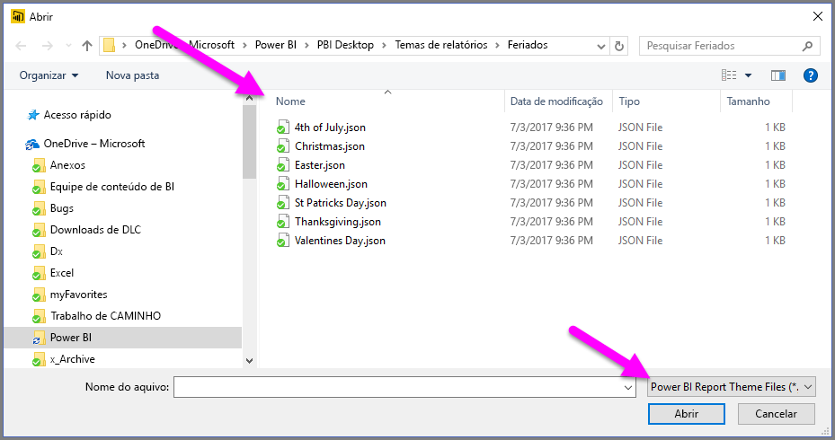
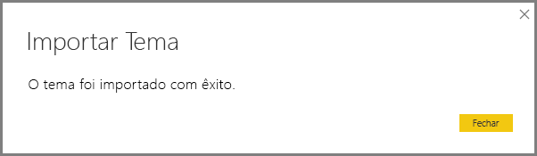
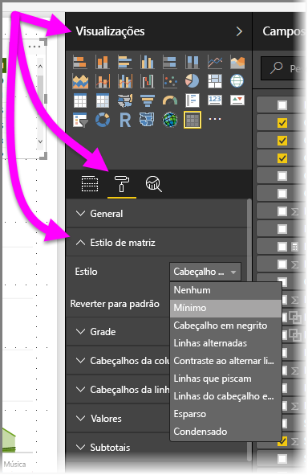
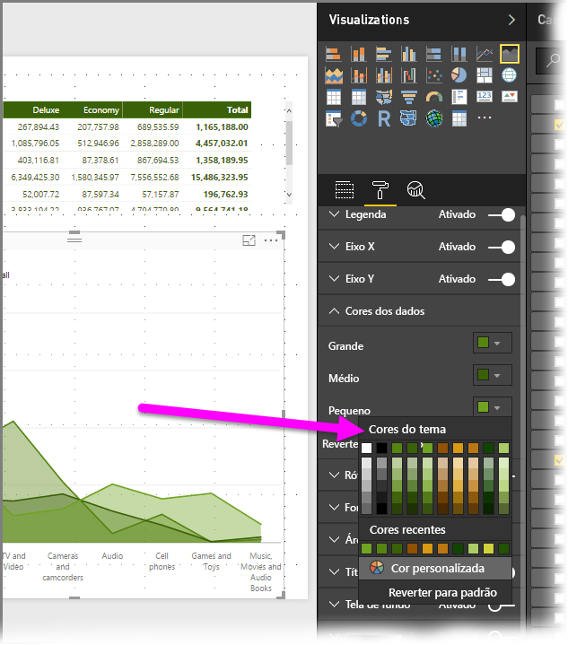
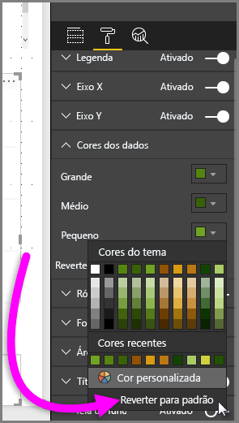
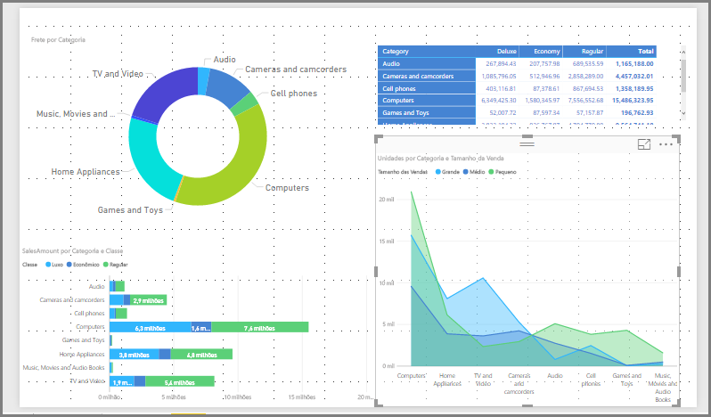
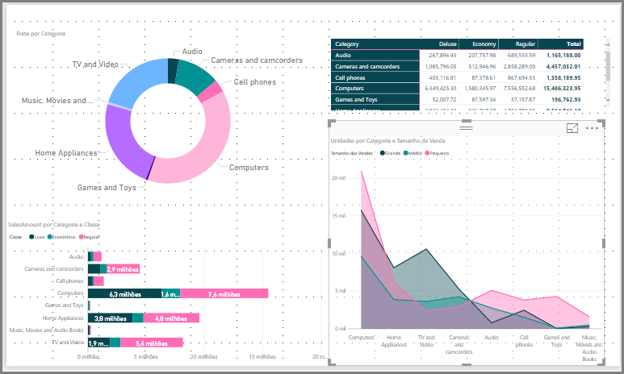
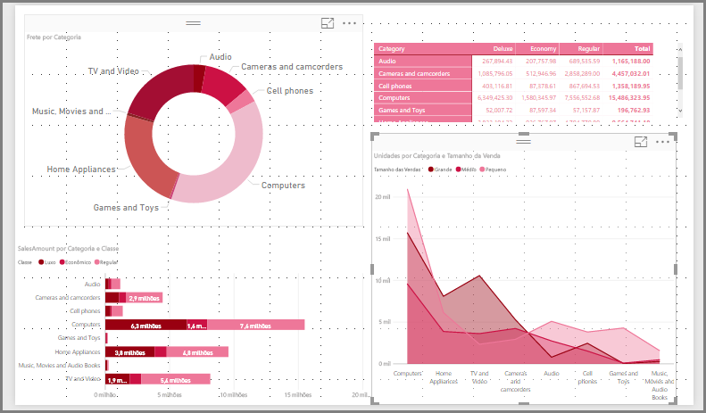

# Usar Temas de Relatório no Power BI Desktop (Visualização)
Com **Temas de Relatório** você pode aplicar um tema de cor ao relatório inteiro, como as cores da empresa, uma coloração sazonal ou qualquer outro tema de cor que você queira aplicar. Quando você aplicar um **Tema de Relatório**, todos os visuais no relatório passarão a usar as cores do tema selecionado (aplicam-se algumas exceções que serão descritas posteriormente neste artigo).

A aplicação de um **Tema de Relatório** requer um arquivo JSON, usando uma estrutura básica, que você pode importar para o Power BI Desktop e aplicar ao relatório. A estrutura do arquivo JSON e o processo de importação (são apenas alguns cliques de botão) são rápidos e fáceis.

A partir da versão de setembro de 2017 do **Power BI Desktop**, você pode definir ainda mais elementos de tema de relatório usando um arquivo JSON, além de personalizar (e padronizar) quase todos os elementos usando o arquivo JSON que pode ser ajustado manualmente no painel **Formatação**. A meta da versão de setembro de 2017 (e posterior) é permitir o controle completo sobre a aparência dos relatórios em um nível granular.

### Habilitar Temas de Relatório na Visualização
Você pode experimentar o novo recurso **Temas de Relatório** a partir da versão de **março de 2017** do **Power BI Desktop**. Para habilitar esse recurso da visualização, selecione **Arquivo > Opções e Configurações > Opções > Recursos da Visualização**, em seguida, marque a caixa de seleção ao lado de **Temas de Relatório Personalizados**. Você precisará reiniciar o **Power BI Desktop** depois de fazer a seleção.

## Como os temas de relatório funcionam
Para aplicar um Tema de Relatório em um relatório do Power BI Desktop, selecione o botão **Mudar Tema** na faixa de opções **Início** e selecione **Importar Tema** na lista suspensa.

Será exibida uma janela permitindo navegar até o local do arquivo de tema JSON. O Power BI Desktop procura arquivos .JSON, que é o tipo de Arquivo de Tema de Relatório do Power BI. Na imagem a seguir, alguns arquivos de tema de feriado estão disponíveis. Vamos escolher um tema de feriado que acontece em março.

Quando o arquivo de tema é carregado com êxito, o Power BI Desktop emite essa informação.

Agora que já importamos um arquivo de tema, vamos examinar a estrutura simples e fácil do arquivo JSON.

## Estrutura de um arquivo JSON de Tema de Relatório
O arquivo JSON básico selecionado na seção anterior (o arquivo *St Patricks Day.json*), quando aberto em um editor, é semelhante ao mostrado a seguir.

Esse arquivo JSON tem as seguintes linhas necessários:

* **name** – esse é o nome do tema, que é o único campo obrigatório
* **dataColors** – uma lista de códigos hexadecimais de cores a serem usados para dados nos visuais do Power BI Desktop. A lista pode conter quantas cores forem desejadas
* **background**, **foreground** e **tableAccent** – esses valores são as cores que devem ser usadas em visuais de **tabela** e **matriz**. A maneira como você usa essas cores depende do estilo específico de tabela ou matriz aplicado. Os visuais de **tabela** e de **matriz** aplicam esses estilos por padrão.

Para aplicar um estilo em um visual de **tabela** ou **matriz**, selecione o visual e no painel **Visualizações**, selecione a seção **Formato** e, em seguida, expanda **Estilo da matriz** e selecione um estilo na lista suspensa **Estilo**.

Para criar seu próprio arquivo JSON facilmente recortando e colando, aqui está o texto do arquivo *St Patricks Day.json*:

    {
        "name": "St Patricks Day",
        "dataColors": ["#568410", "#3A6108", "#70A322", "#915203", "#D79A12", "#bb7711", "#114400", "#aacc66"],
        "background":"#FFFFFF",
        "foreground": "#3A6108",
        "tableAccent": "#568410"
    }

A partir daí, você pode inserir seu próprio código hexadecimal de cor para as cores selecionados.

A partir da versão de setembro de 2017 do **Power BI Desktop**, o arquivo JSON pode ser muito mais sofisticado. No arquivo JSON, você apenas define a formatação que deseja afetar e tudo *não* especificado no arquivo JSON simplesmente é revertido para as configurações padrão do Power BI.

As vantagens de criar um arquivo JSON são muitas. Por exemplo, você pode especificar que todos os gráficos usem o tamanho da fonte 12, que alguns visuais usem uma família de fontes específica ou desligar rótulos de dados em tipos de gráfico específicos.

Com a capacidade de usar um arquivo JSON granular, você pode criar um arquivo de tema que padroniza os gráficos e os relatórios, facilitando a consistência entre os relatórios de sua organização.

Para obter informações sobre o formato do arquivo JSON detalhado, consulte a seção **Formato de arquivo JSON de tema do relatório** ao final deste artigo.

## Como as cores do Tema de Relatório permanecem nos relatórios
Quando você publica o relatório no **Serviço do Power BI**, as cores do Tema de Relatório permanecem nele.

Além disso, a seção **Cores de dados** do painel **Formato** refletem o Tema de Relatório. Por exemplo, depois de aplicar a variedade de cores verdes e marrons do tema **Dia de São Patrício**, ao selecionar um visual e acessar **Formato > Cores de dados** aparece o seguinte.

Viu todo esse verde? Isso ocorre porque essas cores faziam parte do **Tema de Relatório** importado e aplicado.

### Situações em que as cores do Tema de Relatório não permanecerão nos relatórios
Se você aplicar um conjunto de cores personalizadas (ou uma cor individual) a um ponto de dados específico em um visual, aplicar um Tema de Relatório *não* substituirá essa cor personalizada do ponto dados.

Além disso, se você definir manualmente a cor de um ponto de dados usando a seção Cores do tema da paleta de cores, essa cor (ou cores) *não* serão atualizadas quando você aplicar um novo Tema de Relatório. Para retornar às cores padrão (de modo que elas sejam atualizadas ao aplicar um novo Tema de Relatório), você pode selecionar **Reverter para padrão** na paleta **Cores do tema**.

Além disso, muitos **Visuais Personalizados** não aplicam os Temas de Relatório.

## Arquivos de Tema de Relatório que você pode usar agora
Deseja começar a usar **Temas de Relatório**? Ótimo! Aqui estão alguns arquivos de JSON de Tema de Relatório prontos que você pode baixar e importar no relatório **Power BI Desktop**, juntamente com uma imagem desse Tema de Relatório aplicada ao relatório usado neste artigo.

* O [tema](https://go.microsoft.com/fwlink/?linkid=843924) usado na [postagem no blog](https://powerbi.microsoft.com/blog/power-bi-desktop-march-feature-summary/) que anunciou a primeira versão dos **Temas de Relatório** chamava [*waveform.json*](https://go.microsoft.com/fwlink/?linkid=843924).

* O [tema mais adequado para portadores de deficiências visuais](https://go.microsoft.com/fwlink/?linkid=843923) do que o tema de cores padrão chamava [*ColorblindSafe-Longer.json*](https://go.microsoft.com/fwlink/?linkid=843923).

* Vários [Temas do Power View](https://go.microsoft.com/fwlink/?linkid=843925) encapsulados em um arquivo zip, incluindo um que é chamado de [*Apothecary.json*](https://go.microsoft.com/fwlink/?linkid=843925), são mostrados abaixo.

* Por fim, aqui está um que é lindo (o tema *Valentine's Day*) e que certamente chamará sua atenção.

Em vez de um download, aqui está o código do arquivo JSON do Valentine's day:

    {
        "name": "Valentine's Day",
        "dataColors": ["#990011", "#cc1144", "#ee7799", "#eebbcc", "#cc4477", "#cc5555", "#882222", "#A30E33"],
        "background":"#FFFFFF",
        "foreground": "#ee7799",
        "tableAccent": "#990011"
    }

Os **Temas de Relatório** permitem que seus relatórios do Power BI Desktop reflitam as suas cores ou as cores da organização, da estação ou do feriado atual. Aproveite, é fácil!

Aqui estão alguns mais temas de relatório, que você também pode usar como pontos de partida:

* [Girassol-crepúsculo](https://community.powerbi.com/t5/Themes-Gallery/Sunflower-Twilight/m-p/140749)
* [Ameixa](https://community.powerbi.com/t5/Themes-Gallery/Plum/m-p/140711)
* [Outono](https://community.powerbi.com/t5/Themes-Gallery/Autumn/m-p/140746)
* [Alto contraste](https://community.powerbi.com/t5/Themes-Gallery/Color-Blind-Friendly/m-p/140597)

## Formato de arquivo JSON de tema do relatório
O arquivo JSON básico tem cinco linhas obrigatórias:

* **name** – esse é o nome do tema, que é o único campo obrigatório
* **dataColors** – uma lista de códigos hexadecimais de cores a serem usados para dados nos visuais do Power BI Desktop. A lista pode conter quantas cores forem desejadas
* **background**, **foreground** e **tableAccent** – esses valores são as cores que devem ser usadas em visuais de **tabela** e **matriz**. A maneira em que essas cores são usadas depende do estilo específico de tabela ou matriz aplicado. Os visuais de **tabela** e de **matriz** aplicam esses estilos por padrão.

Para criar um arquivo JSON em um formato estendido, com um controle granular e mais detalhado sobre a formatação, você precisa adicionar uma seção **visualStyles** ao arquivo JSON e aninhar as especificações de formatação nessa seção. O formato da seção **visualStyles** é parecido com o seguinte:

    visualStyles: {
        visualName: {
            styleName: {
                cardName: [{
                    propertyName: propertyValue
                }]
            }
        }
    }

Para as seções **visualName** e **cardName**, você poderá listar um visual e cardName específicos ou usar um asterisco (“\*”) se desejar que a configuração seja aplicada a todos os visuais ou cartões que contêm uma propriedade para um visual específico. Você poderá usar o asterisco (“\*”) quando desejar aplicar uma configuração globalmente no relatório, como um tamanho da fonte ou uma família de fontes específica que deve ser usada em todos os visuais do relatório.

> [!NOTE]
> Você só precisa especificar os elementos de formatação que quer afetar. Os elementos de formatação não incluídos no arquivo JSON simplesmente são revertidos para as configurações e os valores padrão.
> 
> 

### Definições de elemento do arquivo JSON
As tabelas nesta seção definem os nomes de visual (*visualName*), os nomes de cartão (*cardName*) e as enumerações necessárias para criação do arquivo JSON.

Ao usar *dateTime*, a data deve ser uma data ISO entre aspas simples, com o datetime no início, semelhante ao seguinte:

    “datetime’2011-10-05T14:48:00.000Z’”

Os boolianos são *true* ou *false*. As cadeias de caracteres devem estar entre aspas duplas, como em “esta é uma cadeia de caracteres”.

| **visualName** |
| --- |
| areaChart |
| barChart |
| basicShape |
| cartão |
| clusteredBarChart |
| clusteredColumnChart |
| columnChart |
| comboChart |
| donutChart |
| filledMap |
| funil |
| medidor |
| hundredPercentStackedBarChart |
| hundredPercentStackedColumnChart |
| image |
| kpi |
| lineChart |
| lineClusteredColumnComboChart |
| lineStackedColumnComboChart |
| mapa |
| multiRowCard |
| pieChart |
| pivotTable |
| ribbonChart |
| scatterChart |
| shapeMap |
| segmentação de dados |
| stackedAreaChart |
| tableEx |
| mapa de árvore |
| waterfallChart |

A tabela a seguir define os valores de *cardName*. O primeiro valor de cada célula é o termo do arquivo JSON e o segundo valor é o nome do cartão como visto na interface do usuário do **Power BI Desktop**.

| **cardName** |
| --- |
| axis: eixo do Medidor |
| breakdown: Divisão |
| bubbles: Bolhas |
| calloutValue: Valor do Balão |
| card: Cartão |
| cardTitle: Título do Cartão |
| categoryAxis: Eixo X |
| categoryLabels: Rótulos de categoria |
| columnFormatting: Formatação de campo |
| columnHeaders: Cabeçalhos de coluna |
| dataLabels: Rótulos de dados |
| fill: Preenchimento |
| fillPoint: Ponto de preenchimento |
| forecast: Previsão |
| general: Geral |
| goals: Metas |
| grid: Grade |
| header: Cabeçalho |
| imageScaling: Dimensionamento |
| indicator: Indicador |
| items: Itens |
| labels: Rótulos de dados |
| legend: Legenda |
| lineStyles: Formas |
| mapControls: Controles de mapa |
| mapStyles: Estilos de mapa |
| numericInputStyle: Entradas numéricas |
| percentBarLabel: Rótulo de Taxa de Conversão |
| plotArea: Área de Plotagem |
| plotAreaShading: Sombreamento de simetria |
| ratioLine: Linha de proporção |
| referenceLine: Linha de constante |
| ribbonChart: Faixas de opções |
| rotation: Rotação |
| rowHeaders: Cabeçalhos de linha |
| selection: Controles de Seleção |
| sentimentColors: Cores de sentimento |
| shape: Forma |
| slider: Controle deslizante |
| status: Codificação de cores |
| subTotals: Subtotais |
| target: Destino |
| total: Total geral |
| trend: Linha de tendência |
| trendline: Eixo de tendência |
| valueAxis: Eixo Y |
| values: Valores |
| wordWrap: Quebra automática de linha |
| xAxisReferenceLine: Linha de Constante do Eixo X |
| y1AxisReferenceLine: Linha de Constante |
| zoom: Zoom |

### Propriedades dentro de cada cartão
A seção a seguir define as propriedades em cada cartão.

    "general":
        "responsive": {
          "type": [
            "bool"
          ],
          "displayName": [
            "(Preview) Responsive"
          ],
          "description": [
            "The visual will adapt to size changes"
          ]
        }
        "legend": {
        "show": {
          "type": [
            "bool"
          ],
          "displayName": [
            "Show"
          ]
        },
        "position": {
          "type": [
            "enumeration"
          ],
          "displayName": [
            "Position"
          ],
          "description": [
            "Select the location for the legend"
          ]
        },
        "showTitle": {
          "type": [
            "bool"
          ],
          "displayName": [
            "Title"
          ],
          "description": [
            "Display a title for legend symbols"
          ]
        },
        "labelColor": {
          "type": [
            "fill"
          ],
          "displayName": [
            "Color"
          ]
        },
        "fontFamily": {
          "type": [
            "formatting"
          ],
          "displayName": [
            "Font family"
          ]
        },
        "fontSize": {
          "type": [
            "formatting"
          ],
          "displayName": [
            "Text Size"
          ]
        }
      },
    "categoryAxis": {
        "show": {
          "type": [
            "bool"
          ],
          "displayName": [
            "Show"
          ]
        },
        "axisScale": {
          "type": [
            "enumeration"
          ],
          "displayName": [
            "Scale type"
          ]
        },
        "start": {
          "type": [
            "numeric",
            "dateTime"
          ],
          "displayName": [
            "Start"
          ],
          "description": [
            "Enter a starting value (optional)"
          ]
        },
        "end": {
          "type": [
            "numeric",
            "dateTime"
          ],
          "displayName": [
            "End"
          ],
          "description": [
            "Enter an ending value (optional)"
          ]
        },
        "axisType": {
          "type": [
            "enumeration"
          ],
          "displayName": [
            "Type"
          ]
        },
        "showAxisTitle": {
          "type": [
            "bool"
          ],
          "displayName": [
            "Title"
          ],
          "description": [
            "Title for the X-axis",
            "Title for the Y-axis"
          ]
        },
        "axisStyle": {
          "type": [
            "enumeration"
          ],
          "displayName": [
            "Style"
          ]
        },
        "labelColor": {
          "type": [
            "fill"
          ],
          "displayName": [
            "Color"
          ]
        },
        "fontFamily": {
          "type": [
            "formatting"
          ],
          "displayName": [
            "Font family"
          ]
        },
        "fontSize": {
          "type": [
            "formatting"
          ],
          "displayName": [
            "Text Size"
          ]
        },
        "labelDisplayUnits": {
          "type": [
            "formatting"
          ],
          "displayName": [
            "Display units"
          ],
          "description": [
            "Select the units (millions, billions, etc.)"
          ]
        },
        "labelPrecision": {
          "type": [
            "numeric"
          ],
          "displayName": [
            "Value decimal places"
          ],
          "description": [
            "Select the number of decimal places to display for the values"
          ]
        },
        "concatenateLabels": {
          "type": [
            "bool"
          ],
          "displayName": [
            "Concatenate labels"
          ],
          "description": [
            "Always concatenate levels of the hierarchy instead of drawing the hierarchy."
          ]
        },
        "preferredCategoryWidth": {
          "type": [
            "numeric"
          ],
          "displayName": [
            "Minimum category width"
          ]
        },
        "titleColor": {
          "type": [
            "fill"
          ],
          "displayName": [
            "Title color"
          ]
        },
        "titleFontFamily": {
          "type": [
            "formatting"
          ],
          "displayName": [
            "Font family"
          ]
        },
        "titleFontSize": {
          "type": [
            "formatting"
          ],
          "displayName": [
            "Title text size"
          ]
        },
        "position": {
          "type": [
            "enumeration"
          ],
          "displayName": [
            "Position"
          ],
          "description": [
            "Select left or right"
          ]
        },
        "color": {
          "type": [
            "fill"
          ],
          "displayName": [
            "Color"
          ],
          "description": [
            "Select color for data labels"
          ]
        },
        "duration": {
          "type": [
            "numeric"
          ]
        }
      },
    "valueAxis": {
        "show": {
          "type": [
            "bool"
          ],
          "displayName": [
            "Show"
          ]
        },
        "position": {
          "type": [
            "enumeration"
          ],
          "displayName": [
            "Position"
          ],
          "description": [
            "Select left or right"
          ]
        },
        "axisScale": {
          "type": [
            "enumeration"
          ],
          "displayName": [
            "Scale type"
          ]
        },
        "start": {
          "type": [
            "numeric",
            "dateTime"
          ],
          "displayName": [
            "Start"
          ],
          "description": [
            "Enter a starting value (optional)"
          ]
        },
        "end": {
          "type": [
            "numeric",
            "dateTime"
          ],
          "displayName": [
            "End"
          ],
          "description": [
            "Enter an ending value (optional)"
          ]
        },
        "showAxisTitle": {
          "type": [
            "bool"
          ],
          "displayName": [
            "Title"
          ],
          "description": [
            "Title for the Y-axis",
            "Title for the X-axis"
          ]
        },
        "axisStyle": {
          "type": [
            "enumeration"
          ],
          "displayName": [
            "Style"
          ]
        },
        "labelColor": {
          "type": [
            "fill"
          ],
          "displayName": [
            "Color"
          ]
        },
        "fontFamily": {
          "type": [
            "formatting"
          ],
          "displayName": [
            "Font family"
          ]
        },
        "fontSize": {
          "type": [
            "formatting"
          ],
          "displayName": [
            "Text Size"
          ]
        },
        "labelDisplayUnits": {
          "type": [
            "formatting"
          ],
          "displayName": [
            "Display units"
          ],
          "description": [
            "Select the units (millions, billions, etc.)"
          ]
        },
        "labelPrecision": {
          "type": [
            "numeric"
          ],
          "displayName": [
            "Value decimal places"
          ],
          "description": [
            "Select the number of decimal places to display for the values"
          ]
        },
        "titleColor": {
          "type": [
            "fill"
          ],
          "displayName": [
            "Title color"
          ]
        },
        "titleFontFamily": {
          "type": [
            "formatting"
          ],
          "displayName": [
            "Font family"
          ]
        },
        "titleFontSize": {
          "type": [
            "formatting"
          ],
          "displayName": [
            "Title text size"
          ]
        },
        "axisLabel": {
          "type": [
            "none"
          ],
          "displayName": [
            "Y-Axis (Column)"
          ]
        },
        "secShow": {
          "type": [
            "bool"
          ],
          "displayName": [
            "Show secondary"
          ]
        },
        "alignZeros": {
          "type": [
            "bool"
          ],
          "displayName": [
            "Align zeros"
          ],
          "description": [
            "Align the zero tick marks for both value axes"
          ]
        },
        "secAxisLabel": {
          "type": [
            "none"
          ],
          "displayName": [
            "Y-Axis (Line)"
          ]
        },
        "secPosition": {
          "type": [
            "enumeration"
          ],
          "displayName": [
            "Position"
          ],
          "description": [
            "Select left or right"
          ]
        },
        "secAxisScale": {
          "type": [
            "enumeration"
          ],
          "displayName": [
            "Scale type"
          ]
        },
        "secStart": {
          "type": [
            "numeric"
          ],
          "displayName": [
            "Start"
          ],
          "description": [
            "Enter a starting value (optional)"
          ]
        },
        "secEnd": {
          "type": [
            "numeric"
          ],
          "displayName": [
            "End"
          ],
          "description": [
            "Enter an ending value (optional)"
          ]
        },
        "secShowAxisTitle": {
          "type": [
            "bool"
          ],
          "displayName": [
            "Title"
          ],
          "description": [
            "Title for the Y-axis"
          ]
        },
        "secAxisStyle": {
          "type": [
            "enumeration"
          ],
          "displayName": [
            "Style"
          ]
        },
        "secLabelColor": {
          "type": [
            "fill"
          ],
          "displayName": [
            "Color"
          ]
        },
        "secFontFamily": {
          "type": [
            "formatting"
          ],
          "displayName": [
            "Font family"
          ]
        },
        "secFontSize": {
          "type": [
            "formatting"
          ],
          "displayName": [
            "Text Size"
          ]
        },
        "secLabelDisplayUnits": {
          "type": [
            "formatting"
          ],
          "displayName": [
            "Display units"
          ],
          "description": [
            "Select the units (millions, billions, etc.)"
          ]
        },
        "secLabelPrecision": {
          "type": [
            "numeric"
          ],
          "displayName": [
            "Value decimal places"
          ],
          "description": [
            "Select the number of decimal places to display for the values"
          ]
        },
        "secTitleColor": {
          "type": [
            "fill"
          ],
          "displayName": [
            "Title color"
          ]
        },
        "secTitleFontFamily": {
          "type": [
            "formatting"
          ],
          "displayName": [
            "Font family"
          ]
        },
        "secTitleFontSize": {
          "type": [
            "formatting"
          ],
          "displayName": [
            "Title text size"
          ]
        }
      },
    "dataPoint": {
        "defaultColor": {
          "type": [
            "fill"
          ],
          "displayName": [
            "Default color",
            "Default Column Color"
          ]
        },
        "fill": {
          "type": [
            "fill"
          ],
          "displayName": [
            "Fill"
          ]
        },
        "defaultCategoryColor": {
          "type": [
            "fill"
          ],
          "displayName": [
            "Default color",
            "Default Column Color"
          ]
        },
        "showAllDataPoints": {
          "type": [
            "bool"
          ],
          "displayName": [
            "Show all"
          ]
        }
      },
    "labels": {
        "show": {
          "type": [
            "bool"
          ],
          "displayName": [
            "Show"
          ]
        },
        "showSeries": {
          "type": [
            "bool"
          ],
          "displayName": [
            "Show"
          ]
        },
        "color": {
          "type": [
            "fill"
          ],
          "displayName": [
            "Color"
          ],
          "description": [
            "Select color for data labels"
          ]
        },
        "labelDisplayUnits": {
          "type": [
            "formatting"
          ],
          "displayName": [
            "Display units"
          ],
          "description": [
            "Select the units (millions, billions, etc.)"
          ]
        },
        "labelPrecision": {
          "type": [
            "numeric"
          ],
          "displayName": [
            "Value decimal places"
          ],
          "description": [
            "Select the number of decimal places to display for the values"
          ]
        },
        "showAll": {
          "type": [
            "bool"
          ],
          "displayName": [
            "Customize series"
          ]
        },
        "fontSize": {
          "type": [
            "formatting"
          ],
          "displayName": [
            "Text Size"
          ]
        },
        "fontFamily": {
          "type": [
            "formatting"
          ],
          "displayName": [
            "Font family"
          ]
        },
        "labelDensity": {
          "type": [
            "formatting"
          ],
          "displayName": [
            "Label density"
          ]
        },
        "labelOrientation": {
          "type": [
            "enumeration"
          ],
          "displayName": [
            "Orientation"
          ]
        },
        "labelPosition": {
          "type": [
            "enumeration"
          ],
          "displayName": [
            "Position"
          ]
        },
        "percentageLabelPrecision": {
          "type": [
            "numeric"
          ],
          "displayName": [
            "% decimal places"
          ],
          "description": [
            "Select the number of decimal places to display for the percentages"
          ]
        },
        "labelStyle": {
          "type": [
            "enumeration"
          ],
          "displayName": [
            "Label style"
          ]
        }
      },
    "lineStyles": {
        "strokeWidth": {
          "type": [
            "numeric"
          ],
          "displayName": [
            "Stroke width"
          ]
        },
        "strokeLineJoin": {
          "type": [
            "enumeration"
          ],
          "displayName": [
            "Join type"
          ]
        },
        "lineStyle": {
          "type": [
            "enumeration"
          ],
          "displayName": [
            "Line style"
          ]
        },
        "showMarker": {
          "type": [
            "bool"
          ],
          "displayName": [
            "Show marker"
          ]
        },
        "markerShape": {
          "type": [
            "enumeration"
          ],
          "displayName": [
            "Marker shape"
          ]
        },
        "markerSize": {
          "type": [
            "numeric"
          ],
          "displayName": [
            "Marker size"
          ]
        },
        "markerColor": {
          "type": [
            "fill"
          ],
          "displayName": [
            "Marker color"
          ]
        },
        "showSeries": {
          "type": [
            "bool"
          ],
          "displayName": [
            "Customize series",
            "Show"
          ]
        },
        "shadeArea": {
          "type": [
            "bool"
          ],
          "displayName": [
            "Shade area"
          ]
        }
      },
    "plotArea": {
        "transparency": {
          "type": [
            "numeric"
          ],
          "displayName": [
            "Transparency"
          ],
          "description": [
            "Set transparency for background color"
          ]
        }
      },
    "trend": {
        "show": {
          "type": [
            "bool"
          ],
          "displayName": [
            "Show"
          ]
        },
        "displayName": {
          "type": [
            "text"
          ],
          "displayName": [
            "Name"
          ],
          "description": [
            "Set trend line name"
          ]
        },
        "lineColor": {
          "type": [
            "fill"
          ],
          "displayName": [
            "Color"
          ],
          "description": [
            "Set trend line color"
          ]
        },
        "transparency": {
          "type": [
            "numeric"
          ],
          "displayName": [
            "Transparency"
          ],
          "description": [
            "Set transparency for trend line color"
          ]
        },
        "style": {
          "type": [
            "enumeration"
          ],
          "displayName": [
            "Style"
          ],
          "description": [
            "Set trend line style"
          ]
        },
        "combineSeries": {
          "type": [
            "bool"
          ],
          "displayName": [
            "Combine Series"
          ],
          "description": [
            "Show one trend line per series or combine"
          ]
        }
      },
      "y1AxisReferenceLine": {
        "show": {
          "type": [
            "bool"
          ],
          "displayName": [
            "Show"
          ]
        },
        "value": {
          "type": [
            "numeric"
          ],
          "displayName": [
            "Value"
          ],
          "description": [
            "Set reference line numeric value "
          ]
        },
        "lineColor": {
          "type": [
            "fill"
          ],
          "displayName": [
            "Color"
          ],
          "description": [
            "Set reference line color"
          ]
        },
        "transparency": {
          "type": [
            "numeric"
          ],
          "displayName": [
            "Transparency"
          ],
          "description": [
            "Set transparency for reference line color"
          ]
        },
        "style": {
          "type": [
            "enumeration"
          ],
          "displayName": [
            "Line style"
          ]
        },
        "position": {
          "type": [
            "enumeration"
          ],
          "displayName": [
            "Position"
          ],
          "description": [
            "Arrange relative to chart data points"
          ]
        },
        "dataLabelShow": {
          "type": [
            "bool"
          ],
          "displayName": [
            "Data label"
          ],
          "description": [
            "Display a data label for the reference line"
          ]
        },
        "dataLabelColor": {
          "type": [
            "fill"
          ],
          "displayName": [
            "Color"
          ],
          "description": [
            "Set the reference line data label color"
          ]
        },
        "dataLabelDecimalPoints": {
          "type": [
            "numeric"
          ],
          "displayName": [
            "Decimal Places"
          ]
        },
        "dataLabelHorizontalPosition": {
          "type": [
            "enumeration"
          ],
          "displayName": [
            "Horizontal Position"
          ],
          "description": [
            "Set the horizontal position for the reference line data label"
          ]
        },
        "dataLabelVerticalPosition": {
          "type": [
            "enumeration"
          ],
          "displayName": [
            "Vertical Position"
          ],
          "description": [
            "Set the vertical position for the reference line data label"
          ]
        },
        "dataLabelDisplayUnits": {
          "type": [
            "formatting"
          ],
          "displayName": [
            "Display units"
          ],
          "description": [
            "Select the units (millions, billions, etc.)"
          ]
        }
      },
    "referenceLine": {
        "show": {
          "type": [
            "bool"
          ],
          "displayName": [
            "Show"
          ]
        },
        "displayName": {
          "type": [
            "text"
          ],
          "displayName": [
            "Name"
          ],
          "description": [
            "Set reference line name"
          ]
        },
        "value": {
          "type": [
            "numeric"
          ],
          "displayName": [
            "Value"
          ],
          "description": [
            "Set reference line numeric value "
          ]
        },
        "lineColor": {
          "type": [
            "fill"
          ],
          "displayName": [
            "Color"
          ],
          "description": [
            "Set reference line color"
          ]
        },
        "transparency": {
          "type": [
            "numeric"
          ],
          "displayName": [
            "Transparency"
          ],
          "description": [
            "Set transparency for reference line color"
          ]
        },
        "style": {
          "type": [
            "enumeration"
          ],
          "displayName": [
            "Line style"
          ]
        },
        "position": {
          "type": [
            "enumeration"
          ],
          "displayName": [
            "Position"
          ],
          "description": [
            "Arrange relative to chart data points"
          ]
        },
        "dataLabelShow": {
          "type": [
            "bool"
          ],
          "displayName": [
            "Data label"
          ],
          "description": [
            "Display a data label for the reference line"
          ]
        },
        "dataLabelColor": {
          "type": [
            "fill"
          ],
          "displayName": [
            "Color"
          ],
          "description": [
            "Set the reference line data label color"
          ]
        },
        "dataLabelDecimalPoints": {
          "type": [
            "numeric"
          ],
          "displayName": [
            "Decimal Places"
          ]
        },
        "dataLabelHorizontalPosition": {
          "type": [
            "enumeration"
          ],
          "displayName": [
            "Horizontal Position"
          ],
          "description": [
            "Set the horizontal position for the reference line data label"
          ]
        },
        "dataLabelVerticalPosition": {
          "type": [
            "enumeration"
          ],
          "displayName": [
            "Vertical Position"
          ],
          "description": [
            "Set the vertical position for the reference line data label"
          ]
        },
        "dataLabelDisplayUnits": {
          "type": [
            "formatting"
          ],
          "displayName": [
            "Display units"
          ],
          "description": [
            "Select the units (millions, billions, etc.)"
          ]
        }
      },
    "line": {
        "lineColor": {
          "type": [
            "fill"
          ],
          "displayName": [
            "Line color"
          ]
        },
        "transparency": {
          "type": [
            "numeric"
          ],
          "displayName": [
            "Transparency"
          ],
          "description": [
            "Set transparency for background color"
          ]
        },
        "weight": {
          "type": [
            "numeric"
          ],
          "displayName": [
            "Weight"
          ]
        },
        "roundEdge": {
          "type": [
            "numeric"
          ],
          "displayName": [
            "Round edges"
          ]
        }
      },
    "fill": {
        "show": {
          "type": [
            "bool"
          ],
          "displayName": [
            "Show"
          ]
        },
        "fillColor": {
          "type": [
            "fill"
          ],
          "displayName": [
            "Fill color"
          ]
        },
        "transparency": {
          "type": [
            "numeric"
          ],
          "displayName": [
            "Transparency"
          ],
          "description": [
            "Set transparency for background color"
          ]
        }
      },
    "rotation": {
        "angle": {
          "type": [
            "numeric"
          ],
          "displayName": [
            "Rotation"
          ]
        }
      },
    "categoryLabels": {
        "show": {
          "type": [
            "bool"
          ],
          "displayName": [
            "Show"
          ]
        },
        "color": {
          "type": [
            "fill"
          ],
          "displayName": [
            "Color"
          ],
          "description": [
            "Select color for data labels"
          ]
        },
        "fontSize": {
          "type": [
            "formatting"
          ],
          "displayName": [
            "Text Size"
          ]
        },
        "fontFamily": {
          "type": [
            "formatting"
          ],
          "displayName": [
            "Font family"
          ]
        }
      },
    "wordWrap": {
        "show": {
          "type": [
            "bool"
          ],
          "displayName": [
            "Show"
          ]
        }
      },
    "dataLabels": {
        "color": {
          "type": [
            "fill"
          ],
          "displayName": [
            "Color"
          ],
          "description": [
            "Select color for data labels"
          ]
        },
        "fontSize": {
          "type": [
            "formatting"
          ],
          "displayName": [
            "Text Size"
          ]
        },
        "fontFamily": {
          "type": [
            "formatting"
          ],
          "displayName": [
            "Font family"
          ]
        }
      },
    "cardTitle": {
        "color": {
          "type": [
            "fill"
          ],
          "displayName": [
            "Color"
          ],
          "description": [
            "Select color for data labels"
          ]
        },
        "fontSize": {
          "type": [
            "formatting"
          ],
          "displayName": [
            "Text Size"
          ]
        },
        "fontFamily": {
          "type": [
            "formatting"
          ],
          "displayName": [
            "Font family"
          ]
        }
      },
    "card": {
        "outline": {
          "type": [
            "enumeration"
          ],
          "displayName": [
            "Outline"
          ]
        },
        "outlineColor": {
          "type": [
            "fill"
          ],
          "displayName": [
            "Outline color"
          ],
          "description": [
            "Color of the outline"
          ]
        },
        "outlineWeight": {
          "type": [
            "numeric"
          ],
          "displayName": [
            "Outline weight"
          ],
          "description": [
            "Thickness of the outline in pixels"
          ]
        },
        "barShow": {
          "type": [
            "bool"
          ],
          "displayName": [
            "Show bar"
          ],
          "description": [
            "Display a bar to the left side of the card as an accent"
          ]
        },
        "barColor": {
          "type": [
            "fill"
          ],
          "displayName": [
            "Bar color"
          ]
        },
        "barWeight": {
          "type": [
            "numeric"
          ],
          "displayName": [
            "Bar thickness"
          ],
          "description": [
            "Thickness of the bar in pixels"
          ]
        },
        "cardPadding": {
          "type": [
            "numeric"
          ],
          "displayName": [
            "Padding"
          ],
          "description": [
            "Background"
          ]
        },
        "cardBackground": {
          "type": [
            "fill"
          ],
          "displayName": [
            "Background"
          ]
        }
      },
    "percentBarLabel": {
        "show": {
          "type": [
            "bool"
          ],
          "displayName": [
            "Show"
          ]
        },
        "color": {
          "type": [
            "fill"
          ],
          "displayName": [
            "Color"
          ],
          "description": [
            "Select color for data labels"
          ]
        },
        "fontSize": {
          "type": [
            "formatting"
          ],
          "displayName": [
            "Text Size"
          ]
        },
        "fontFamily": {
          "type": [
            "formatting"
          ],
          "displayName": [
            "Font family"
          ]
        }
      },
    "axis": {
        "min": {
          "type": [
            "numeric"
          ],
          "displayName": [
            "Min"
          ]
        },
        "max": {
          "type": [
            "numeric"
          ],
          "displayName": [
            "Max"
          ]
        },
        "target": {
          "type": [
            "numeric"
          ],
          "displayName": [
            "Target"
          ]
        }
      },
    "target": {
        "show": {
          "type": [
            "bool"
          ],
          "displayName": [
            "Show"
          ]
        },
        "color": {
          "type": [
            "fill"
          ],
          "displayName": [
            "Color"
          ],
          "description": [
            "Select color for data labels"
          ]
        },
        "labelDisplayUnits": {
          "type": [
            "formatting"
          ],
          "displayName": [
            "Display units"
          ],
          "description": [
            "Select the units (millions, billions, etc.)"
          ]
        },
        "labelPrecision": {
          "type": [
            "numeric"
          ],
          "displayName": [
            "Value decimal places"
          ],
          "description": [
            "Select the number of decimal places to display for the values"
          ]
        },
        "fontSize": {
          "type": [
            "formatting"
          ],
          "displayName": [
            "Text Size"
          ]
        },
        "fontFamily": {
          "type": [
            "formatting"
          ],
          "displayName": [
            "Font family"
          ]
        }
      },
    "calloutValue": {
        "show": {
          "type": [
            "bool"
          ],
          "displayName": [
            "Show"
          ]
        },
        "color": {
          "type": [
            "fill"
          ],
          "displayName": [
            "Color"
          ],
          "description": [
            "Select color for data labels"
          ]
        },
        "labelDisplayUnits": {
          "type": [
            "formatting"
          ],
          "displayName": [
            "Display units"
          ],
          "description": [
            "Select the units (millions, billions, etc.)"
          ]
        },
        "labelPrecision": {
          "type": [
            "numeric"
          ],
          "displayName": [
            "Value decimal places"
          ],
          "description": [
            "Select the number of decimal places to display for the values"
          ]
        }
      },
    "forecast": {
        "show": {
          "type": [
            "bool"
          ],
          "displayName": [
            "Show"
          ]
        },
        "displayName": {
          "type": [
            "text"
          ],
          "displayName": [
            "Name"
          ],
          "description": [
            "Set forecast name"
          ]
        },
        "confidenceBandStyle": {
          "type": [
            "enumeration"
          ],
          "displayName": [
            "Confidence band style"
          ],
          "description": [
            "Set forecast confidence band style"
          ]
        },
        "lineColor": {
          "type": [
            "fill"
          ],
          "displayName": [
            "Color"
          ],
          "description": [
            "Set forecast line color"
          ]
        },
        "transparency": {
          "type": [
            "numeric"
          ],
          "displayName": [
            "Transparency"
          ],
          "description": [
            "Set transparency for background color"
          ]
        },
        "style": {
          "type": [
            "enumeration"
          ],
          "displayName": [
            "Line style"
          ]
        },
        "transform": {
          "type": [
            "queryTransform"
          ]
        }
      },
    "bubbles": {
        "bubbleSize": {
          "type": [
            "formatting"
          ],
          "displayName": [
            "Size"
          ]
        }
      },
    "mapControls": {
        "autoZoom": {
          "type": [
            "bool"
          ],
          "displayName": [
            "Auto zoom"
          ]
        },
        "zoomLevel": {
          "type": [
            "numeric"
          ]
        },
        "centerLatitude": {
          "type": [
            "numeric"
          ]
        },
        "centerLongitude": {
          "type": [
            "numeric"
          ]
        }
      },
    "mapStyles": {
        "mapTheme": {
          "type": [
            "enumeration"
          ],
          "displayName": [
            "Theme"
          ]
        }
      },
    "shape": {
        "map": {
          "type": [
            "geoJson"
          ]
        },
        "projectionEnum": {
          "type": [
            "enumeration"
          ],
          "displayName": [
            "Projection"
          ],
          "description": [
            "Projection"
          ]
        }
      },
    "zoom": {
        "autoZoom": {
          "type": [
            "bool"
          ],
          "displayName": [
            "Auto zoom"
          ],
          "description": [
            "Zoom in on shapes with available data"
          ]
        },
        "selectionZoom": {
          "type": [
            "bool"
          ],
          "displayName": [
            "Selection zoom"
          ],
          "description": [
            "Zoom in on selected shapes"
          ]
        },
        "manualZoom": {
          "type": [
            "bool"
          ],
          "displayName": [
            "Manual zoom"
          ],
          "description": [
            "Allow user to zoom and pan"
          ]
        }
      },
    "xAxisReferenceLine": {
        "show": {
          "type": [
            "bool"
          ],
          "displayName": [
            "Show"
          ]
        },
        "value": {
          "type": [
            "numeric"
          ],
          "displayName": [
            "Value"
          ],
          "description": [
            "Set reference line numeric value "
          ]
        },
        "lineColor": {
          "type": [
            "fill"
          ],
          "displayName": [
            "Color"
          ],
          "description": [
            "Set reference line color"
          ]
        },
        "transparency": {
          "type": [
            "numeric"
          ],
          "displayName": [
            "Transparency"
          ],
          "description": [
            "Set transparency for reference line color"
          ]
        },
        "style": {
          "type": [
            "enumeration"
          ],
          "displayName": [
            "Line style"
          ]
        },
        "position": {
          "type": [
            "enumeration"
          ],
          "displayName": [
            "Position"
          ],
          "description": [
            "Arrange relative to chart data points"
          ]
        },
        "dataLabelShow": {
          "type": [
            "bool"
          ],
          "displayName": [
            "Data label"
          ],
          "description": [
            "Display a data label for the reference line"
          ]
        },
        "dataLabelColor": {
          "type": [
            "fill"
          ],
          "displayName": [
            "Color"
          ],
          "description": [
            "Set the reference line data label color"
          ]
        },
        "dataLabelDecimalPoints": {
          "type": [
            "numeric"
          ],
          "displayName": [
            "Decimal Places"
          ]
        },
        "dataLabelHorizontalPosition": {
          "type": [
            "enumeration"
          ],
          "displayName": [
            "Horizontal Position"
          ],
          "description": [
            "Set the horizontal position for the reference line data label"
          ]
        },
        "dataLabelVerticalPosition": {
          "type": [
            "enumeration"
          ],
          "displayName": [
            "Vertical Position"
          ],
          "description": [
            "Set the vertical position for the reference line data label"
          ]
        },
        "dataLabelDisplayUnits": {
          "type": [
            "formatting"
          ],
          "displayName": [
            "Display units"
          ],
          "description": [
            "Select the units (millions, billions, etc.)"
          ]
        }
      },
    "fillPoint": {
        "show": {
          "type": [
            "bool"
          ],
          "displayName": [
            "Show"
          ]
        }
      },
    "colorByCategory": {
        "show": {
          "type": [
            "bool"
          ],
          "displayName": [
            "Show"
          ]
        }
      },
    "plotAreaShading": {
        "show": {
          "type": [
            "bool"
          ],
          "displayName": [
            "Show"
          ]
        },
        "upperShadingColor": {
          "type": [
            "fill"
          ],
          "displayName": [
            "Upper shading"
          ],
          "description": [
            "Shading color of the upper region"
          ]
        },
        "lowerShadingColor": {
          "type": [
            "fill"
          ],
          "displayName": [
            "Lower shading"
          ],
          "description": [
            "Shading color of the lower region"
          ]
        },
        "transparency": {
          "type": [
            "numeric"
          ],
          "displayName": [
            "Transparency"
          ],
          "description": [
            "Set transparency for background color"
          ]
        }
      },
    "ratioLine": {
        "show": {
          "type": [
            "bool"
          ],
          "displayName": [
            "Show"
          ]
        },
        "lineColor": {
          "type": [
            "fill"
          ],
          "displayName": [
            "Color"
          ],
          "description": [
            "Set reference line color"
          ]
        },
        "transparency": {
          "type": [
            "numeric"
          ],
          "displayName": [
            "Transparency"
          ],
          "description": [
            "Set transparency for line color"
          ]
        },
        "style": {
          "type": [
            "enumeration"
          ],
          "displayName": [
            "Line style"
          ]
        }
      },
    "grid": {
        "outlineColor": {
          "type": [
            "fill"
          ],
          "displayName": [
            "Outline color"
          ],
          "description": [
            "Color of the outline"
          ]
        },
        "outlineWeight": {
          "type": [
            "numeric"
          ],
          "displayName": [
            "Outline weight"
          ],
          "description": [
            "Thickness of the outline in pixels"
          ]
        },
        "gridVertical": {
          "type": [
            "bool"
          ],
          "displayName": [
            "Vert grid"
          ],
          "description": [
            "Show/Hide the vertical gridlines"
          ]
        },
        "gridVerticalColor": {
          "type": [
            "fill"
          ],
          "displayName": [
            "Vert grid color"
          ],
          "description": [
            "Color for the vertical gridlines"
          ]
        },
        "gridVerticalWeight": {
          "type": [
            "numeric"
          ],
          "displayName": [
            "Vert grid thickness"
          ],
          "description": [
            "Thickness of the vertical gridlines in pixels"
          ]
        },
        "gridHorizontal": {
          "type": [
            "bool"
          ],
          "displayName": [
            "Horiz grid"
          ],
          "description": [
            "Show/Hide the horizontal gridlines"
          ]
        },
        "gridHorizontalColor": {
          "type": [
            "fill"
          ],
          "displayName": [
            "Horiz grid color"
          ],
          "description": [
            "Color for the horizontal gridlines"
          ]
        },
        "gridHorizontalWeight": {
          "type": [
            "numeric"
          ],
          "displayName": [
            "Horiz grid thickness"
          ],
          "description": [
            "Thickness of the horizontal gridlines in pixels"
          ]
        },
        "rowPadding": {
          "type": [
            "numeric"
          ],
          "displayName": [
            "Row padding"
          ],
          "description": [
            "Padding in pixels applied to top and bottom of every row"
          ]
        },
        "imageHeight": {
          "type": [
            "numeric"
          ],
          "displayName": [
            "Image height"
          ],
          "description": [
            "The height of images in pixels"
          ]
        },
        "textSize": {
          "type": [
            "numeric"
          ],
          "displayName": [
            "Text Size"
          ]
        }
      },
    "columnHeaders": {
        "outline": {
          "type": [
            "enumeration"
          ],
          "displayName": [
            "Outline"
          ]
        },
        "fontColor": {
          "type": [
            "fill"
          ],
          "displayName": [
            "Font color"
          ],
          "description": [
            "Font color of the cells"
          ]
        },
        "backColor": {
          "type": [
            "fill"
          ],
          "displayName": [
            "Background color"
          ],
          "description": [
            "Background color of the cells"
          ]
        },
        "wordWrap": {
          "type": [
            "bool"
          ],
          "displayName": [
            "Word wrap"
          ]
        },
        "fontFamily": {
          "type": [
            "formatting"
          ],
          "displayName": [
            "Font family"
          ]
        },
        "fontSize": {
          "type": [
            "formatting"
          ],
          "displayName": [
            "Text Size"
          ]
        },
        "autoSizeColumnWidth": {
          "type": [
            "bool"
          ],
          "displayName": [
            "Auto-size column width"
          ]
        },
        "urlIcon": {
          "type": [
            "bool"
          ],
          "displayName": [
            "URL icon"
          ],
          "description": [
            "Show an icon instead of the full URL"
          ]
        }
      },
    "values": {
        "outline": {
          "type": [
            "enumeration"
          ],
          "displayName": [
            "Outline"
          ]
        },
        "backColor": {
          "type": [
            "fill"
          ],
          "displayName": [
            "Color scales"
          ]
        },
        "fontColorPrimary": {
          "type": [
            "fill"
          ],
          "displayName": [
            "Font color"
          ],
          "description": [
            "Font color of the odd rows"
          ]
        },
        "backColorPrimary": {
          "type": [
            "fill"
          ],
          "displayName": [
            "Background color"
          ],
          "description": [
            "Background color of the odd rows"
          ]
        },
        "fontColorSecondary": {
          "type": [
            "fill"
          ],
          "displayName": [
            "Alternate font color"
          ],
          "description": [
            "Font color of the even rows"
          ]
        },
        "backColorSecondary": {
          "type": [
            "fill"
          ],
          "displayName": [
            "Alternate background color"
          ],
          "description": [
            "Background color of the even rows"
          ]
        },
        "urlIcon": {
          "type": [
            "bool"
          ],
          "displayName": [
            "URL icon"
          ],
          "description": [
            "Show an icon instead of the full URL"
          ]
        },
        "fontFamily": {
          "type": [
            "formatting"
          ],
          "displayName": [
            "Font family"
          ]
        },
        "fontSize": {
          "type": [
            "formatting"
          ],
          "displayName": [
            "Text Size"
          ]
        },
        "wordWrap": {
          "type": [
            "bool"
          ],
          "displayName": [
            "Word wrap"
          ]
        },
        "bandedRowHeaders": {
          "type": [
            "bool"
          ],
          "displayName": [
            "Banded row style"
          ],
          "description": [
            "Apply banded row style to the last level of the row group headers, using the colors of the values."
          ]
        },
        "valuesOnRow": {
          "type": [
            "bool"
          ],
          "displayName": [
            "Show on rows"
          ],
          "description": [
            "Show values in row groups rather than columns"
          ]
        }
      },
    "total": {
        "outline": {
          "type": [
            "enumeration"
          ],
          "displayName": [
            "Outline"
          ]
        },
        "fontColor": {
          "type": [
            "fill"
          ],
          "displayName": [
            "Font color"
          ],
          "description": [
            "Font color of the cells"
          ]
        },
        "backColor": {
          "type": [
            "fill"
          ],
          "displayName": [
            "Background color"
          ],
          "description": [
            "Background color of the cells"
          ]
        },
        "applyToHeaders": {
          "type": [
            "bool"
          ],
          "displayName": [
            "Apply to labels"
          ]
        },
        "totals": {
          "type": [
            "bool"
          ],
          "displayName": [
            "Totals"
          ]
        },
        "fontFamily": {
          "type": [
            "formatting"
          ],
          "displayName": [
            "Font family"
          ]
        },
        "fontSize": {
          "type": [
            "formatting"
          ],
          "displayName": [
            "Text Size"
          ]
        }
      },
    "columnFormatting": {
        "fontColor": {
          "type": [
            "fill"
          ],
          "displayName": [
            "Font color"
          ],
          "description": [
            "Font color of the cells"
          ]
        },
        "backColor": {
          "type": [
            "fill"
          ],
          "displayName": [
            "Background color"
          ],
          "description": [
            "Background color of the cells"
          ]
        },
        "styleHeader": {
          "type": [
            "bool"
          ],
          "displayName": [
            "Color header"
          ]
        },
        "styleValues": {
          "type": [
            "bool"
          ],
          "displayName": [
            "Color values"
          ]
        },
        "styleTotal": {
          "type": [
            "bool"
          ],
          "displayName": [
            "Color total"
          ]
        },
        "styleSubtotals": {
          "type": [
            "bool"
          ],
          "displayName": [
            "Color subtotals"
          ]
        }
      },
    "rowHeaders": {
        "outline": {
          "type": [
            "enumeration"
          ],
          "displayName": [
            "Outline"
          ]
        },
        "fontColor": {
          "type": [
            "fill"
          ],
          "displayName": [
            "Font color"
          ],
          "description": [
            "Font color of the cells"
          ]
        },
        "backColor": {
          "type": [
            "fill"
          ],
          "displayName": [
            "Background color"
          ],
          "description": [
            "Background color of the cells"
          ]
        },
        "wordWrap": {
          "type": [
            "bool"
          ],
          "displayName": [
            "Word wrap"
          ]
        },
        "fontFamily": {
          "type": [
            "formatting"
          ],
          "displayName": [
            "Font family"
          ]
        },
        "fontSize": {
          "type": [
            "formatting"
          ],
          "displayName": [
            "Text Size"
          ]
        },
        "stepped": {
          "type": [
            "bool"
          ],
          "displayName": [
            "Stepped layout"
          ],
          "description": [
            "Render row headers with stepped layout"
          ]
        },
        "steppedLayoutIndentation": {
          "type": [
            "numeric"
          ],
          "displayName": [
            "Stepped layout indentation"
          ],
          "description": [
            "Set the indentation, in pixels, applied to row headers"
          ]
        },
        "urlIcon": {
          "type": [
            "bool"
          ],
          "displayName": [
            "URL icon"
          ],
          "description": [
            "Show an icon instead of the full URL"
          ]
        }
      },
    "subTotals": {
        "outline": {
          "type": [
            "enumeration"
          ],
          "displayName": [
            "Outline"
          ]
        },
        "fontColor": {
          "type": [
            "fill"
          ],
          "displayName": [
            "Font color"
          ],
          "description": [
            "Font color of the cells"
          ]
        },
        "backColor": {
          "type": [
            "fill"
          ],
          "displayName": [
            "Background color"
          ],
          "description": [
            "Background color of the cells"
          ]
        },
        "fontFamily": {
          "type": [
            "formatting"
          ],
          "displayName": [
            "Font family"
          ]
        },
        "fontSize": {
          "type": [
            "formatting"
          ],
          "displayName": [
            "Text Size"
          ]
        },
        "rowSubtotals": {
          "type": [
            "bool"
          ],
          "displayName": [
            "Total row"
          ]
        },
        "columnSubtotals": {
          "type": [
            "bool"
          ],
          "displayName": [
            "Total column"
          ]
        },
        "applyToHeaders": {
          "type": [
            "bool"
          ],
          "displayName": [
            "Apply to labels"
          ]
        }
      },
    "selection": {
        "selectAllCheckboxEnabled": {
          "type": [
            "bool"
          ],
          "displayName": [
            "Select All"
          ]
        },
        "singleSelect": {
          "type": [
            "bool"
          ],
          "displayName": [
            "Single Select"
          ]
        }
      },
    "header": {
        "show": {
          "type": [
            "bool"
          ],
          "displayName": [
            "Show"
          ]
        },
        "fontColor": {
          "type": [
            "fill"
          ],
          "displayName": [
            "Font color"
          ],
          "description": [
            "Font color of the cells"
          ]
        },
        "background": {
          "type": [
            "fill"
          ],
          "displayName": [
            "Background"
          ]
        },
        "outline": {
          "type": [
            "enumeration"
          ],
          "displayName": [
            "Outline"
          ]
        },
        "textSize": {
          "type": [
            "numeric"
          ],
          "displayName": [
            "Text Size"
          ]
        },
        "fontFamily": {
          "type": [
            "formatting"
          ],
          "displayName": [
            "Font family"
          ]
        }
      },
    "items": {
        "fontColor": {
          "type": [
            "fill"
          ],
          "displayName": [
            "Font color"
          ],
          "description": [
            "Font color of the cells"
          ]
        },
        "background": {
          "type": [
            "fill"
          ],
          "displayName": [
            "Background"
          ]
        },
        "outline": {
          "type": [
            "enumeration"
          ],
          "displayName": [
            "Outline"
          ]
        },
        "textSize": {
          "type": [
            "numeric"
          ],
          "displayName": [
            "Text Size"
          ]
        },
        "fontFamily": {
          "type": [
            "formatting"
          ],
          "displayName": [
            "Font family"
          ]
        }
      },
    "numericInputStyle": {
        "fontColor": {
          "type": [
            "fill"
          ],
          "displayName": [
            "Font color"
          ],
          "description": [
            "Font color of the cells"
          ]
        },
        "textSize": {
          "type": [
            "numeric"
          ],
          "displayName": [
            "Text Size"
          ]
        },
        "fontFamily": {
          "type": [
            "formatting"
          ],
          "displayName": [
            "Font family"
          ]
        },
        "background": {
          "type": [
            "fill"
          ],
          "displayName": [
            "Background"
          ]
        }
      },
    "slider": {
        "show": {
          "type": [
            "bool"
          ],
          "displayName": [
            "Show"
          ]
        },
        "color": {
          "type": [
            "fill"
          ],
          "displayName": [
            "Color"
          ]
        }
      },
    "dateRange": {
        "includeToday": {
          "type": [
            "bool"
          ],
          "displayName": [
            "Include today"
          ]
        }
      },
    "sentimentColors": {
        "increaseFill": {
          "type": [
            "fill"
          ],
          "displayName": [
            "Increase"
          ]
        },
        "decreaseFill": {
          "type": [
            "fill"
          ],
          "displayName": [
            "Decrease"
          ]
        },
        "totalFill": {
          "type": [
            "fill"
          ],
          "displayName": [
            "Total"
          ]
        },
        "otherFill": {
          "type": [
            "fill"
          ],
          "displayName": [
            "Other"
          ]
        }
      },
    "breakdown": {
        "maxBreakdowns": {
          "type": [
            "integer"
          ],
          "displayName": [
            "Max breakdowns"
          ],
          "description": [
            "The number of individual breakdowns to show (rest grouped into Other)"
          ]
        }
      },
    "indicator": {
        "indicatorDisplayUnits": {
          "type": [
            "formatting"
          ],
          "displayName": [
            "Display units"
          ],
          "description": [
            "Select the units (millions, billions, etc.)"
          ]
        },
        "indicatorPrecision": {
          "type": [
            "numeric"
          ],
          "displayName": [
            "Value decimal places"
          ],
          "description": [
            "Select the number of decimal places to display for the values"
          ]
        },
        "kpiFormat": {
          "type": [
            "text"
          ],
          "displayName": [
            "Format"
          ]
        }
      },
    "trendline": {
        "show": {
          "type": [
            "bool"
          ],
          "displayName": [
            "Show"
          ]
        }
      },
    "goals": {
        "showGoal": {
          "type": [
            "bool"
          ],
          "displayName": [
            "Goal"
          ]
        },
        "showDistance": {
          "type": [
            "bool"
          ],
          "displayName": [
            "Distance"
          ]
        }
      },
    "status": {
        "direction": {
          "type": [
            "enumeration"
          ],
          "displayName": [
            "Direction"
          ]
        },
        "goodColor": {
          "type": [
            "fill"
          ],
          "displayName": [
            "Good Color"
          ]
        },
        "neutralColor": {
          "type": [
            "fill"
          ],
          "displayName": [
            "Neutral Color"
          ]
        },
        "badColor": {
          "type": [
            "fill"
          ],
          "displayName": [
            "Bad Color"
          ]
        }
      }

### Enumerações no arquivo JSON
A seção a seguir define as enumerações que podem ser usadas no arquivo JSON.

    {
        "legend": {
            "position": [
                {
                    "value": "Top",
                    "displayName": "Top"
                },
                {
                    "value": "Bottom",
                    "displayName": "Bottom"
                },
                {
                    "value": "Left",
                    "displayName": "Left"
                },
                {
                    "value": "Right",
                    "displayName": "Right"
                },
                {
                    "value": "TopCenter",
                    "displayName": "Top Center"
                },
                {
                    "value": "BottomCenter",
                    "displayName": "Bottom Center"
                },
                {
                    "value": "LeftCenter",
                    "displayName": "Left Center"
                },
                {
                    "value": "RightCenter",
                    "displayName": "Right center"
                }
            ],
            "legendMarkerRendering": [
                {
                    "value": "markerOnly",
                    "displayName": "Markers only"
                },
                {
                    "value": "lineAndMarker",
                    "displayName": "Line and markers"
                },
                {
                    "value": "lineOnly",
                    "displayName": "Line only"
                }
            ]
        },
        "categoryAxis": {
            "axisScale": [
                {
                    "value": "linear",
                    "displayName": "Linear"
                },
                {
                    "value": "log",
                    "displayName": "Log"
                }
            ],
            "axisType": [
                {
                    "value": "Scalar",
                    "displayName": "Continuous"
                },
                {
                    "value": "Categorical",
                    "displayName": "Categorical"
                }
            ],
            "axisStyle": [
                {
                    "value": "showTitleOnly",
                    "displayName": "Show title only"
                },
                {
                    "value": "showUnitOnly",
                    "displayName": "Show unit only"
                },
                {
                    "value": "showBoth",
                    "displayName": "Show both"
                }
            ],
            "gridlineStyle": [
                {
                    "value": "dashed",
                    "displayName": "Dashed"
                },
                {
                    "value": "solid",
                    "displayName": "Solid"
                },
                {
                    "value": "dotted",
                    "displayName": "Dotted"
                }
            ],
            "position": [
                {
                    "value": "Left",
                    "displayName": "Left"
                },
                {
                    "value": "Right",
                    "displayName": "Right"
                }
            ]
        },
        "valueAxis": {
            "position": [
                {
                    "value": "Left",
                    "displayName": "Left"
                },
                {
                    "value": "Right",
                    "displayName": "Right"
                }
            ],
            "axisScale": [
                {
                    "value": "linear",
                    "displayName": "Linear"
                },
                {
                    "value": "log",
                    "displayName": "Log"
                }
            ],
            "axisStyle": [
                {
                    "value": "showTitleOnly",
                    "displayName": "Show title only"
                },
                {
                    "value": "showUnitOnly",
                    "displayName": "Show unit only"
                },
                {
                    "value": "showBoth",
                    "displayName": "Show both"
                }
            ],
            "gridlineStyle": [
                {
                    "value": "dashed",
                    "displayName": "Dashed"
                },
                {
                    "value": "solid",
                    "displayName": "Solid"
                },
                {
                    "value": "dotted",
                    "displayName": "Dotted"
                }
            ],
            "secPosition": [
                {
                    "value": "Left",
                    "displayName": "Left"
                },
                {
                    "value": "Right",
                    "displayName": "Right"
                }
            ],
            "secAxisScale": [
                {
                    "value": "linear",
                    "displayName": "Linear"
                },
                {
                    "value": "log",
                    "displayName": "Log"
                }
            ],
            "secAxisStyle": [
                {
                    "value": "showTitleOnly",
                    "displayName": "Show title only"
                },
                {
                    "value": "showUnitOnly",
                    "displayName": "Show unit only"
                },
                {
                    "value": "showBoth",
                    "displayName": "Show both"
                }
            ]
        },
        "lineStyles": {
            "strokeLineJoin": [
                {
                    "value": "miter",
                    "displayName": "Miter"
                },
                {
                    "value": "round",
                    "displayName": "Round"
                },
                {
                    "value": "bevel",
                    "displayName": "Bevel"
                }
            ],
            "lineStyle": [
                {
                    "value": "dashed",
                    "displayName": "Dashed"
                },
                {
                    "value": "solid",
                    "displayName": "Solid"
                },
                {
                    "value": "dotted",
                    "displayName": "Dotted"
                }
            ],
            "markerShape": [
                {
                    "value": "circle",
                    "displayName": "●"
                },
                {
                    "value": "square",
                    "displayName": "■"
                },
                {
                    "value": "diamond",
                    "displayName": "◆"
                },
                {
                    "value": "triangle",
                    "displayName": "▲"
                },
                {
                    "value": "x",
                    "displayName": "☓"
                },
                {
                    "value": "shortDash",
                    "displayName": " -"
                },
                {
                    "value": "longDash",
                    "displayName": "—"
                },
                {
                    "value": "plus",
                    "displayName": "+"
                }
            ]
        },
        "trend": {
            "style": [
                {
                    "value": "dashed",
                    "displayName": "Dashed"
                },
                {
                    "value": "solid",
                    "displayName": "Solid"
                },
                {
                    "value": "dotted",
                    "displayName": "Dotted"
            }
        ]
    },
    "y1AxisReferenceLine": {
        "style": [
            {
                "value": "dashed",
                "displayName": "Dashed"
            },
            {
                "value": "solid",
                "displayName": "Solid"
            },
            {
                "value": "dotted",
                "displayName": "Dotted"
            }
        ],
        "position": [
            {
                "value": "back",
                "displayName": "Behind"
            },
            {
                "value": "front",
                "displayName": "In Front"
            }
        ],
        "dataLabelText": [
            {
                "value": "Value",
                "displayName": "Value"
            },
            {
                "value": "Name",
                "displayName": "Name"
            },
            {
                "value": "ValueAndName",
                "displayName": "Name and Value"
            }
        ],
        "dataLabelHorizontalPosition": [
            {
                "value": "left",
                "displayName": "Left"
            },
            {
                "value": "right",
                "displayName": "Right"
            }
        ],
        "dataLabelVerticalPosition": [
            {
                "value": "above",
                "displayName": "Above"
            },
            {
                "value": "under",
                "displayName": "Under"
            }
        ]
    },
    "referenceLine": {
        "style": [
            {
                "value": "dashed",
                "displayName": "Dashed"
            },
            {
                "value": "solid",
                "displayName": "Solid"
            },
            {
                "value": "dotted",
                "displayName": "Dotted"
            }
        ],
        "position": [
            {
                "value": "back",
                "displayName": "Behind"
            },
            {
                "value": "front",
                "displayName": "In Front"
            }
        ],
        "dataLabelText": [
      {
        "value": "Value",
        "displayName": "Value"
      },
      {
        "value": "Name",
        "displayName": "Name"
      },
      {
        "value": "ValueAndName",
        "displayName": "Name and Value"
      }
    ],
    "dataLabelHorizontalPosition": [
      {
        "value": "left",
        "displayName": "Left"
      },
      {
        "value": "right",
        "displayName": "Right"
      }
    ],
    "dataLabelVerticalPosition": [
      {
        "value": "above",
        "displayName": "Above"
      },
      {
        "value": "under",
        "displayName": "Under"
      }
    ]
    },
    "labels": {
    "labelOrientation": [
      {
        "value": "vertical",
        "displayName": "Vertical"
      },
      {
        "value": "horizontal",
        "displayName": "Horizontal"
      }
    ],
    "labelPosition": [
      {
        "value": "Auto",
        "displayName": "Auto"
      },
      {
        "value": "InsideEnd",
        "displayName": "Inside End"
      },
      {
        "value": "OutsideEnd",
        "displayName": "Outside End"
      },
      {
        "value": "InsideCenter",
        "displayName": "Inside Center"
      },
      {
        "value": "InsideBase",
        "displayName": "Inside Base"
      }
    ],
    "labelStyle": [
      {
        "value": "Category",
        "displayName": "Category"
      },
      {
        "value": "Data",
        "displayName": "Data value"
      },
      {
        "value": "Percent of total",
        "displayName": "Percent of total"
      },
      {
        "value": "Both",
        "displayName": "Category, data value"
      },
      {
        "value": "Category, percent of total",
        "displayName": "Category, percent of total"
      },
      {
        "value": "Data value, percent of total",
        "displayName": "Data value, percent of total"
      },
      {
        "value": "Category, data value, percent of total",
        "displayName": "All detail labels"
      }
     ]
    },
    "card": {
        "outline": [
          {
            "value": "None",
            "displayName": "None"
          },
          {
            "value": "BottomOnly",
            "displayName": "Bottom only"
          },
          {
            "value": "TopOnly",
            "displayName": "Top only"
          },
          {
            "value": "LeftOnly",
            "displayName": "Left only"
          },
          {
            "value": "RightOnly",
            "displayName": "Right only"
          },
          {
            "value": "TopBottom",
            "displayName": "Top + bottom"
          },
          {
            "value": "LeftRight",
            "displayName": "Left + right"
          },
          {
            "value": "Frame",
            "displayName": "Frame"
          }
         ]
    },
    "imageScaling": {
        "imageScalingType": [
          {
            "value": "Normal",
            "displayName": "Normal"
          },
          {
            "value": "Fit",
            "displayName": "Fit"
          },
          {
            "value": "Fill",
            "displayName": "Fill"
          }
        ]
    },
    "forecast": {
        "confidenceBandStyle": [
          {
            "value": "fill",
            "displayName": "Fill"
          },
          {
            "value": "line",
            "displayName": "Line"
          },
          {
            "value": "none",
            "displayName": "None"
          }
        ],
        "style": [
          {
            "value": "dashed",
            "displayName": "Dashed"
          },
          {
            "value": "solid",
            "displayName": "Solid"
          },
          {
            "value": "dotted",
            "displayName": "Dotted"
          }
        ]
        },
        "mapStyles": {
        "mapTheme": [
          {
            "value": "aerial",
            "displayName": "Aerial"
          },
          {
            "value": "canvasDark",
            "displayName": "Dark"
          },
          {
            "value": "canvasLight",
            "displayName": "Light"
          },
          {
            "value": "grayscale",
            "displayName": "Grayscale"
          },
          {
            "value": "road",
            "displayName": "Road"
          }
        ]
    },
    "shape": {
        "projectionEnum": [
          {
            "value": "albersUsa",
            "displayName": "Albers USA"
          },
          {
            "value": "equirectangular",
            "displayName": "Equirectangular"
          },
          {
            "value": "mercator",
            "displayName": "Mercator"
          },
          {
            "value": "orthographic",
            "displayName": "Orthographic"
          }
        ]
        },
        "xAxisReferenceLine": {
        "style": [
          {
            "value": "dashed",
            "displayName": "Dashed"
          },
          {
            "value": "solid",
            "displayName": "Solid"
          },
          {
            "value": "dotted",
            "displayName": "Dotted"
          }
        ],
        "position": [
          {
            "value": "back",
            "displayName": "Behind"
          },
          {
            "value": "front",
            "displayName": "In Front"
          }
        ],
        "dataLabelText": [
          {
            "value": "Value",
            "displayName": "Value"
          },
          {
            "value": "Name",
            "displayName": "Name"
          },
          {
            "value": "ValueAndName",
            "displayName": "Name and Value"
          }
        ],
        "dataLabelHorizontalPosition": [
          {
            "value": "left",
            "displayName": "Left"
          },
          {
            "value": "right",
            "displayName": "Right"
          }
        ],
        "dataLabelVerticalPosition": [
          {
            "value": "above",
            "displayName": "Above"
          },
          {
            "value": "under",
            "displayName": "Under"
          }
        ]
        },
        "ratioLine": {
        "style": [
          {
            "value": "dashed",
            "displayName": "Dashed"
          },
          {
            "value": "solid",
            "displayName": "Solid"
          },
          {
            "value": "dotted",
            "displayName": "Dotted"
          }
        ]
        },
        "columnHeaders": {
        "outline": [
          {
            "value": "None",
            "displayName": "None"
          },
          {
            "value": "BottomOnly",
            "displayName": "Bottom only"
          },
          {
            "value": "TopOnly",
            "displayName": "Top only"
          },
          {
            "value": "LeftOnly",
            "displayName": "Left only"
          },
          {
            "value": "RightOnly",
            "displayName": "Right only"
          },
          {
            "value": "TopBottom",
            "displayName": "Top + bottom"
          },
          {
            "value": "LeftRight",
            "displayName": "Left + right"
          },
          {
            "value": "Frame",
            "displayName": "Frame"
          }
        ]
        },
        "values": {
        "outline": [
          {
            "value": "None",
            "displayName": "None"
          },
          {
            "value": "BottomOnly",
            "displayName": "Bottom only"
          },
          {
            "value": "TopOnly",
            "displayName": "Top only"
          },
          {
            "value": "LeftOnly",
            "displayName": "Left only"
          },
          {
            "value": "RightOnly",
            "displayName": "Right only"
          },
          {
            "value": "TopBottom",
            "displayName": "Top + bottom"
          },
          {
            "value": "LeftRight",
            "displayName": "Left + right"
          },
          {
            "value": "Frame",
            "displayName": "Frame"
          }
        ]
        },
        "total": {
        "outline": [
          {
            "value": "None",
            "displayName": "None"
          },
          {
            "value": "BottomOnly",
            "displayName": "Bottom only"
          },
          {
            "value": "TopOnly",
            "displayName": "Top only"
          },
          {
            "value": "LeftOnly",
            "displayName": "Left only"
          },
          {
            "value": "RightOnly",
            "displayName": "Right only"
          },
          {
            "value": "TopBottom",
            "displayName": "Top + bottom"
          },
          {
            "value": "LeftRight",
            "displayName": "Left + right"
          },
          {
            "value": "Frame",
            "displayName": "Frame"
          }
        ]
        },
        "rowHeaders": {
        "outline": [
          {
            "value": "None",
            "displayName": "None"
          },
          {
            "value": "BottomOnly",
            "displayName": "Bottom only"
          },
          {
            "value": "TopOnly",
            "displayName": "Top only"
          },
          {
            "value": "LeftOnly",
            "displayName": "Left only"
          },
          {
            "value": "RightOnly",
            "displayName": "Right only"
          },
          {
            "value": "TopBottom",
            "displayName": "Top + bottom"
          },
          {
            "value": "LeftRight",
            "displayName": "Left + right"
          },
          {
            "value": "Frame",
            "displayName": "Frame"
          }
        ]
        },
        "subTotals": {
        "outline": [
          {
            "value": "None",
            "displayName": "None"
          },
          {
            "value": "BottomOnly",
            "displayName": "Bottom only"
          },
          {
            "value": "TopOnly",
            "displayName": "Top only"
          },
          {
            "value": "LeftOnly",
            "displayName": "Left only"
          },
          {
            "value": "RightOnly",
            "displayName": "Right only"
          },
          {
            "value": "TopBottom",
            "displayName": "Top + bottom"
          },
          {
            "value": "LeftRight",
            "displayName": "Left + right"
          },
          {
            "value": "Frame",
            "displayName": "Frame"
          }
        ],
        "rowSubtotalsPosition": [
          {
            "value": "Top",
            "displayName": "Top"
          },
          {
            "value": "Bottom",
            "displayName": "Bottom"
          }
        ]
        },
        "general": {
        "orientation": [
          {
            "value": "vertical",
            "displayName": "Vertical"
          },
          {
            "value": "horizontal",
            "displayName": "Horizontal"
          }
        ]
        },
        "data": {
        "relativeRange": [
          {
            "value": "Last",
            "displayName": "Last"
          },
          {
            "value": "Next",
            "displayName": "Next"
          },
          {
            "value": "This",
            "displayName": "This"
          }
        ],
        "relativePeriod": [
          {
            "value": "None",
            "displayName": "Select"
          },
          {
            "value": "Days",
            "displayName": "Days"
          },
          {
            "value": "Weeks",
            "displayName": "Weeks"
          },
          {
            "value": "Calendar Weeks",
            "displayName": "Weeks (Calendar)"
          },
          {
            "value": "Months",
            "displayName": "Months"
          },
          {
            "value": "Calendar Months",
            "displayName": "Months (Calendar)"
          },
          {
            "value": "Years",
            "displayName": "Years"
          },
          {
            "value": "Calendar Years",
            "displayName": "Years (Calendar)"
          }
        ],
        "mode": [
          {
            "value": "Between",
            "displayName": "Between"
          },
          {
            "value": "Before",
            "displayName": "Before"
          },
          {
            "value": "After",
            "displayName": "After"
          },
          {
            "value": "Basic",
            "displayName": "List"
          },
          {
            "value": "Dropdown",
            "displayName": "Dropdown"
          },
          {
            "value": "Relative",
            "displayName": "Relative"
          },
          {
            "value": "Single",
            "displayName": "Single Value"
          }
        ]
        },
        "header": {
        "outline": [
          {
            "value": "None",
            "displayName": "None"
          },
          {
            "value": "BottomOnly",
            "displayName": "Bottom only"
          },
          {
            "value": "TopOnly",
            "displayName": "Top only"
          },
          {
            "value": "LeftOnly",
            "displayName": "Left only"
          },
          {
            "value": "RightOnly",
            "displayName": "Right only"
          },
          {
            "value": "TopBottom",
            "displayName": "Top + bottom"
          },
          {
            "value": "LeftRight",
            "displayName": "Left + right"
          },
          {
            "value": "Frame",
            "displayName": "Frame"
          }
        ]
        },
        "items": {
        "outline": [
          {
            "value": "None",
            "displayName": "None"
          },
          {
            "value": "BottomOnly",
            "displayName": "Bottom only"
          },
          {
            "value": "TopOnly",
            "displayName": "Top only"
          },
          {
            "value": "LeftOnly",
            "displayName": "Left only"
          },
          {
            "value": "RightOnly",
            "displayName": "Right only"
          },
          {
            "value": "TopBottom",
            "displayName": "Top + bottom"
          },
          {
            "value": "LeftRight",
            "displayName": "Left + right"
          },
          {
            "value": "Frame",
            "displayName": "Frame"
          }
        ]
        },
        "status": {
        "direction": [
          {
            "value": "Positive",
            "displayName": "High is good"
          },
          {
            "value": "Negative",
            "displayName": "Low is good"
          }
         ]
       }
    }
