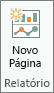
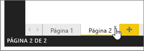

# Exibição de Relatório no Power BI Desktop
Se você já trabalhou com o Power BI, você sabe como é fácil criar relatórios que fornecem ideias e perspectivas dinâmicas sobre seus dados. O Power BI também conta com recursos mais avançados no Power BI Desktop. Com o Power BI Desktop, você pode criar consultas avançadas, efetuar mashup de dados provenientes de várias fontes, criar relações entre tabelas e muito mais.

O Power BI Desktop inclui um **Modo de Exibição de Relatório**, no qual você pode quantas páginas de relatório desejar com visualizações. O Modo de Exibição de Relatório oferece praticamente a mesma experiência de design que aquela encontrada no Modo de Exibição de Edição de um relatório no serviço do Power BI. Você pode mover as visualizações de um lugar para outro, copiar e colar, mesclar, etc.

A diferença entre eles é que ao usar o Power BI Desktop, você pode trabalhar com suas consultas e modelar seus dados para garantir que os dados deem suporte às melhores ideias em seus relatórios. Você pode, então, salvar o seu arquivo do Power BI Desktop onde quiser, seja em sua unidade local ou na nuvem.

## Vamos dar uma olhada!
Quando carregar dados pela primeira vez no Power BI Desktop, você verá o **Modo de Exibição de Relatório** com uma tela em branco.

Você pode alternar entre o **Modo de Exibição de Relatório**, o **Modo de Exibição de Dados** e o **Modo de Exibição de Relação** selecionando os ícones na barra de navegação à esquerda:

Depois de adicionar alguns dados, você pode adicionar campos a uma nova visualização na tela.

Para alterar o tipo da visualização, você poderá selecioná-la no grupo **Visualizar** na faixa de opções, ou então você pode clicar com o botão direito do mouse e selecionar um tipo diferente no ícone **Alterar tipo de visualização**.

> [!TIP]
> Certifique-se de experimentar os diferentes tipos de visualização. É importante que sua visualização transmita com clareza as informações presentes em seus dados.
> 
> 

Um relatório terá pelo menos uma página em branco para ser iniciado. As páginas são exibidas no painel de navegação à esquerda da tela. Você pode adicionar todos os tipos de visualizações a uma página, mas é importante não exagerar. Um excesso de visualizações em uma página dará a ela uma aparência congestionada e tornará difícil encontrar as informações corretas. Você pode adicionar novas páginas ao seu relatório. Basta clicar em **Nova Página** na faixa de opções.

Para excluir uma página, clique no **X** na guia da página na parte inferior do Modo de Exibição de Relatório.

> [!NOTE]
> Visualizações e relatórios não podem ser anexados a um dashboard por meio do Power BI Desktop. Para fazer isso, você precisará [Publicar por meio do Power BI Desktop](desktop-upload-desktop-files.md) para o seu site do Power BI.

## Ocultar páginas de relatório

Quando você cria um relatório, também poderá ocultar as páginas de um relatório. Isso poderá ser útil se você precisar criar dados subjacentes ou elementos visuais em um relatório, mas não quiser que essas páginas fiquem visíveis para outras pessoas, como quando você cria tabelas ou elementos visuais de suporte que são usados em outras páginas do relatório. Há muitas outras razões criativas para você talvez querer criar uma página de relatório e, em seguida, ocultá-la de um relatório que quiser publicar. 

Ocultar uma página de relatório é fácil. Basta clicar na guia da página de relatório e selecionar **Ocultar** no menu que é exibido.

Há algumas considerações para ter em mente ao ocultar uma página de relatório:

* Você ainda pode ver um relatório oculto quando estiver no **Power BI Desktop**, embora o título da página esteja esmaecido. Na imagem a seguir, a página 4 estará oculta.

    

* Você *não pode* ver uma página de relatório oculta ao exibir o relatório no **serviço do Power BI**.

* Ocultar uma página de relatório *não* é uma medida de segurança. A página ainda pode ser acessada por usuários e seu conteúdo ainda será acessível usando o detalhamento e outros métodos.

* Quando uma página é oculta, quando está no modo de Visualização, nenhuma seta de navegação do modo de exibição será mostrada.

