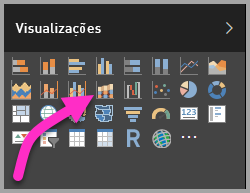
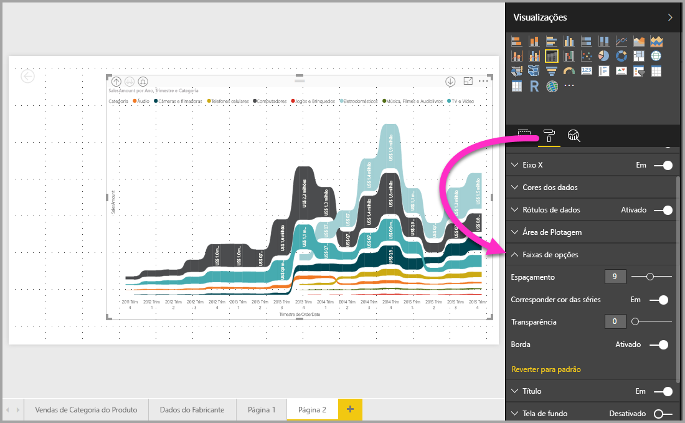

# Usar gráficos de faixa de opções no Power BI
Use gráficos de faixa de opções no **Power BI** para visualizar dados e determinar rapidamente qual categoria de dados tem a classificação mais alta (maior valor). Gráficos de faixa de opções são eficazes para mostrar alterações na classificação, com o maior intervalo (valor) sempre exibido na parte superior de cada período. Os gráficos de faixa de opções estão disponíveis no **Power BI Desktop** a partir da versão de setembro de 2017 e nas atualizações posteriores do **serviço do Power BI**.

## Criar um gráfico de faixa de opções
Para criar um gráfico de faixa de opções, selecione **Gráfico de faixa de opções** no painel **Visualizações**.

Os gráficos de faixa de opções conectam uma categoria de dados no continuum de tempo visualizado usando faixas de opções, permitindo que você veja como determinada categoria é classificada em todo o intervalo do eixo x do gráfico (geralmente, a linha do tempo).

## Formatar um gráfico de faixa de opções
Quando você cria um gráfico de faixa de opções, você tem opções de formatação disponíveis na seção **Formato** do painel **Visualizações**. As opções de formatação para gráficos de faixa de opções são semelhantes às de um gráfico de colunas empilhadas, com opções de formatação adicionais específicas às faixas de opções.

Essas opções de formatação para gráficos de faixa de opções permitem ajustar o seguinte:

* A opção **Espaçamento** permite ajustar a quantidade de espaço exibida entre as faixas de opções. O número é o percentual da altura máxima da coluna.
* A opção **Corresponder cor da série** permite fazer a correspondência da cor das faixas de opções com a cor da série. Quando estiver desativada, as faixas de opções ficarão cinza.
* A opção **Transparência** especifica o grau de transparência das faixas de opções, com o padrão definido como 30.
* A opção **Borda** permite colocar uma borda escura na parte superior e inferior das faixas de opções. Por padrão, as bordas estão desativadas.

## Próximas etapas
Para obter mais informações sobre o **Power BI Desktop** e como começar, confira os artigos a seguir.

* [Introdução ao Power BI Desktop](desktop-getting-started.md)
* [Visão geral de Consulta com o Power BI Desktop](desktop-query-overview.md)
* [Fontes de dados no Power BI Desktop](desktop-data-sources.md)
* [Conectar-se a dados no Power BI Desktop](desktop-connect-to-data.md)
* [Formatar e combinar dados com o Power BI Desktop](desktop-shape-and-combine-data.md)
* [Tarefas comuns de consulta no Power BI Desktop](desktop-common-query-tasks.md)   

