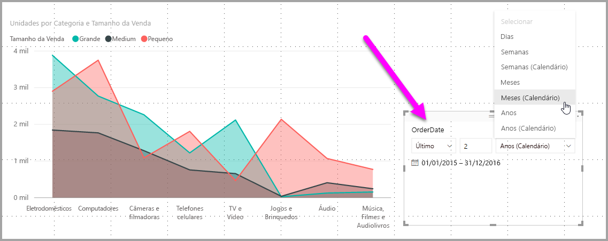
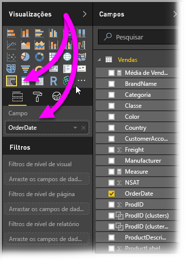
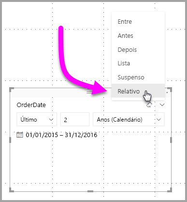
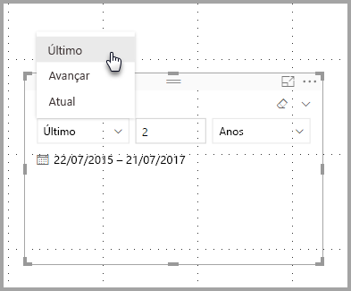
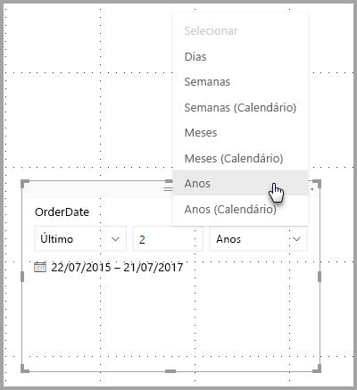
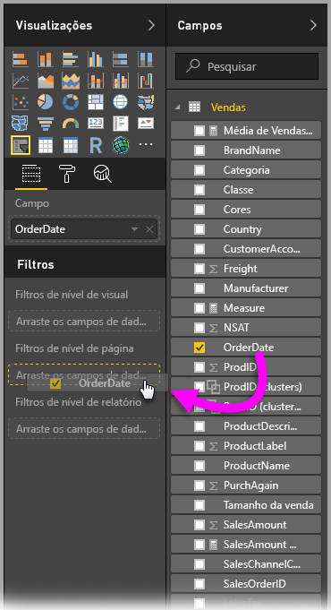
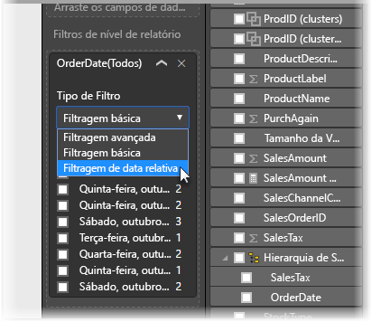
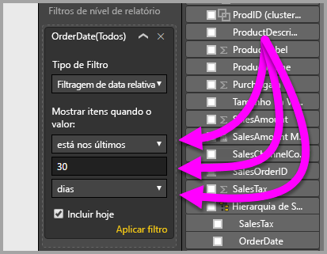

# Usar uma segmentação e um filtro de datas relativas no Power BI Desktop
Com a **segmentação de datas relativas** ou o **filtro de datas relativas**, aplique filtros baseados em tempo a qualquer coluna de data do modelo de dados. Por exemplo, você pode usar a **segmentação de datas relativas** para mostrar apenas os dados de vendas ocorridos nos últimos trinta dias (ou mês, meses do calendário e assim por diante). Quando você atualizar os dados, o período relativo aplicará automaticamente a restrição de datas relativas apropriada.

## Usando a segmentação de intervalo de datas relativas
Use a segmentação de datas relativas como qualquer outra segmentação. Basta criar um visual de **segmentação** para o relatório e, em seguida, selecionar um valor de data no valor **Campo**. Na imagem a seguir, o campo *OrderDate* é selecionado.

Selecione o acento circunflexo no canto superior direito da **segmentação de datas relativas** e um menu será exibido.

Na segmentação de datas relativas, selecione *Relativo*.

Em seguida, selecione as configurações. Na primeira lista suspensa da *segmentação de datas relativas*, selecione umas das seguintes opções:

* Último
* Avançar
* Atual

Essas seleções são mostradas na imagem a seguir.

A próxima configuração (no meio) da *segmentação de datas relativas* permite digitar um número para definir o intervalo de datas relativas.

A terceira configuração permite selecionar a medição de data. Selecione uma das seguintes opções:

* Dias
* Semanas
* Semanas (calendário)
* Meses
* Meses (calendário)
* Anos
* Anos (calendário)

Essas seleções são mostradas na imagem a seguir.

Se você selecionar *Meses* nessa lista, insira 2 na configuração do meio. O seguinte acontecerá: se hoje for 20 de julho, os dados incluídos nos visuais restringidos pela segmentação mostrarão dados dos dois meses anteriores, começando em 20 de maio e passando por 20 de julho (data de hoje).

Em comparação, se você selecionou *Meses (calendário)*, os visuais restringidos mostrarão dados de 1º de maio a 30 de junho (os dois últimos meses do calendário completos).

## Usando o filtro de intervalo de datas relativas
Você também pode criar um filtro de intervalo de datas relativas para a página de relatório ou para o relatório inteiro. Para fazer isso, basta arrastar um campo de data para as áreas **Filtros no nível de página** ou **Filtros no nível de relatório** do painel **Campo**, conforme mostrado na imagem a seguir.

Depois, você pode modificar o intervalo de datas relativas de maneira semelhante ao modo como a **segmentação de datas relativas** é personalizada. Selecione **Filtragem de datas relativas** na lista suspensa **Tipo de Filtro**.

Depois que **Filtragem de datas relativas** for selecionada, você verá três seções a serem modificadas, incluindo uma caixa numérica intermediária, como a segmentação.

Isso é tudo o que é necessário para usar essas restrições de datas relativas nos relatórios.

## Limitações e considerações
No momento, as limitações e considerações a seguir aplicam-se ao filtro e à **segmentação de intervalo de datas relativas**.

* Os modelos de dados do **Power BI** não incluem informações de fuso horário. Os modelos podem armazenar horários, mas não há nenhuma indicação do fuso horário em que estão localizados.
* A segmentação e o filtro sempre se baseiam no horário em UTC; portanto, se você configurar um filtro em um relatório e enviá-lo para um colega de trabalho que está em outro fuso horário, vocês verão os mesmos dados. No entanto, se você não estiver no fuso horário UTC, talvez veja dados de um deslocamento de tempo diferente do que o esperado.
* Os dados capturados em um fuso horário local podem ser convertidos em UTC usando o **Editor de Consultas**.

