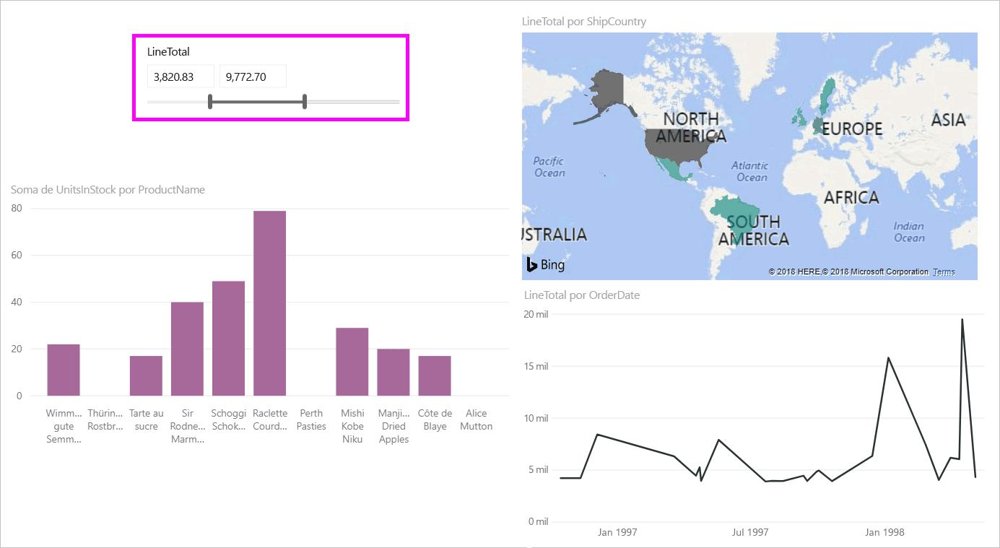
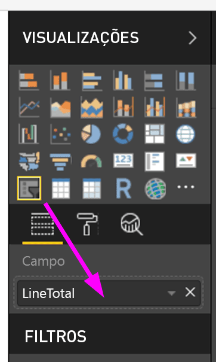
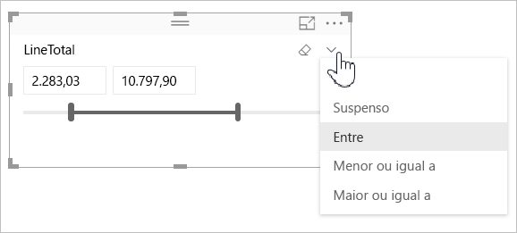
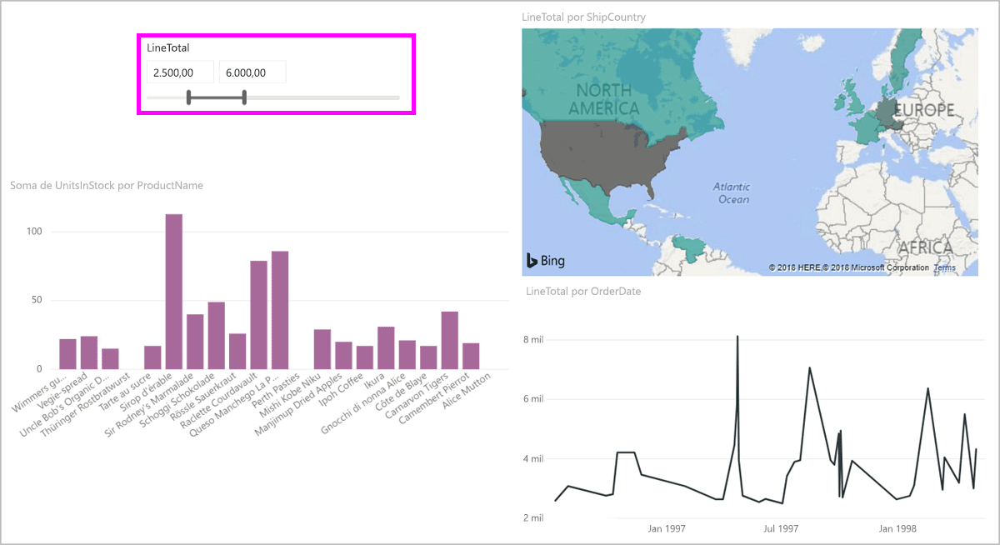
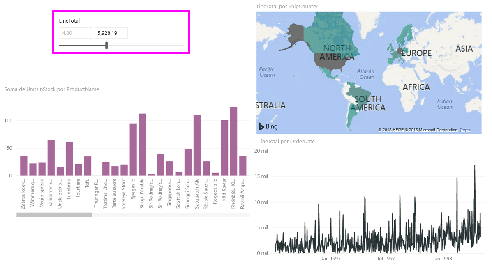
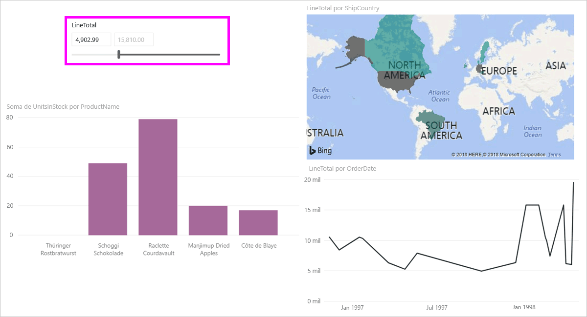

# Usar a segmentação de intervalo numérico no Power BI Desktop
Com a **segmentação de intervalo numérico**, você pode aplicar todos os tipos de filtros a qualquer coluna numérica no modelo de dados. Você pode optar por filtrar como **entre** números, **menor ou igual** a um número ou **maior ou igual** a um número. Embora possa parecer simples, essa é uma maneira muito eficiente de filtrar os dados.

## Usando a segmentação de intervalo numérico
Você pode usar a segmentação de intervalo numérico como qualquer outra segmentação de dados. Basta criar um visual de **segmentação** para o relatório e, em seguida, selecionar um valor numérico para o valor **Campo**. Na imagem a seguir, o campo *LineTotal* está selecionado.

Selecione o link de seta para baixo no canto superior direito da **segmentação de intervalo numérico** e um menu será exibido.

Para o intervalo numérico, você pode selecionar uma das três seleções a seguir:

* Entre
* Menor ou igual a
* Maior ou igual a

Ao selecionar **Entre** no menu, um controle deslizante será exibido e você poderá filtrar os valores numéricos que estão entre os números. Além de usar a barra de controle deslizante, você pode clicar em qualquer caixa e digitar os valores. Isso é prático quando você deseja segmentar em números inteiros específicos e a granularidade de movimentação da barra de segmentação dificulta encontrar exatamente esse número.

Na imagem a seguir, a página do relatório é filtrada por valores de *LineTotal* que variam entre 2500,00 e 6000,00.

Quando selecionamos **menor ou igual a**, a alça esquerda (valor mais baixo) da barra de controle deslizante desaparece e somente podemos ajustar o limite superior da barra de controle deslizante. Na imagem a seguir, definimos o máximo da barra deslizante como 5928,19.

Por fim, se selecionarmos **maior ou igual a**, a alça da barra de controle deslizante direita (valor mais alto) desaparecerá e poderemos ajustar o valor menor, conforme é mostrado na imagem a seguir. Agora apenas os itens com *LineTotal* maior ou igual a 4902,99 serão exibidos nos visuais na página do relatório.

## Ajustar para números inteiros com a segmentação de intervalo numérico

Uma segmentação de intervalo numérico ajustará para números inteiros, a menos que o intervalo seja de decimal. Isso permite que a segmentação se alinhe corretamente com números inteiros. 

## Limitações e considerações
No momento, as seguintes considerações e limitações aplicam-se à **segmentação de intervalo numérico**:

* No momento, a **segmentação de intervalo numérico** filtra todas as linhas subjacentes nos dados, não qualquer valor agregado. Por exemplo, se o campo *Valor de Vendas* for usado, cada transação com base em *Valor de Vendas* será filtrada, não a soma de *Valor de Vendas* de cada ponto de dados de um visual.
* No momento, isso não funciona com Medidas.
