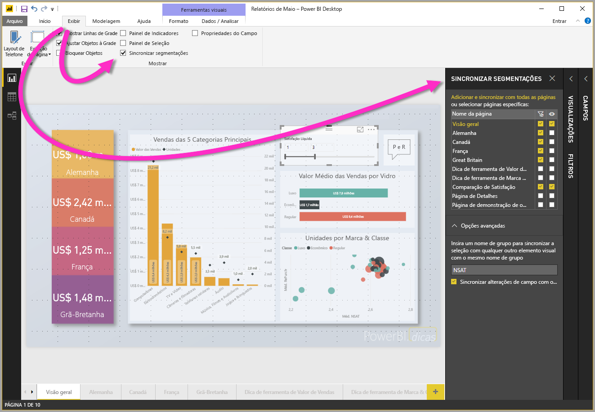
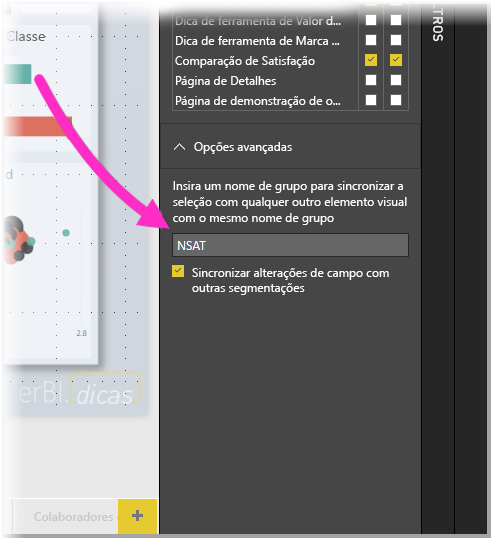

# Usando segmentações de dados do Power BI Desktop

Você pode usar uma **segmentação de dados** no **Power BI Desktop** para filtrar os resultados de elementos visuais na página do seu relatório. E com as segmentações de dados, você pode ajustar facilmente o filtro que é aplicado ao interagir com a segmentação de dados em si. Você também pode especificar opções para como a segmentação de dados é exibida, e como interagir com ela. A imagem a seguir mostra uma segmentação de dados, com seu menu suspenso *tipo* visível. 

Uma segmentação de dados pode ser mostrada em um dos vários tipos:

* List
* Lista suspensa
* Entre
* Menor ou igual a
* Maior ou igual a

Você pode adicionar uma segmentação de dados a um relatório clicando no elemento visual **segmentação de dados** no painel **Visualizações**.

As segmentações de dados comportam-se da mesma forma no **Power BI Desktop** e no **serviço do Power BI**. Para ver um artigo sobre como usar segmentações, confira [segmentações no serviço do Power BI](power-bi-visualization-slicers.md).

## Sincronizar as segmentações de dados nas páginas do relatório

No **Power BI Desktop**, você pode sincronizar as segmentações de dados em várias páginas do relatório. Para sincronizar as segmentações de dados no painel **Exibição** na faixa de opções, selecione **Sincronizar segmentações de dados**. Quando você sincronizar as segmentações de dados, o painel **Sincronizar segmentações de dados** é exibido, conforme mostrado na imagem a seguir.

No painel **Sincronizar segmentações de dados**, você pode especificar como a segmentação de dados deve ser sincronizada nas páginas do relatório. Você pode especificar se cada segmentação de dados deve ser **aplicada** a cada página de relatório individual e se a segmentação de dados deve ser **visível** em cada página de relatório individual.

Por exemplo, você pode colocar uma segmentação de dados na **Página 2** do seu relatório, conforme mostrado na imagem a seguir. Você pode selecionar se essa segmentação de dados deve ser *aplicada* a cada página selecionada e se essa segmentação de dados deve ser *visível* em cada página selecionada no relatório. Você pode aplicar qualquer combinação das duas a cada segmentação de dados. 

Usar o link **Adicionar a todos** no painel aplica a segmentação de dados selecionada a todas as páginas no relatório.

Observe que as seleções mostradas no painel **Sincronizar segmentações de dados** aplicam apenas a *segmentação de dados selecionada*. Você pode aplicar várias segmentações de dados a várias páginas e usar o painel para definir como cada segmentação de dados é individualmente aplicada a várias páginas em seu relatório. 

Embora a seleção de segmentação de dados possa ser sincronizada, outras seleções, como estilos, edição e exclusão, *não* serão sincronizadas. 

## Opções avançadas para segmentações

Você também pode aplicar um **nome do grupo** a uma coleção de segmentações na seção **Opções avançadas** do painel **Sincronizar segmentações** e fazer com que as segmentações que compartilham o mesmo grupo sejam sincronizadas entre as páginas. 

Esse recurso permite criar um grupo personalizado de segmentações a serem mantidas sincronizadas. É fornecido um nome padrão, mas você pode usar qualquer nome que preferir. 

O nome do grupo fornece uma flexibilidade adicional com as segmentações. É possível criar grupos separados para sincronizar as segmentações que usam o mesmo campo ou colocar as segmentações que usam campos diferentes no mesmo grupo. 

## Próximas etapas

Você também pode estar interessado nos seguintes artigos:

* [Segmentações no serviço do Power BI](power-bi-visualization-slicers.md)
* [Usar a segmentação de intervalo numérico no Power BI Desktop](desktop-slicer-numeric-range.md)
* [Usar uma segmentação e um filtro de datas relativas no Power BI Desktop](desktop-slicer-filter-date-range.md)

