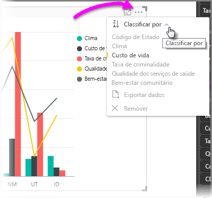
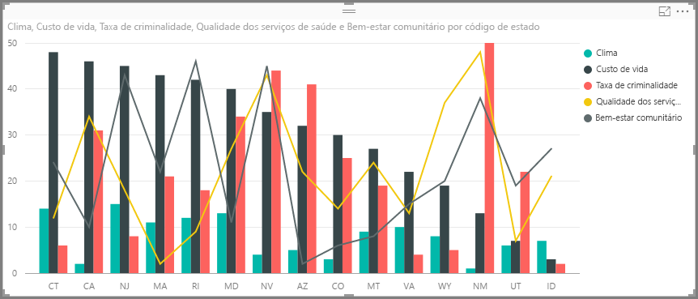
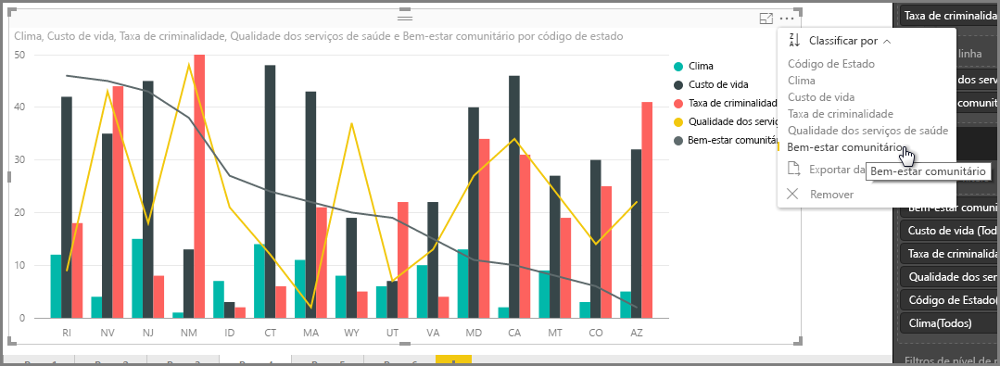
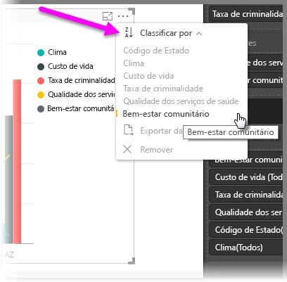
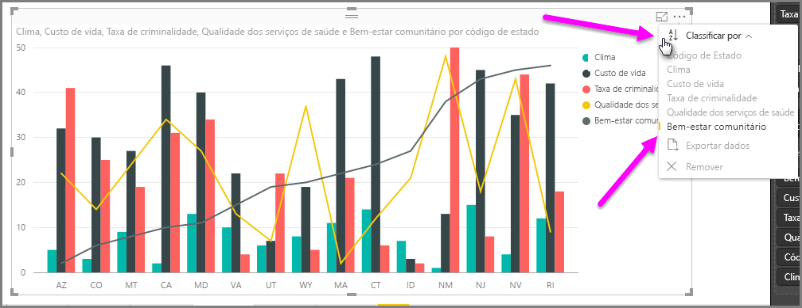
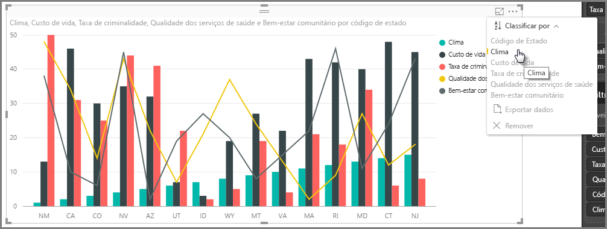
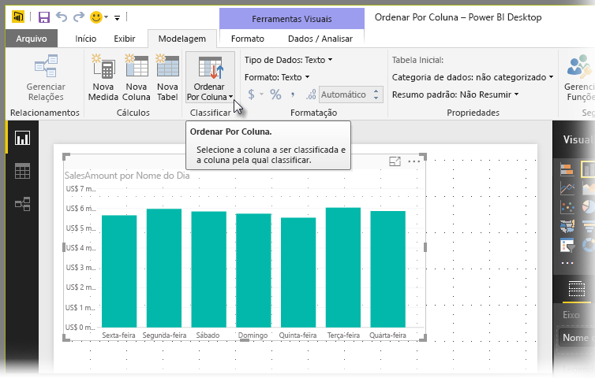
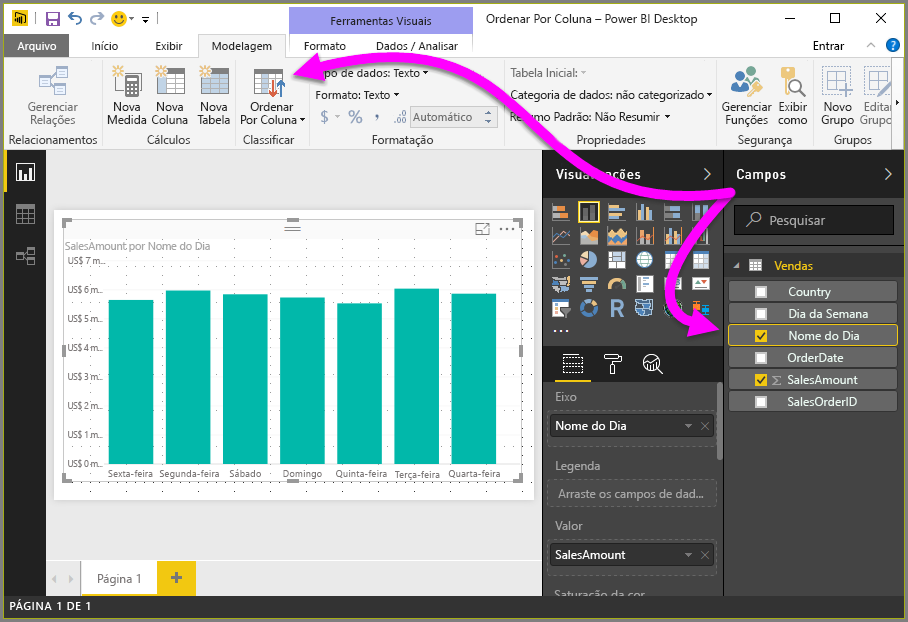
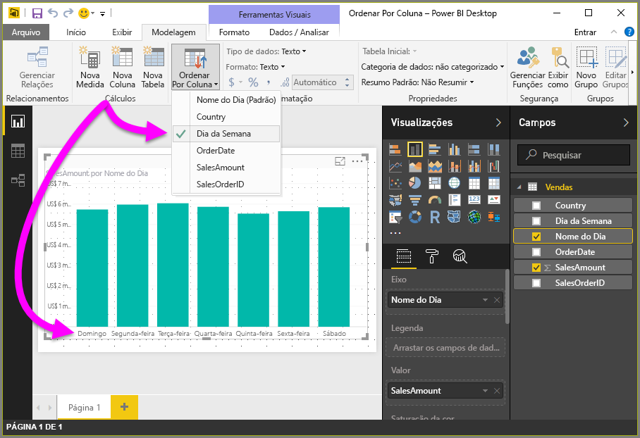
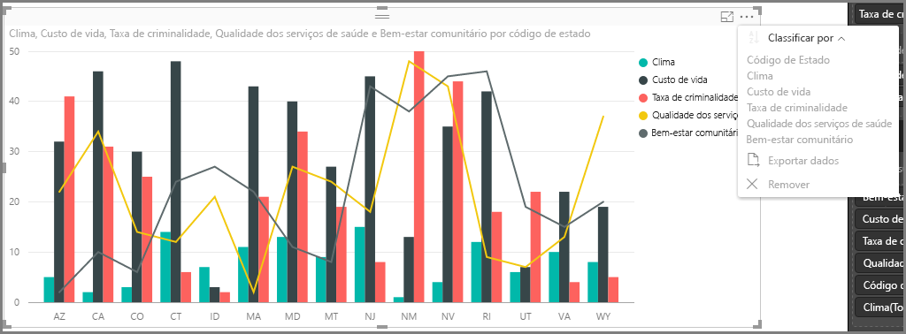

# Classificação por coluna no Power BI Desktop
No **Power BI Desktop** e no **serviço do Power BI**, você pode alterar a aparência de um visual, classificando-o por diferentes campos de dados. Ao alterar a maneira como você classifica um visual, é possível realçar as informações que você deseja transmitir e garantir de que o visual reflita qualquer tendência (ou ênfase) que você deseja transmitir.

Se estiver usando dados numéricos (como valores de vendas) ou dados de texto (como nomes de estado), você pode classificar suas visualizações da forma que quiser e fazer com que elas tenham a aparência que você quiser.  O **Power BI** oferece muita flexibilidade para a classificação e menus rápidos para você usar. Em qualquer visual, selecione o menu de reticências (...) e, em seguida, **Classificar por**. Então selecione o campo pelo qual você deseja classificar, conforme mostrado na imagem a seguir.

## Mais detalhes e um exemplo
Vamos tomar um exemplo com mais detalhes e ver como ele funciona no **Power BI Desktop**.

A visualização a seguir lista os 15 primeiros estados em termos de clima (dias mais ensolarados, classificados de 1 a 50, com 1 tendo mais dias ensolarados). Esta é a visualização como ela aparece antes de fazermos qualquer classificação.

Atualmente, o visual é classificado por **Custo de vida** – podemos observar isso fazendo a correspondência entre a cor das barras decrescentes e a legenda, mas há uma maneira melhor de determinar a coluna de classificação atual: o diálogo **Classificar Por**, disponível no menu de reticências (...) no canto superior direito do visual. Quando selecionamos as reticências, vemos o seguinte:

Há alguns itens a serem observados no menu que aparece quando você seleciona as reticências:

* Na barra amarela ao lado de **Custo de vida** e o fato de **Custo de vida** estar em negrito
* O pequeno ícone ao lado das palavras **Classificar Por**, que mostra **Z/A** (Z sobre A) e uma seta para baixo.

Vamos examinar cada um deles independentemente nas próximas duas seções.

## Selecionando a coluna a ser usada para classificação
Você notou a barra amarela ao lado de **Custo de vida** no menu **Classificar Por**, o que indica que o visual estava usando a coluna **Custo de vida** para classificá-lo. Classificar por outra coluna é fácil – basta selecionar as reticências para mostrar o menu **Classificar Por** e selecionar outra coluna. É bem fácil.

Na imagem a seguir, selecionamos **Bem-estar da comunidade** como a coluna segundo a qual queremos classificar. Essa coluna é uma das linhas no visual, e não uma das barras. Esta é a aparência após selecionarmos **Bem-estar da comunidade**.

Observe como o visual foi alterado. Agora, os valores estão ordenados do valor mais alto de **Bem-estar da comunidade** (neste caso, RI representando Rhode Island) para os Estados incluídos neste visual, até AZ (Arizona), que tem o valor mais baixo. Lembre-se de que o gráfico geral inclui apenas os 15 estados com mais dias ensolarados – nós apenas os ordenamos com base em outra coluna incluída no visual.

Mas e se quisermos classificar em ordem crescente em vez de decrescente? A próxima seção mostra como é fácil faz isso.

## Selecionando a ordem de classificação - menor para o maior, maior para o menor
Quando analisamos de forma mais detalhada o menu **Classificar Por** da imagem anterior, podemos ver que o ícone ao lado de **Classificar Por** mostra **Z/A** (Z sobre A). Observe:

Quando **Z/A** é exibido, significa que o visual está sendo classificado pela coluna selecionada em ordem do maior valor para o menor. Quer mudar? Sem problemas – basta tocar ou clicar no ícone **Z/A** e a ordem de classificação é alterada para **A/Z** e o visual (com base na coluna selecionada) é classificado do menor valor para o maior.

Este é o nosso mesmo visual, desta vez depois de tocar no ícone **Z/A** no menu **Classificar Por** para alterar sua ordem. Observe que AZ (Arizona) agora é o primeiro estado listado e RI (Rhode Island) é o último – a classificação é oposta à anterior.

Você pode classificar segundo qualquer coluna incluída no visual - poderíamos facilmente selecionar Clima como a coluna segunda a qual queremos classificar e selecionar **Z/A** no menu **Classificar Por** para mostrar os estados mais ensolarados primeiro (o valor mais alto para Clima corresponde a dias de sol neste modelo de dados) e ainda manter as outras colunas no visual da forma como se aplicam ao estado. Veja o visual com essas configurações.

## Classificar usando o botão Classificar por Coluna
Há outra maneira de classificar os dados, usando o botão **Classificar por Coluna** na faixa de opções **Modelagem**.

Essa abordagem de classificação exige que você selecione uma coluna no painel **Campos** e, em seguida, selecione o botão **Classificar por Coluna** para escolher como (por qual coluna) você deseja classificar seu visual. Você deve selecionar a coluna (campo) que deseja classificar no painel **Campos** para habilitar o botão **Classificar por Coluna**. Caso contrário, o botão ficará inativo.

Vejamos um exemplo comum: você tem dados de cada dia da semana e deseja classificá-los com base em ordem cronológica. As etapas a seguir mostram como fazer isso.

1. Primeiro, observe que quando o visual é selecionado, mas nenhuma coluna é selecionada no painel **Campos**, o botão **Classificar por Coluna** fica inativo (esmaecido).
   
   
2. Quando selecionamos a coluna pela qual queremos classificar no painel **Campos**, o botão **Classificar por Coluna** se torna ativo.
   
   
3. Agora, com o visual selecionado, podemos selecionar *Dia da Semana*, em vez do padrão (*Nome do Dia*), e o visual classifica na ordem que queremos: por dia da semana.
   
   

E isso é tudo. Lembre-se de que você deve selecionar uma coluna no painel **Campos** para o botão **Classificar por Coluna** ficar ativo.

## Voltando à coluna padrão para classificação
Você pode classificar segundo qualquer coluna que desejar, mas pode haver ocasiões em que você deseja que o visual retorne à coluna de classificação padrão. Sem problemas. Para um visual que tem uma coluna de classificação selecionada (como já vimos, uma coluna de classificação selecionada tem uma barra amarela ao seu lado no menu **Classificar Por**), basta abrir o menu **Classificar Por** e selecionar a coluna novamente, e a visualização retorna à coluna de classificação padrão.

Por exemplo, este é nosso gráfico anterior:

Quando voltamos ao menu e selecionamos **Clima** novamente, o visual volta ao padrão de ordem alfabética por **Código de estado**, conforme mostra a imagem a seguir.

Com tantas opções para classificar os visuais, criando exatamente o gráfico ou imagem que você deseja é fácil.

