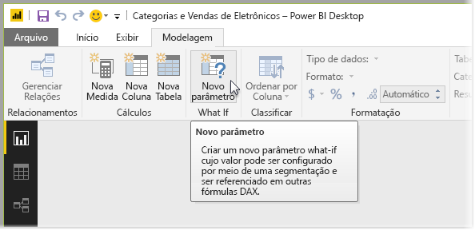

# Criar e usar um parâmetro What if para visualizar variáveis no Power BI Desktop
A partir da versão de agosto de 2017 do **Power BI Desktop**, é possível criar variáveis **What if** para os relatórios, interagir com a variável como uma segmentação e, portanto, visualizar e quantificar diferentes valores de chave nos relatórios.

O parâmetro **What if** é encontrado na guia **Modelagem** do **Power BI Desktop**. Quando você fizer isso, será exibida uma caixa de diálogo na qual o parâmetro pode ser configurado.

## Criando um parâmetro What if
Para criar um parâmetro **What if**, selecione o botão **What if** na guia **Modelagem** do **Power BI Desktop**. Na imagem a seguir, criamos um parâmetro chamado *Percentual de desconto* e definimos seu tipo de dados como *Número decimal.* O valor *Mínimo* é zero e o *Máximo* é 0,50 (50%). Também definimos o *Incremento* como 0,05 ou 5%. Esse é o nível de ajuste que o parâmetro fará ao interagir com um relatório.

> [!NOTE]
> Para números decimais, preceda-os com um zero, como em 0,50, comparado a apenas ,50 nessa caixa. Caso contrário, o número não será validado e o botão **OK** não será selecionável.
> 
> 

Para sua conveniência, a caixa de seleção **Adicionar segmentação a esta página** coloca automaticamente uma segmentação com o parâmetro **What if** na página de relatório atual.

Além de criar o parâmetro, a criação de um parâmetro **What if** também cria uma medida, que pode ser usada para visualizar o valor atual do parâmetro **What if**.

É importante e útil observar que, depois de criar um parâmetro **What if**, o parâmetro e a medida se tornam parte do modelo. Portanto, eles estão disponíveis em todo o relatório e podem ser usados em outras páginas do relatório. Como eles fazem parte do modelo, você pode excluir a segmentação da página de relatório e, se desejar tê-la novamente, basta selecionar o parâmetro **What if** na lista **Campos** e arrastá-lo para a tela (e, depois, alterar o visual para uma segmentação) para inserir o parâmetro **What if** no relatório com facilidade.

## Usando um parâmetro What if
Vamos criar um exemplo simples do uso de um parâmetro **What if**. Criamos o parâmetro **What if** na seção anterior. Agora, nós o colocaremos em uso criando uma nova medida cujo valor é ajustado com o controle deslizante. Para fazer isso, criamos uma nova medida.

A nova medida simplesmente será o valor total de vendas, com a taxa de desconto aplicada. Obviamente, você pode criar medidas complexas e interessantes, que permitem aos consumidores dos relatórios visualizar a variável do parâmetro **What if**. Por exemplo, você poderá criar um relatório que permitirá ao pessoal de vendas ver suas compensações se eles cumprirem determinadas metas ou percentuais de vendas ou ver o efeito do aumento das vendas em descontos maiores.

Depois de digitarmos a fórmula de medida na barra de fórmulas e nomeá-la **Vendas após o Desconto**, vemos o resultado:

Em seguida, criamos um visual de coluna com *OrderDate* no eixo e *SalesAmount* e a medida recém-criada *Vendas após o Desconto* como os valores.

Depois, conforme movemos o controle deslizante, vemos que a coluna *Vendas após o Desconto* reflete o valor de vendas com desconto.

E isso é tudo para ele. Você pode usar parâmetros **What if** em inúmeras situações, a fim de permitir aos consumidores de relatórios interagir com os diferentes cenários criados nos relatórios.

