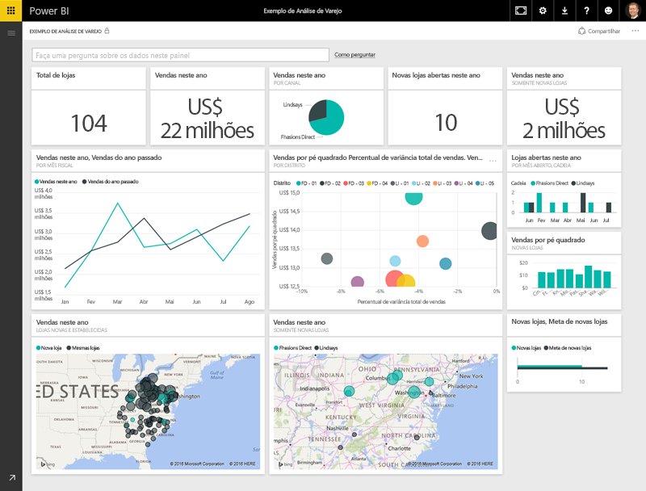
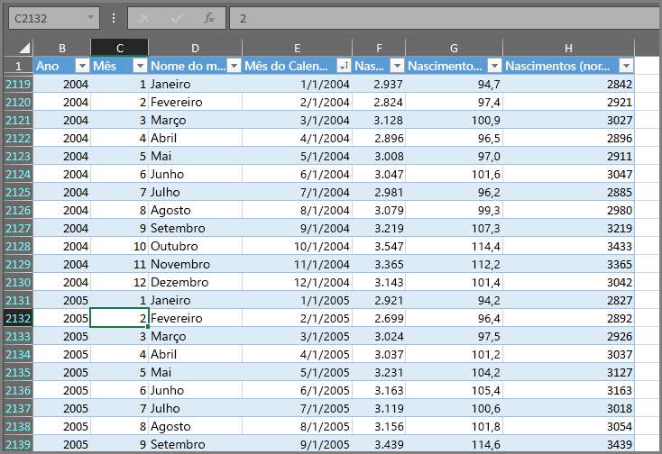
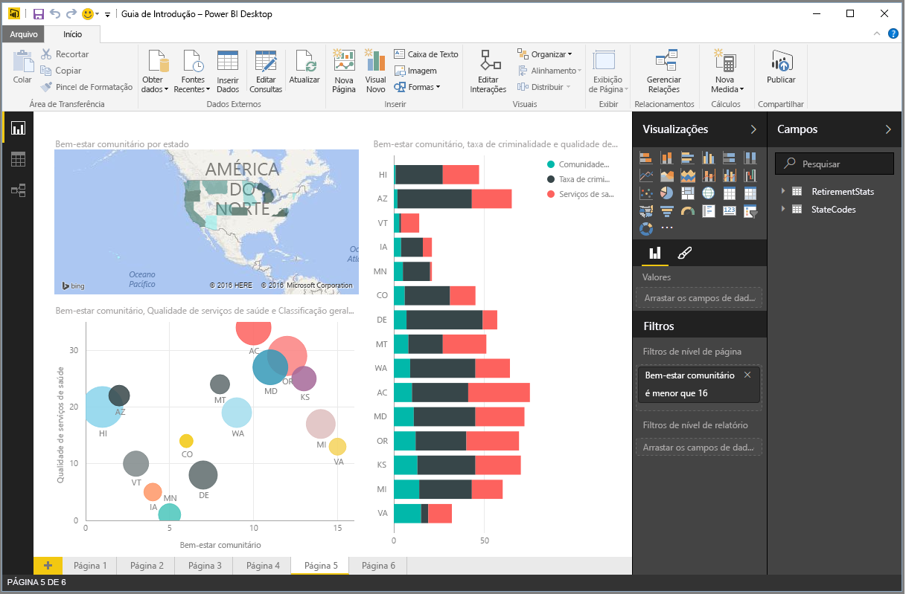
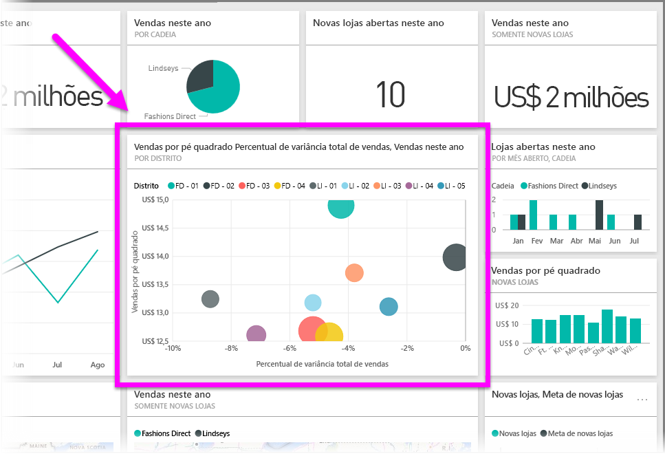

Tudo o que você faz no Power BI pode ser dividido em alguns **blocos de construção** básicos. Depois de entender esses blocos de construção, é possível expandir cada um deles e começar a criar relatórios complexos e elaborados. Afinal, até mesmo coisas aparentemente complexas são criadas com base em blocos de construção básicos – edifícios são criados com madeira, aço, concreto e vidro. Carros são feitos de metal, tecido e borracha. É claro que edifícios e carros podem ser básicos ou elaborados também –dependendo de como os blocos de construção básicos são organizados.

Vamos examinar esses blocos de construção básicos, abordar alguns itens simples que podem ser criados com eles e fornecer uma visão rápida sobre como itens complexos também podem ser criados.

Os blocos de construção básicos no Power BI são os seguintes:

* Visualizações
* Conjuntos de dados
* Relatórios
* Painéis
* Blocos

## Visualizações
Uma **visualização** (às vezes, também chamada de **visual**) é uma representação visual dos dados, como um gráfico, um mapa codificado por cores ou outros itens interessantes que você pode criar para representar os dados visualmente. O Power BI traz todos os tipos de diferentes tipos de visualização, com mais novidades lançadas a todo momento. A imagem a seguir mostra uma coleção de visualizações diferentes que foram criadas no serviço do Power BI.

Visualizações podem ser simples – como um único número que representa algo significativo – ou ser visualmente complexas – como um mapa de cores de gradiente que mostra o sentimento do eleitor diante de determinado problema social ou preocupação. O objetivo de um visual é apresentar dados de modo a fornecer contexto e informações, que, provavelmente, seriam difíceis de serem assimilados em uma tabela bruta de números ou texto.

## Conjuntos de dados
Um **conjunto de dados** é uma coleção de dados que o Power BI usa para criar suas visualizações.

Você pode ter um conjunto de dados simples baseado em uma única tabela de uma pasta trabalho do Excel, semelhante ao que é mostrado na imagem a seguir.

**Conjuntos de dados** também podem ser uma combinação de várias fontes diferentes, que podem ser filtradas e combinadas para fornecer dados de coleção exclusivos (um conjunto de dados) para uso no Power BI.

Por exemplo, você poderia criar um conjunto de dados baseado em três campos de banco de dados diferentes, em uma tabela de site, em uma tabela do Excel e nos resultados online de uma campanha de marketing por email. Essa combinação exclusiva ainda é considerada um único **conjunto de dados**, mesmo que tenha sido extraída de várias fontes diferentes.

A filtragem de dados antes de sua inserção no Power BI permite que você se concentre nos dados mais importantes para você. Por exemplo, você poderia filtrar o banco de dados de contatos para que apenas os clientes que receberam emails da campanha de marketing fossem incluídos no conjunto de dados. Em seguida, você poderia criar visuais baseados nesse subconjunto (a coleção filtrada) de clientes que foram incluídos na campanha. A filtragem o ajuda a se concentrar em seus dados e esforços.

Uma parte importante e capacitadora do Power BI é a grande quantidade de **conectores** de dados incluídos. Quer os dados que você deseja obter estejam no Excel ou em um banco de dados SQL, no Azure ou Oracle, ou em um serviço como Facebook, Salesforce ou MailChimp, o Power BI tem conectores de dados internos que permitem a fácil conexão a esses dados, sua filtragem e, se necessário, sua inserção no conjunto de dados.

Depois de obter um conjunto de dados, você pode começar a criar visualizações que exibem diferentes partes desse conjunto de dados de diferentes maneiras e, com o que vê, você se aprofunda. Esse é o momento em que os relatórios entram em cena.

## Relatórios
No Power BI, um **relatório** é uma coleção de visualizações que aparecem juntas em uma ou mais páginas. Assim como ocorre com qualquer outro relatório que você possa criar para uma apresentação de vendas ou um relatório que você prepararia para uma tarefa escolar, no Power BI, um **relatório** é uma coleção de itens que estão relacionados entre si. A imagem a seguir mostra um **relatório** no Power BI Desktop – nesse caso, é a quinta página em um relatório de seis páginas. Você também pode criar relatórios no serviço do Power BI.

Os relatórios permitem que você crie muitas visualizações, em várias páginas diferentes, se necessário, e possibilita organizá-las de qualquer maneira que melhor conte sua história.

Você poderia ter um relatório sobre as vendas do trimestre, um relatório sobre o crescimento do produto em um segmento específico, ou poderia criar um relatório sobre os padrões de migração de ursos polares. Qualquer que seja o assunto, os relatórios permitem reunir e organizar suas visualizações em uma (ou mais) páginas.

## Painéis
Quando você está pronto para compartilhar uma única página de um relatório ou compartilhar uma coleção de visualizações, você cria um **dashboard**. Assim como o painel de um carro, um **dashboard** do Power BI é uma coleção de visuais de uma única página que você pode compartilhar com outras pessoas. Geralmente, é um grupo selecionado de visuais que fornecem uma análise rápida dos dados ou da história que você está tentando apresentar.

Um dashboard deve se ajustar à uma única página, geralmente chamada uma tela (a tela é o pano de fundo em branco no Power BI Desktop, ou no serviço, na qual você coloca visualizações). Pense nisso como a tela que um artista ou um pintor usa – um espaço de trabalho no qual você cria, combina e retrabalha visuais interessantes e atraentes.
Você pode compartilhar dashboards com outros usuários ou grupos, que, por sua vez, podem interagir com seu dashboard quando estiverem no serviço do Power BI ou em seus dispositivos móveis.

## Blocos
No Power BI, um **bloco** é uma única visualização encontrada em um relatório ou dashboard. É a caixa retangular que contém cada visual individual. Na imagem a seguir, você vê um bloco (realçado por uma caixa brilhante), que também está circundado por outros blocos.

Ao *criar* um relatório ou um dashboard no Power BI, você pode mover ou organizar os blocos como desejar a fim de apresentar suas informações. Você pode aumentá-los, alterar sua altura ou largura e aninhá-los com outros blocos da maneira desejada.

Ao *exibir* ou *consumir* um dashboard ou relatório – isso significa que você não é o criador ou o proprietário, mas que ele foi compartilhado com você –, você pode interagir com ele, mas não alterar o tamanho dos blocos nem alterar a forma como estão dispostos.

## Todos juntos agora
Esses são os fundamentos do Power BI e seus blocos de construção. Vamos reservar alguns momentos para a revisão.

O Power BI é uma coleção de serviços, aplicativos e conectores que permite que você se conecte a seus dados – onde quer que eles residam – filtrá-los, se necessário, e inseri-los no Power BI, no qual é possível criar visualizações interessantes para compartilhar com outras pessoas.  

Agora que você entendeu alguns dos blocos de construção básicos do Power BI, fica claro que você pode criar conjuntos de dados que fazem sentido *para você* e criar relatórios visualmente atraentes que contam a sua história. As histórias contadas com o Power BI não precisam ser complexas nem complicadas, para serem atraentes.

Para algumas pessoas, usar uma única tabela do Excel em um conjunto de dados e compartilhar um dashboard com sua equipe, será uma maneira incrivelmente importante de usar o Power BI.

Para outras, usar tabelas do Azure SQL Data Warehouse em tempo real que são combinadas com os outros bancos de dados e com o código-fonte em tempo real, que são então filtradas em tempo real para criar um conjunto de dados que monitora o progresso constante de fabricação, será o valor que elas buscam obter do Power BI.

Para elas, o processo é o mesmo: criar conjuntos de dados, criar visuais interessantes e compartilhá-los com outras pessoas. E, da mesma forma, o resultado (para elas, individualmente) é o mesmo: aproveitar o seu mundo cada vez maior de dados e transformá-lo em informações práticas.

Se suas análises de dados precisam de conjuntos de dados simples ou complexos, o Power BI o ajuda a se familiarizar rapidamente e ele pode ser expandido de acordo com suas necessidades para ser tão complexo quanto o seu mundo de dados exigir. E, já que o Power BI é um produto da Microsoft, você pode confiar que ele é robusto, extensível, amigável para o Office e pronto para empresas.

Agora, vamos ver como isso funciona. Vamos começar dando uma olhada rápida no serviço do Power BI.

