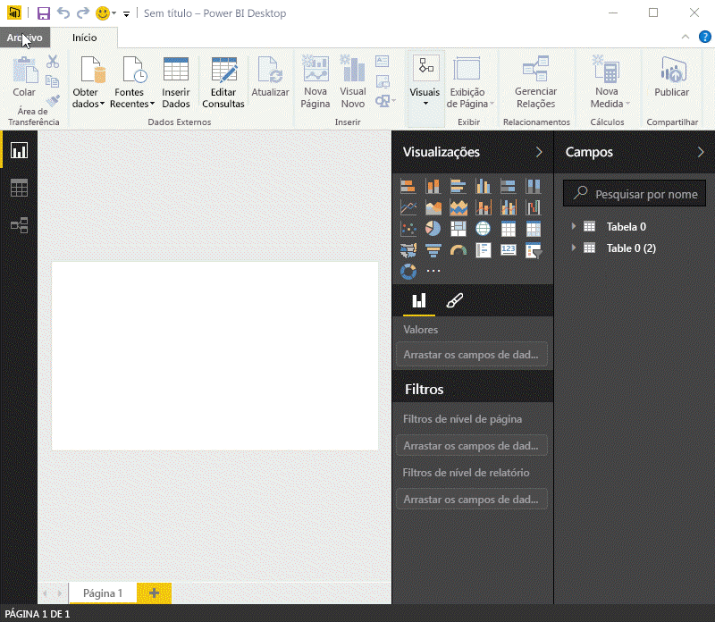
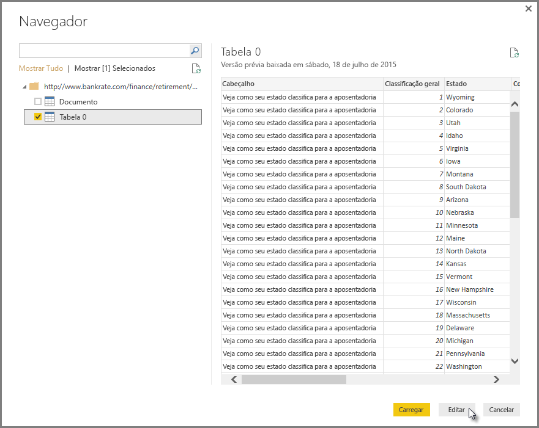
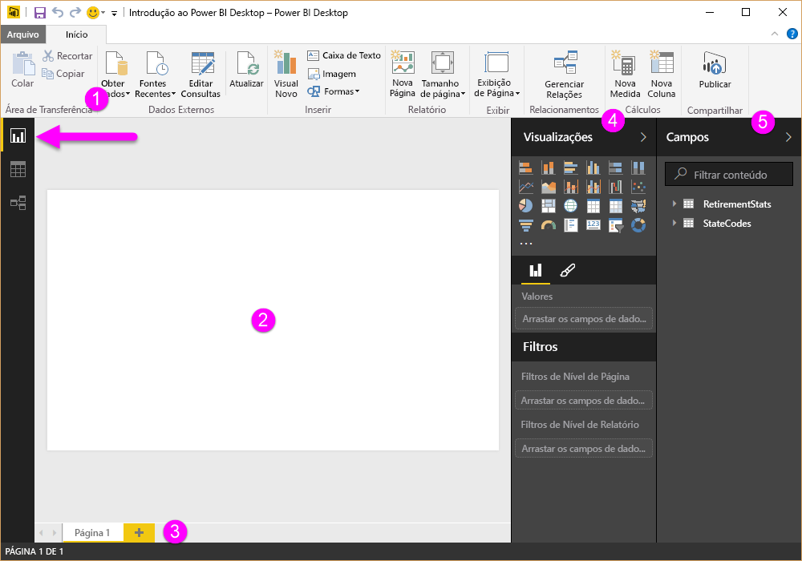
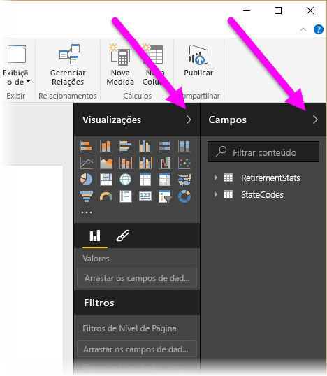
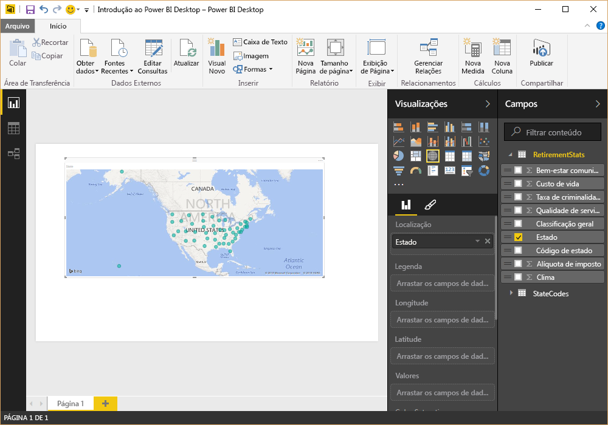
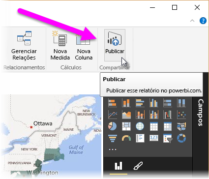
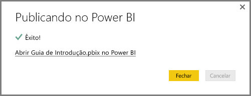
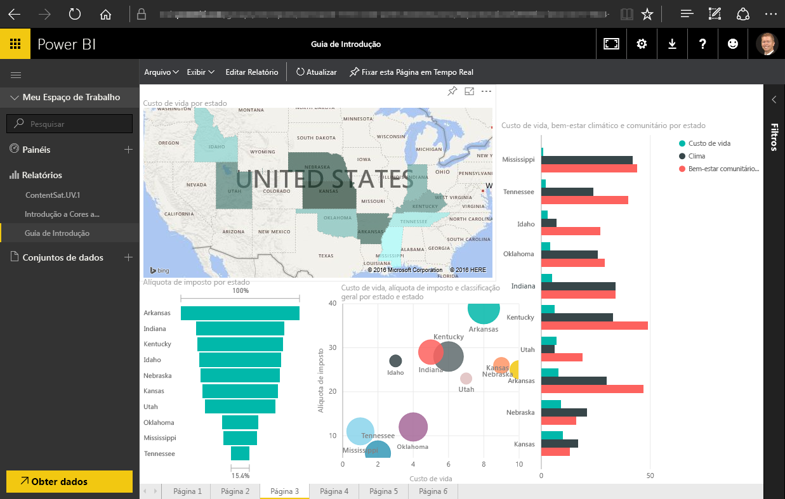
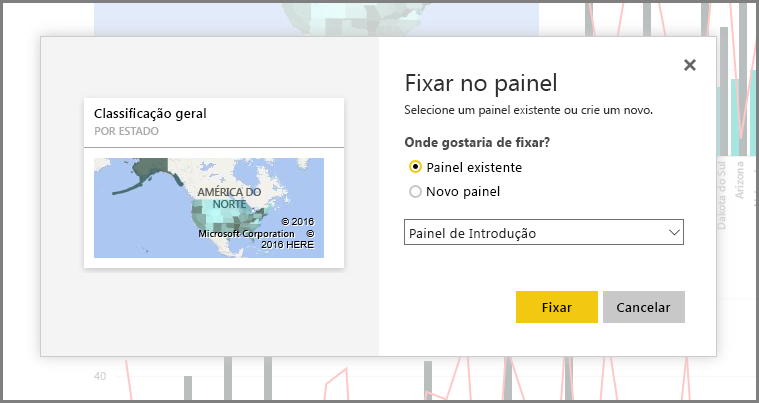
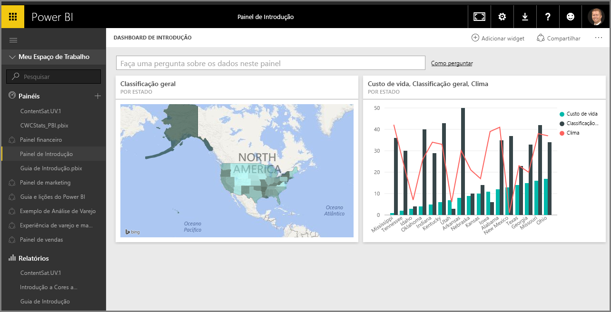

Neste tópico, vamos examinar mais detalhadamente como as primeiras duas partes do Power BI se encaixam:

* Criar um relatório no **Power BI Desktop**
* Publicar o relatório no **serviço do Power BI**

Vamos começar no Power BI Desktop e selecionar **Obter Dados**. A coleção de fontes de dados é exibida, permitindo a escolha de uma fonte de dados. A imagem a seguir mostra a seleção de uma página da Web como a fonte e, no vídeo acima, Will selecionou uma pasta de trabalho do **Excel**.

Independentemente de qual fonte de dados que você escolher, o Power BI conecta-se a ela e mostra os dados disponíveis. A imagem a seguir é outro exemplo, de uma página da Web que analisa diferentes estados e algumas estatísticas interessantes sobre aposentadoria.

Na exibição de **Relatório** do Power BI Desktop, você pode começar a criar relatórios.

A exibição **Relatório** tem quatro áreas principais:

1. A faixa de opções, que exibe tarefas comuns associadas a relatórios e visualizações
2. A exibição, ou tela, de **Relatório** , em que as visualizações são criadas e organizadas
3. A área da guia **Páginas** na parte inferior, que permite selecionar ou adicionar uma página de relatório
4. O painel **Visualizações** , em que é possível alterar visualizações, personalizar cores ou eixos, aplicar filtros, arrastar campos e muito mais
5. O painel **Campos** , em que os elementos e filtros de consulta podem ser arrastados até a exibição de **Relatório** ou até a área **Filtros** do painel **Visualizações**

Os painéis **Visualizações** e **Campos** podem ser ocultados selecionando a pequena seta ao longo da borda, oferecendo mais espaço na exibição de **Relatório** para a criação de visualizações interessantes. Ao modificar visualizações, você também verá essas setas apontando para cima ou para baixo, o que significa que você pode expandir ou recolher essa seção de acordo.

Para criar uma visualização, basta arrastar um campo da lista **Campos** até a exibição de **Relatório** . Neste caso, vamos arrastar o campo Estado de *RetirementStats* e ver o que acontece.

Veja só... O Power BI Desktop criou automaticamente uma visualização baseada em mapa, porque ele reconheceu que o campo Estado continha dados de localização geográfica.

Agora vamos avançar um pouco e, depois de criar um relatório com algumas visualizações, estamos prontos para publicá-lo no serviço do Power BI. Na faixa de opções **Página Inicial** do Power BI Desktop, selecione **Publicar**.

Será solicitado que você entre no Power BI.

Depois de entrar e o processo de publicação estiver concluído, você verá a caixa de diálogo a seguir. Você pode selecionar o link (abaixo **Êxito!**) para ser direcionado para o serviço do Power BI, no qual poderá ver o relatório que acabou de ser publicado.

Quando você entrar no Power BI, você verá o arquivo do Power BI Desktop que você acabou de publicar no serviço. Na imagem abaixo, o relatório criado no Power BI Desktop é mostrado na seção **Relatórios**.

Nesse relatório, posso escolher o ícone **Marcador** para fixar o visual em um dashboard. A imagem a seguir mostra o ícone para fixar realçado com uma caixa brilhante e uma seta.

Quando o seleciono, a seguinte caixa de diálogo é exibida, permitindo que eu fixe o visual em um dashboard existente ou crie um novo dashboard.

Quando fixamos alguns visuais de nosso relatório, podemos vê-los no dashboard.

Há muito mais coisas que você pode fazer com o Power BI, é claro, como compartilhar os dashboards que você criar. Vamos abordar o compartilhamento adiante neste curso.

Em seguida, vamos examinar um recurso que pode criar dashboards automaticamente para você, apenas se conectando a um serviço de nuvem como o Facebook, Salesforce e muitos outros.

