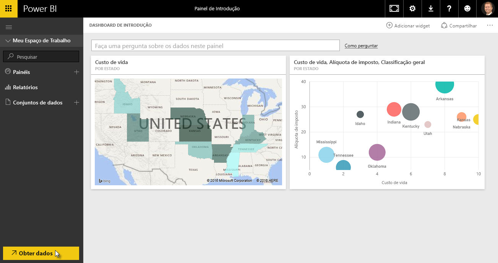
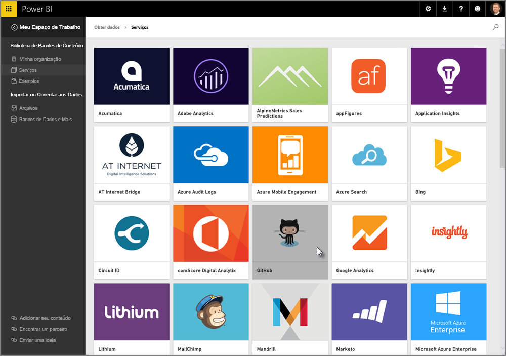
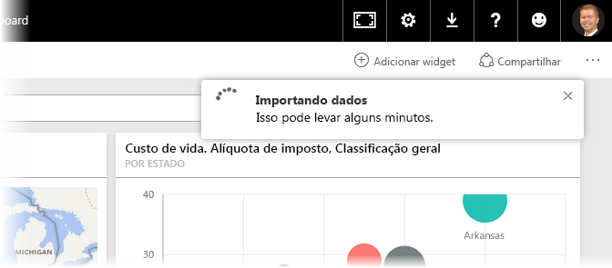
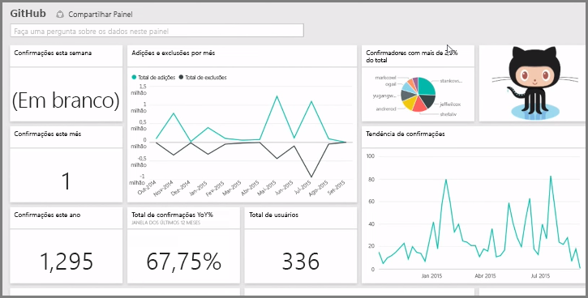
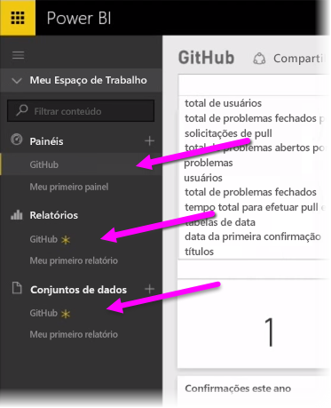
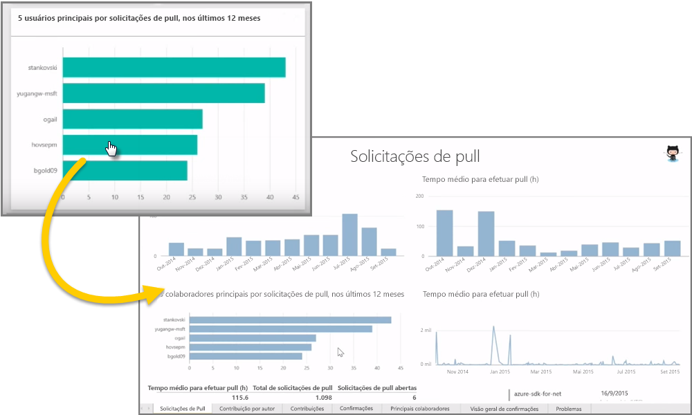
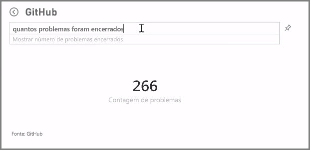
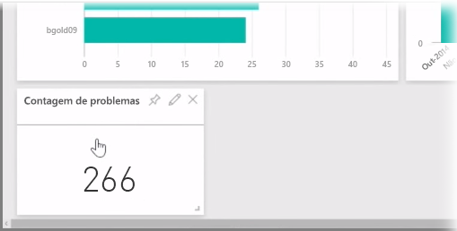
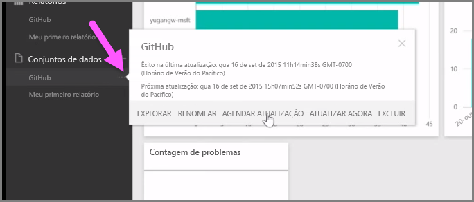

Como aprendemos, o fluxo comum de trabalho no Power BI é criar um relatório no Power BI Desktop, publicá-lo no serviço do Power BI e compartilhá-lo com outras pessoas para que elas possam exibi-lo no serviço ou em um aplicativo móvel.

Algumas pessoas começam no serviço do Power BI; no entanto, vamos dar uma olhada rápida no serviço e aprender sobre uma maneira fácil e popular de criar rapidamente visuais no Power BI: *pacotes de conteúdo*.

Um **pacote de conteúdo** é uma coleção de visuais e relatórios pré-configurados e prontos baseados em fontes de dados específicas, como o Salesforce. Usar um pacote de conteúdo é como usar o forno de micro-ondas para preparar uma refeição rápida ou pedir uma refeição expressa: com apenas alguns cliques e comentários, você é servido rapidamente com uma coleção de entradas desenvolvidas para uma ótima combinação, todas apresentadas em um pacote organizado e pronto para consumo.

Portanto, vamos dar uma olhada nos pacotes de conteúdo, no serviço e em como eles funcionam. Entrarmos em mais detalhes sobre os pacotes de conteúdo (e o serviço) em seções futuras; pense nisso como um teste de degustação para estimular seu apetite.

## Criar dashboards prontos para uso com serviços de nuvem
Com o Power BI, é fácil se conectar a dados. No serviço do Power BI, basta selecionar o botão **Obter Dados** no canto inferior esquerdo da tela inicial.

A *tela* (a área no centro do serviço do Power BI) mostra as fontes de dados disponíveis no serviço do Power BI. Além de fontes de dados comuns, como arquivos do Excel, bancos de dados ou dados do Azure, o Power BI pode se conectar a **serviços de software** (também chamados de provedores de SaaS ou serviços de nuvem), como Salesforce, Facebook, Google Analytics, e outros diversos serviços de SaaS com a mesma facilidade.

Para esses serviços de software, o **serviço do Power BI** fornece uma coleção de visuais prontos para uso, pré-organizados em dashboards e relatórios chamados **Pacotes de Conteúdo**. Os pacotes de conteúdo o preparam rapidamente no Power BI com dados do serviço selecionado. Por exemplo, quando você usa o pacote de conteúdo do Salesforce, o Power BI se conecta à sua conta do Salesforce (depois que você fornecer suas credenciais) e popula uma coleção predefinida de visuais e dashboards no Power BI.

O Power BI fornece pacotes de conteúdo para todos os tipos de serviços. A imagem a seguir mostra a primeira tela de serviços, em ordem alfabética, exibida quando você seleciona **Obter** na caixa **Serviços** (mostrada na imagem anterior). Como você pode ver na imagem abaixo, existem muitos tipos para escolher.

Para nossas finalidades, vamos escolher o **GitHub**. O GitHub é um aplicativo de controle do código-fonte online. Depois que eu inserir as informações e as credenciais referentes ao pacote de conteúdo do GitHub, ele começará a importar meus dados.

Depois que os dados forem carregados, o dashboard do pacote de conteúdo do GitHub predefinido será exibido.

Além do **Dashboard**, o **Relatório** gerado (como parte do pacote de conteúdo do GitHub) para criar o dashboard estará disponível também, assim como o **Conjunto de Dados** (A coleção de dados enviada por pull pelo GitHub) criado durante a importação de dados e usado para criar o Relatório do GitHub.

No Dashboard, você pode clicar em qualquer um dos visuais e será levado automaticamente para a página **Relatório** no qual o visual foi criado. Portanto, quando o visual **5 principais usuários por solicitações pull** é clicado, o Power BI abre a página **Solicitações pull** do Relatório (a página do Relatório na qual o visual foi criado).

## Fazendo perguntas sobre seus dados
Também é possível fazer perguntas de seus dados, e o serviço do Power BI criará visuais de acordo com sua pergunta, em tempo real. Na imagem a seguir, observe que o Power BI cria um visual de número mostrando a Contagem de Problemas fechados, de acordo com o que é digitado na barra **Consulta de Linguagem Natural**.

Quando você tiver um visual preferido, você poderá selecionar o ícone **Marcador** à direita da barra Consulta de Linguagem Natural para fixar o visual no dashboard. Nesse caso, o visual é fixado no dashboard do GitHub, já que esse é o dashboard selecionado no momento.

## Atualizando dados no serviço do Power BI
Você também pode optar por **atualizar** o conjunto de dados de um pacote de conteúdo ou outros dados usados no Power BI. Para definir as configurações de atualização, selecione as reticências (os três pontos) ao lado de um conjunto de dados e um menu será exibido.

Selecione a opção **Agendar Atualização** na parte inferior do menu. A caixa de diálogo Configurações é exibida na tela, permitindo definir as configurações de atualização que atendem às suas necessidades.

Isso é o suficiente para nossa visão rápida no serviço do Power BI. Há muitas outras coisas que você pode fazer no serviço, que abordaremos adiante no curso. Lembre-se também de que há vários tipos diferentes de dados aos quais você pode se conectar e todos os tipos de pacotes de conteúdo, com mais pacotes de conteúdo lançados a todo momento.

Certo, vamos passar para o próximo tópico, no qual vamos resumir esta seção **Introdução** e prepará-lo para o que vem a seguir.

