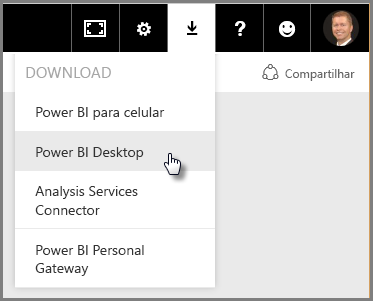
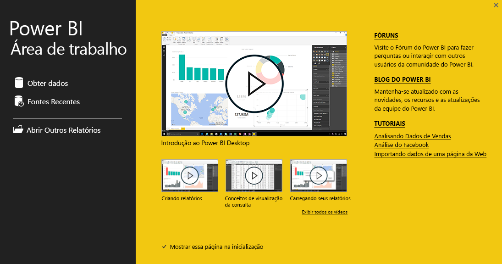

Bem-vindo à segunda seção deste curso **Aprendizagem interativa** sobre o Power BI, intitulada **Obtendo dados**. Esta seção examina os vários recursos centrados em dados e as ferramentas do Power BI, com foco no BI. Muitas dessas ferramentas também se aplicam ao serviço do Power BI e, portanto, sua aprendizagem terá dupla utilidade nesta seção.

Quando você obtém dados, às vezes, eles não são tão bem formados, ou *limpos*, como desejado. Portanto, nesta seção, você aprenderá a obter dados, como limpá-los (processo às vezes chamado de *limpeza* ou *transformação* de dados) e também aprenderá alguns truques avançados que podem facilitar sua tarefa de obtenção de dados.

Como sempre, neste curso, sua jornada de aprendizado segue o mesmo caminho que o fluxo de trabalho no Power BI. Assim, vamos conferir o **Power BI Desktop**, o local em que tudo geralmente começa.

## Uma visão geral do Power BI Desktop
O Power BI Desktop é uma ferramenta usada para se conectar aos dados, bem como para limpá-los e visualizá-los. Com o Power BI Desktop, você pode se conectar a dados e, em seguida, modelá-los e visualizá-los de maneiras diferentes. A maioria dos usuários que trabalham em projetos de Business Intelligence passará a maior parte do tempo usando o Power BI Desktop.

Você pode baixar o Power BI Desktop [da Web](http://go.microsoft.com/fwlink/?LinkID=521662), você também pode instalar o **Power BI Desktop** como um aplicativo a partir da [**Windows Store**](http://aka.ms/pbidesktopstore), ou pode baixá-lo do serviço do Power BI. Para obter o **Power BI Desktop** através do serviço basta selecionar o botão de seta para baixo no canto superior direito do Power BI e selecionar Power BI Desktop.

O Power BI Desktop é instalado como um aplicativo no computador com Windows.

Depois de baixá-lo, você vai instalar o Power BI Desktop e executá-lo como outros aplicativos no Windows. A imagem a seguir mostra a Tela Iniciar do Power BI Desktop, que é exibida quando você inicia o aplicativo.

O Power BI Desktop se conecta a uma ampla variedade de fontes de dados, que vão desde bancos de dados locais e planilhas do Excel até serviços de nuvem. Ele ajuda a limpar e formatar os dados para torná-los mais utilizáveis, incluindo divisão e renomeação de colunas, alteração dos tipos de dados e trabalho com datas. Também é possível criar relações entre as colunas para simplificar a modelagem e análise dos dados.

