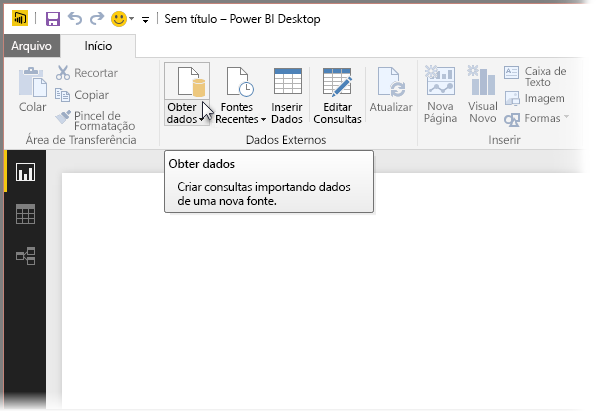
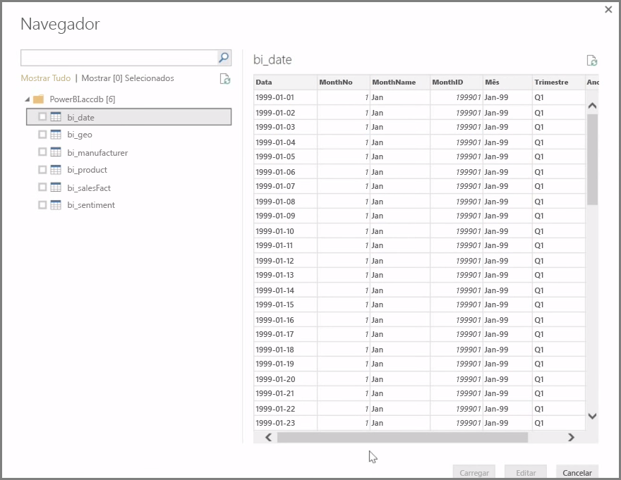
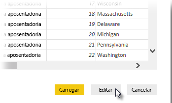

O **Power BI Desktop** pode se conectar a uma grande variedade de fontes de dados, incluindo bancos de dados locais, pastas de trabalho do Excel e serviços de nuvem. Atualmente, mais de 59 serviços de nuvem diferentes, como GitHub e Marketo, tem conectores específicos, e você pode se conectar a fontes genéricas por meio de XML, CSV, texto e ODBC. O Power BI até mesmo extrairá dados de tabela diretamente de uma URL do site! Mas vamos começar do início, abrindo o Power BI Desktop e conectando-se a dados.

Quando você inicia o **Power BI Desktop** e passa pela Tela Iniciar, é possível optar por Obter Dados na faixa de opções, na guia **Página Inicial**.

Há atualizações mensais do Power BI Desktop e, com cada atualização, a página **Novidades do Power BI Desktop** é atualizada com informações sobre as atualizações, links para o blog e um link de download.

No Power BI Desktop, há todos os tipos de fontes de dados diferentes disponíveis. Selecione uma fonte para estabelecer uma conexão. Dependendo da seleção, será solicitado que você encontre a fonte no computador ou na rede ou que faça logon em um serviço para autenticar a solicitação.

Depois de se conectar, a primeira janela que você verá será o **Navegador**. O Navegador exibe as tabelas ou entidades da fonte de dados e, ao clicar em uma delas, você verá uma visualização do conteúdo. Em seguida, você pode importar as tabelas ou entidades selecionadas imediatamente ou selecionar **Editar** para transformar e limpar seus dados antes da importação.

Depois de selecionar as tabelas que você gostaria de inserir no Power BI Desktop, você poderá optar por carregá-los no Power BI Desktop selecionando o botão **Carregar** no canto inferior direito do **Navegador**. No entanto, há ocasiões em que você talvez queira fazer alterações a essas tabelas antes de carregá-las no Power BI Desktop. Provavelmente, você desejará obter apenas um subconjunto de clientes ou filtrar os dados em busca de vendas que ocorreram somente em um país específico. Nesses casos, é possível selecionar o botão Editar e filtrar ou transformar os dados antes de enviá-los ao Power BI Desktop.

Vamos obtê-los lá, e editar nossos dados, na próxima seção.

