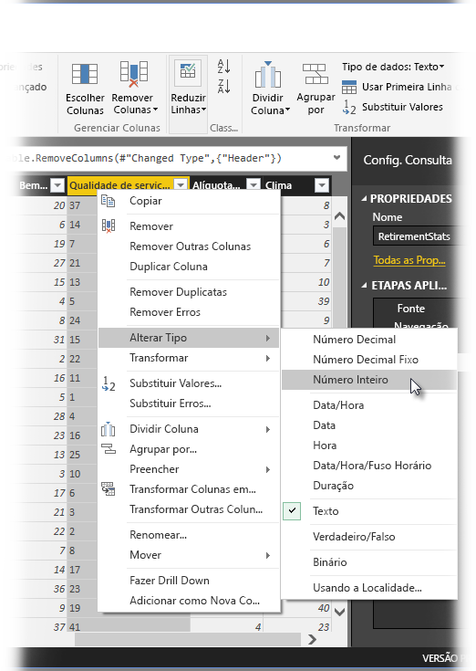
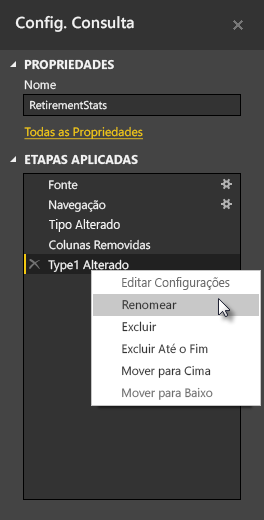
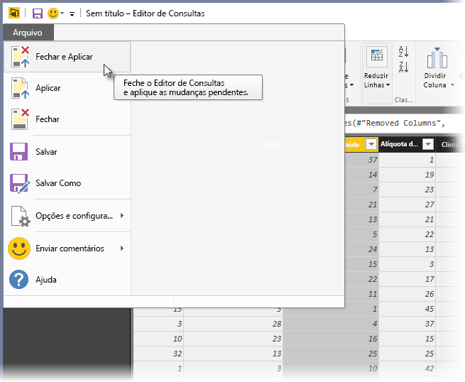
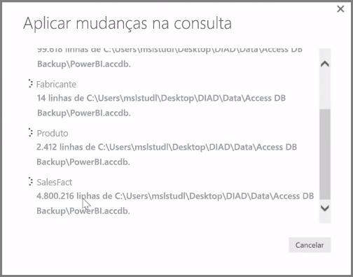

O **Power BI Desktop** inclui o **Editor de Consultas**, uma ferramenta avançada para formatação e transformação dos dados de modo que eles estejam prontos para seus modelos e suas visualizações. Ao selecionar Editar do Navegador, o Editor de Consulta é iniciado e populado com as tabelas ou outras entidades selecionadas na fonte de dados.

Você também pode iniciar o **Editor de Consultas** diretamente no **Power BI Desktop**, usando o botão **Editar Consultas** na faixa de opções **Página Inicial**.

Quando o Editor de Consultas for carregado com dados que estão prontos para a formatação, você verá algumas seções:

1. Na faixa de opções, muitos botões agora estão ativos para interagir com os dados na consulta
2. No painel esquerdo, as consultas (uma para cada tabela ou entidade) são listadas e ficam disponíveis para seleção, exibição e formatação
3. No painel central, dados da consulta selecionada são exibidos e estarão disponíveis para formatação
4. A janela Configurações de Consulta é exibida, listando as propriedades da consulta e as etapas aplicadas

No painel central, ao clicar duas vezes em uma coluna, serão exibidas várias transformações diferentes disponíveis, como remover a coluna da tabela, duplicar a coluna com um novo nome e substituir os valores. Nesse menu, você também pode dividir as colunas de texto em múltiplos por delimitadores comuns.

A faixa de opções **Editor de Consultas** contém outras ferramentas, tais como alterar o tipo de dados das colunas, adicionar notação científica ou extrair elementos de datas, como o dia da semana.

À medida que você aplica as transformações, cada etapa é exibida na lista **Etapas Aplicadas** do painel **Configurações de Consulta** no lado direito do **Editor de Consultas**. Você pode usar essa lista para desfazer ou examinar alterações específicas, ou até mesmo alterar o nome de uma etapa. Para salvar as transformações, selecione **Fechar e Aplicar** na guia **Página Inicial**.

Depois de selecionar **Fechar e Aplicar**, o Editor de Consultas aplica as alterações de consulta feitas, aplicando-as ao Power BI Desktop.

Há diversas coisas que você pode fazer ao transformar dados no **Editor de Consultas**, incluindo transformações avançadas. Na próxima seção, vamos dar uma olhada em algumas dessas transformações avançadas, para dar uma ideia das maneiras quase imensuráveis pelas quais é possível transformar seus dados com o **Editor de Consultas**.

