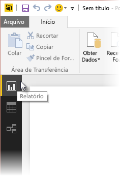
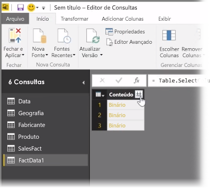
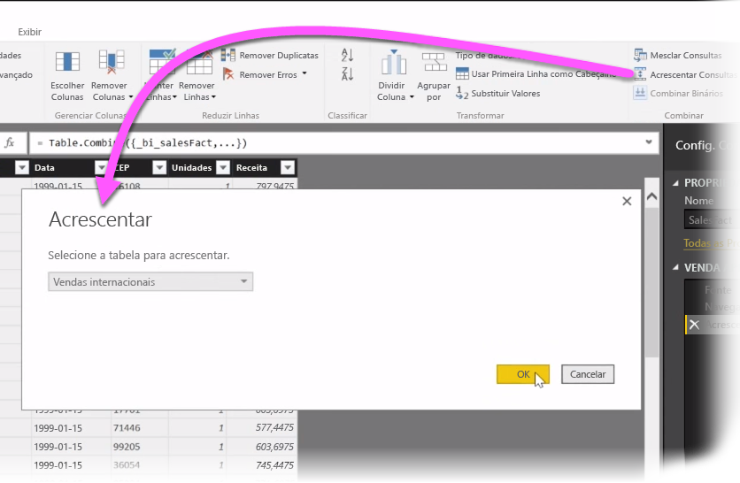
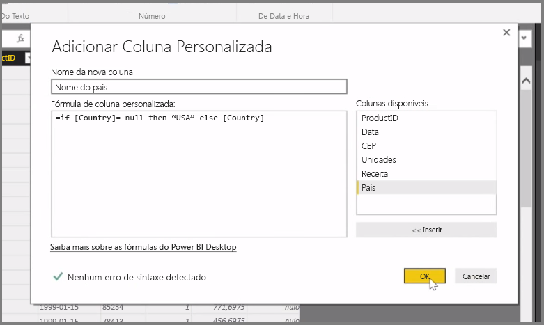

Neste artigo, investigamos algumas técnicas avançadas de importação e limpeza de dados do **Power BI Desktop**. Depois de formatar seus dados no **Editor de Consultas** e inseri-los no **Power BI Desktop**, é possível examiná-los de maneiras diferentes. Há três exibições no Power BI Desktop: **Relatório** , **Dados** e **Relações** . Você verá cada modo de exibição selecionando seu ícone no canto superior esquerdo da tela. Na imagem a seguir, o modo de exibição **Relatório** está selecionado. A barra amarela ao lado do ícone indica qual modo de exibição está ativo.

Para alterar o modo de exibição, basta selecionar qualquer um dos outros dois ícones. A barra amarela ao lado do ícone indica qual modo de exibição está ativo.

Power BI Desktop pode combinar dados de várias fontes em um único relatório, a qualquer momento durante o processo de modelagem. Para adicionar fontes adicionais a um relatório existente, selecione **Editar Consultas** na faixa de opções **Página Inicial** e selecione **Nova Fonte** no **Editor de Consultas**.

Há várias fontes de dados diferentes possíveis que podem ser usadas no **Power BI Desktop**, incluindo Pastas. Ao se conectar a uma pasta, é possível importar dados de vários arquivos ao mesmo tempo, como uma série de arquivos do Excel de arquivos CSV. Os arquivos contidos na pasta selecionada aparecem no **Editor de Consultas** como conteúdo binário e, ao clicar no ícone de seta dupla na parte superior da coluna **Conteúdo**, seus valores serão carregados.

Uma das ferramentas mais úteis do Power BI são seus *Filtros*. Por exemplo, selecionar a seta suspensa ao lado de uma coluna abre uma lista de filtros de texto que você pode usar para remover valores do modelo.

Você pode também mesclar e acrescentar consultas, bem como transformar várias tabelas (ou dados de vários arquivos, em pastas) em uma única tabela que contém apenas os dados desejados. É possível usar a ferramenta **Acrescentar Consultas** para adicionar os dados de uma nova tabela a uma consulta existente. O Power BI Desktop tenta fazer a correspondência das colunas nas consultas, que podem ser ajustadas conforme necessário no **Editor de Consultas**.

Por fim, a ferramenta **Adicionar Coluna Personalizada** oferece aos usuários avançados a opção de escrever expressões de consulta do zero usando a linguagem avançada M. Você pode adicionar uma coluna personalizada com base em instruções da linguagem de consulta M e fazer com que seus dados fiquem como desejado.

