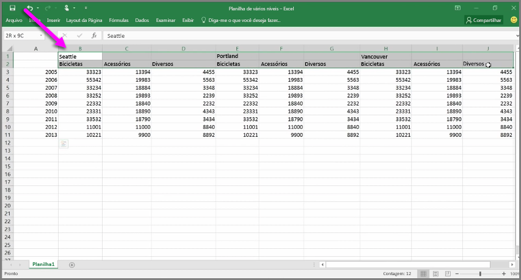
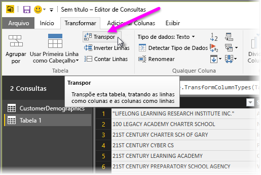
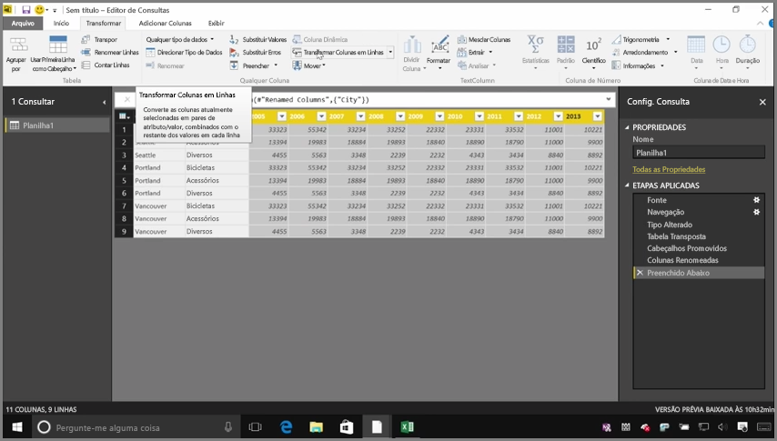
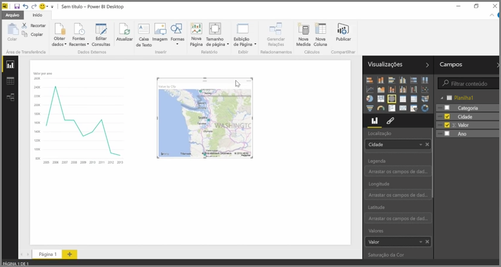

Embora o Power BI possa importar seus dados de praticamente qualquer fonte, suas ferramentas de visualização e modelagem funcionam melhor com dados de colunas. Às vezes, os dados não serão formatados em colunas simples, o que geralmente ocorre com planilhas do Excel, nas quais um layout de tabela que parece bom ao olho humano não é necessariamente ideal para consultas automatizadas. Por exemplo, a planilha mostrada a seguir contém cabeçalhos que abrangem várias colunas.

Felizmente, o Power BI tem as ferramentas para transformar rapidamente tabelas de várias colunas em conjuntos de dados que podem ser usados.

## Transpor dados
Por exemplo, com a opção **Transpor** do **Editor de Consultas**, é possível inverter os dados (transformar colunas em linhas e linhas em colunas) para que você possa dividi-los em formatos que podem ser manipulados.

Depois de fazer isso algumas vezes, conforme descrito no vídeo, sua tabela começa a se transformar em algo com que o Power BI pode trabalhar com mais facilidade.

## Formatar dados
Você também precisará formatar os dados de modo que o Power BI consiga categorizá-los e identificá-los corretamente após a importação.

Com algumas transformações, incluindo *promover linhas em cabeçalhos* e dividir cabeçalhos, usar a opção **Preencher** para mudar os valores *null* para os valores encontrados acima ou abaixo em determinada coluna e a opção **Transformar colunas em linhas**, você pode limpar os dados em um conjunto de dados que pode ser usado no Power BI.

Com o Power BI, você pode fazer testes com essas transformações em seus dados e determinar quais tipos transformam seus dados no formato de coluna que permite que o Power BI trabalhe com ele. E lembre-se: todas as ações executadas são registradas na seção Etapas Aplicadas do Editor de Consultas; portanto, se uma transformação não funcionar da maneira desejada, você poderá simplesmente clicar no **x** ao lado da etapa e desfazê-la.

## Criar visuais
Depois que os dados estiverem em um formato que o Power BI pode usar, ao transformar e limpar de dados, será possível começar a criar visuais.

## Próximas etapas
**Parabéns!** Você concluiu esta seção do curso **Aprendizagem interativa** sobre o Power BI. Agora você sabe como **inserir dados** no Power BI Desktop e como *formatar* ou *transformar* os dados, de modo que você possa criar visuais interessantes.

A próxima etapa do aprendizado de como funciona o Power BI e como fazê-lo funcionar *para você*, é entender o que acontece na **modelagem**. Como você aprendeu, um **conjunto de dados** é um bloco de construção básico do Power BI, porém, alguns conjuntos de dados podem ser complexos e se basear em várias fontes de dados diferentes. E, às vezes, é preciso adicionar seu próprio toque especial (ou *campo*) ao conjunto de dados que você criar.

Você saberá mais sobre a **modelagem** e muito mais na próxima seção. Até mais!

