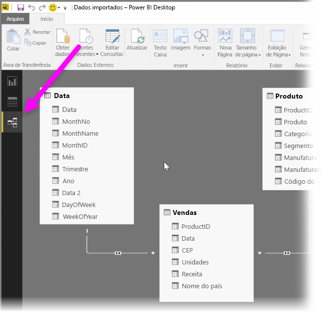
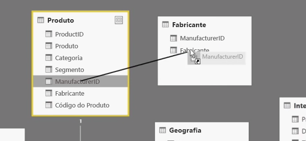
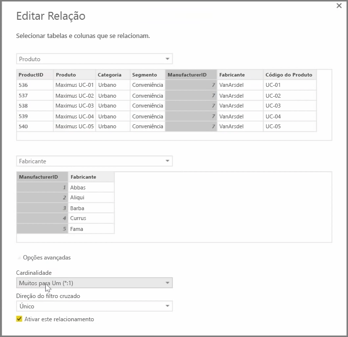

O Power BI permite definir visualmente a relação entre tabelas ou elementos. Para ver uma exibição diagramática de seus dados, use o **Modo de exibição relações**, localizado no lado esquerdo da tela ao lado da tela do Relatório.

No modo de exibição **Relações**, você poderá ver um bloco que representa cada tabela e suas colunas, bem como as linhas entre elas para representar as relações.

Adicionar e remover relações é simples. Para remover uma relação, clique nela com o botão direito do mouse e selecione **Excluir**. Para criar uma relação, arraste e solte os campos que você deseja associar entre tabelas.

Para ocultar uma tabela ou coluna individual do relatório, clique nela com o botão direito do mouse no modo de exibição Relação e selecione **Ocultar no Modo de Exibição Relatório**.

Para obter uma visão mais detalhada das relações de dados, selecione **Gerenciar Relações** na guia **Página Inicial**. Isso abrirá a caixa de diálogo **Gerenciar Relações**, que exibe as relações como uma lista em vez de um diagrama visual. Nela, é possível selecionar **Detecção Automática** para encontrar relações em dados novos ou atualizados. Selecione **Editar** na caixa de diálogo **Gerenciar Relações** para editar as relações manualmente. Esse também é o local em que você pode encontrar opções avançadas para definir a direção de *Cardinalidade* e de *Filtro cruzado* das relações.

Suas opções de Cardinalidade são *Muitos para Um* e *Um para Um*. *Muitos para Um* é a relação do tipo fato para dimensão, por exemplo, uma tabela de vendas com várias linhas por produto com correspondência a uma tabela que lista os produtos em sua própria linha exclusiva. *Um para Um* é usado com frequência para associar entradas únicas em tabelas de referência.

Por padrão, as relações serão definidas como filtro cruzado nas duas direções. A filtragem cruzada em apenas uma direção limitava algumas das funcionalidades de modelagem em uma relação.

Definir relações precisas entre os dados permite que você crie cálculos complexos entre vários elementos de dados.

