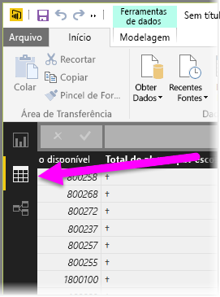
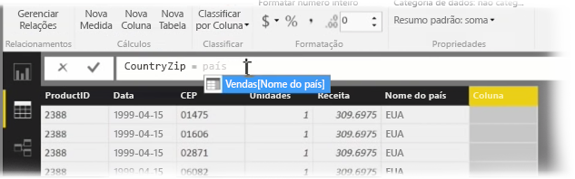
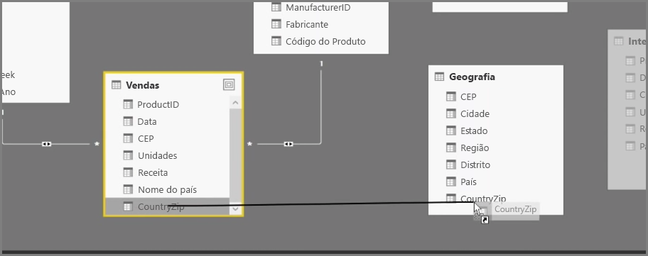
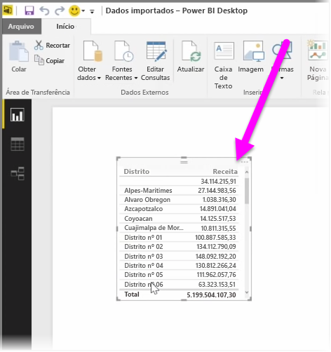

Criar colunas calculadas é uma maneira simples para enriquecer e aprimorar seus dados. Uma **coluna calculada** é uma nova coluna que você cria definindo um cálculo que transforma ou combina dois ou mais elementos de dados existentes. Por exemplo, você pode criar uma nova coluna combinando duas colunas em uma.

Um motivo útil para a criação de uma coluna calculada é estabelecer uma relação entre tabelas, quando não houver campos exclusivos que podem ser usados para estabelecer uma relação. A falta de uma relação se torna aparente quando você cria um visual de tabela simples no Power BI Desktop e você obtém o mesmo valor para todas as entradas, mas sabe que os dados subjacentes são diferentes.

Para criar uma relação com campos exclusivos nos dados, você, por exemplo, poderá criar uma nova coluna calculada para “Número de Telefone Completo” combinando os valores das colunas “Código de Área” e “Número Local” quando encontrar esses valores nos dados. Colunas calculadas são uma ferramenta útil para criar rapidamente modelos e visualizações.

Para criar uma coluna calculada, selecione o **Modo de exibição de dados** no Power BI Desktop do lado esquerdo da tela do relatório.

Na guia Modelagem, selecione **Nova Coluna**. Isso habilitará a barra de fórmulas, em que você poderá inserir cálculos usando a linguagem DAX (Data Analysis Expressions). DAX é uma linguagem de fórmula avançada, também encontrada no Excel, que permite criar cálculos robustos. Conforme você digita uma fórmula, o Power BI Desktop exibe fórmulas ou elementos de dados correspondentes para auxiliar e acelerar a criação da fórmula.

A barra de fórmulas do Power BI fará sugestões de funções DAX específicas e de colunas de dados relacionadas quando você inserir a expressão.

Depois que as colunas calculadas forem criadas em cada tabela, elas poderão ser usadas como uma chave exclusiva para estabelecer uma relação entre elas. Ao acessar o modo de exibição **Relação**, você poderá arrastar o campo de uma tabela para a outra para criar a relação.

Ao retornar para o modo de exibição **Relatório**, você verá um valor diferente para cada distrito.

Também há muitas outras coisas que você pode fazer com a criação de colunas calculadas.

