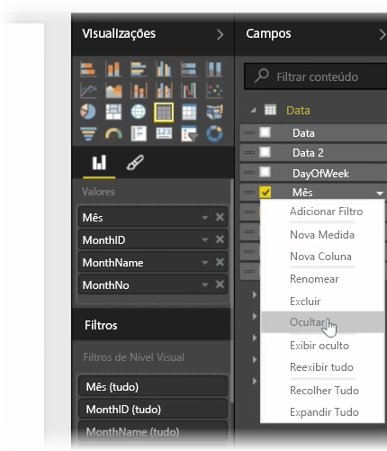
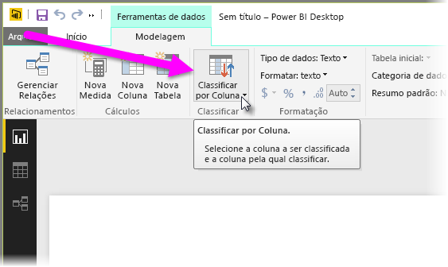
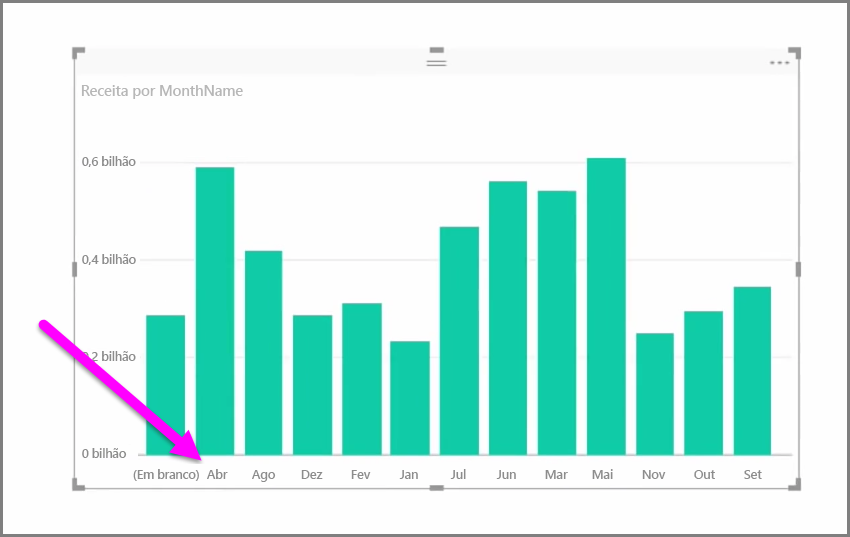
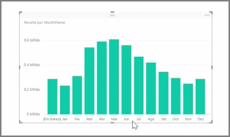

Em geral, os dados importados contém os campos que você, na verdade, não precisa para suas tarefas de relatório e visualização, porque são informações extras ou porque esses dados já estão disponíveis em outra coluna. O Power BI Desktop tem as ferramentas para otimizar seus dados e torná-los mais úteis para a criação de relatórios e visuais, bem como para exibir seus relatórios compartilhados.

## Ocultando campos
Para ocultar uma coluna no painel **Campos** do Power BI Desktop, clique com o botão direito do mouse nela e selecione **Ocultar**. Observe que as colunas ocultas não são excluídas; se você usou esse campo nas visualizações existentes, os dados ainda estarão nesse visual e você ainda poderá usar esses dados em outras visualizações também; o campo oculto apenas não é exibido no painel **Campos**.

Se você exibir tabelas no modo de exibição **Relações**, os campos ocultados serão indicados ficando esmaecidos. Novamente, seus dados ainda estão disponíveis e ainda fazem parte do modelo; eles estão apenas ocultos da exibição. Você sempre pode exibir novamente qualquer campo oculto clicando com o botão direito do mouse no campo e selecionando **Exibir Novamente**.

## Classificando dados de visualização por outro campo
A ferramenta **Classificar por Coluna**, disponível na guia **Modelagem**, é muito útil para garantir que seus dados são exibidos na ordem desejada.

Como um exemplo comum, dados que incluem o nome do mês são classificados em ordem alfabética por padrão, por exemplo, “Agosto” aparece antes de “Fevereiro”.

Nesse caso, selecionar o campo na lista Campos e **Classificar por Coluna** na guia **Modelagem** e, por fim, escolher um campo que será usado para a classificação poderá corrigir o problema. Nesse caso, a opção de classificação de categoria “MonthNo” ordena os meses conforme desejado.

Definir o tipo de dados para um campo é outra maneira de otimizar suas informações para que elas sejam manipuladas corretamente. Para alterar um tipo de dados na tela do relatório, selecione a coluna no painel **Campos** e use o menu suspenso **Formatar** para selecionar uma das opções de formatação. Todos os visuais criados que exibem esse campo são atualizados automaticamente.

