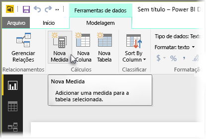
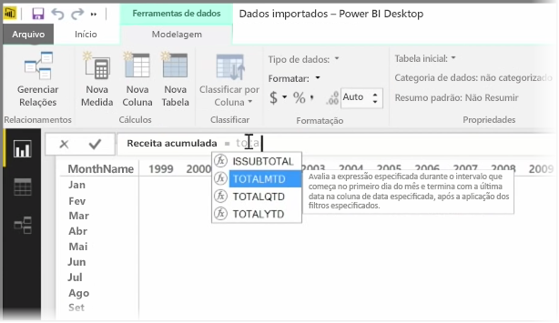
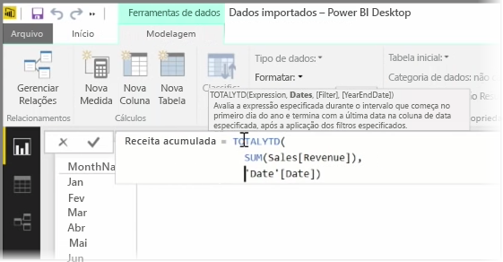
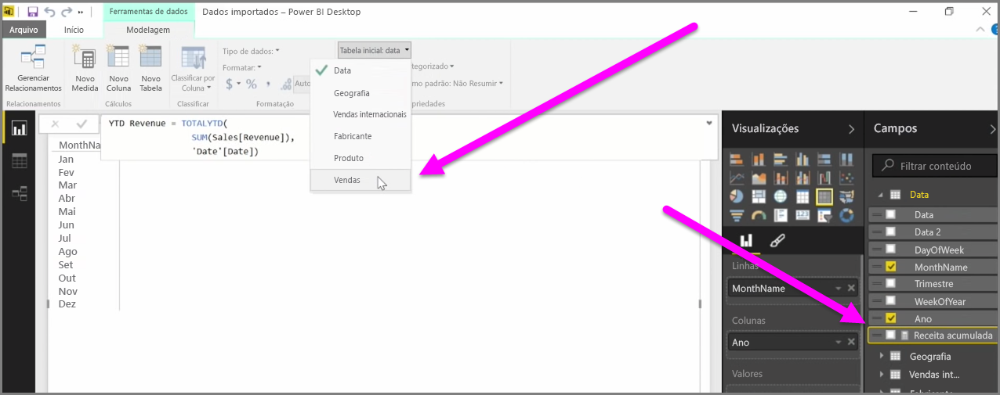

Uma *medida* é um cálculo que existe no modelo de dados do Power BI. Para criar uma medida, no modo de exibição **Relatório**, selecione **Nova Medida** na guia **Modelagem**.

Uma das melhores coisas sobre o DAX, a linguagem Data Analysis Expression no Power BI, é que ela tem muitas funções úteis, especialmente, relacionadas a cálculos baseados em tempo, como *Acumulado no Ano* ou *Comparação Ano Após Ano*. Com o DAX, você pode definir uma medida de tempo uma vez e segmentá-la por quantos campos diferentes desejar com base em seu modelo de dados.

No Power BI, um cálculo definido é chamado de *medida*. Para criar uma *medida*, selecione **Nova Medida** na guia **Página Inicial**. Isso abrirá a barra de Fórmulas, em que é possível digitar a expressão DAX que define a medida. Conforme você digita, o Power BI faz apresenta sugestões de funções DAX relevantes e campos de dados à medida que você insere o cálculo, e você também obterá uma dica de ferramenta explicando alguns dos parâmetros de sintaxe e de função.

Se o cálculo for particularmente longo, você poderá adicionar quebras de linha extras no Editor de Expressão digitando **ALT-Enter**.

Depois de criar uma nova medida, ela será exibida em uma das tabelas no painel **Campos**, localizado no lado direito da tela. O Power BI insere a nova medida em qualquer tabela selecionada atualmente, e embora a localização exata da medida nos dados não seja importante, você poderá movê-la com facilidade selecionando a medida e usando o menu suspenso **Tabela Inicial**.

É possível usar uma medida assim como qualquer outra coluna de tabela: basta arrastá-la e soltá-la na tela do relatório ou nos campos de visualização. As medidas também são integradas perfeitamente com as segmentações, segmentando os dados em tempo real, o que significa que você pode definir uma medida uma vez e usá-la em várias visualizações diferentes.

A função DAX **Calculate** é uma função avançada que possibilita todos os tipos de cálculos úteis, o que é especialmente útil para relatórios e visuais financeiros.

