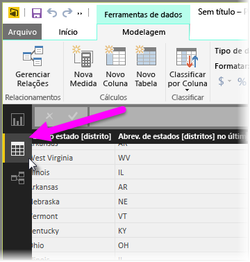
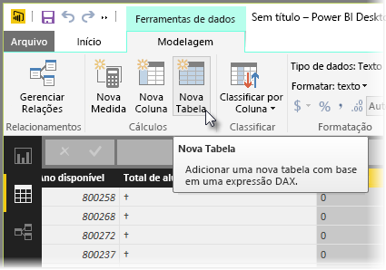
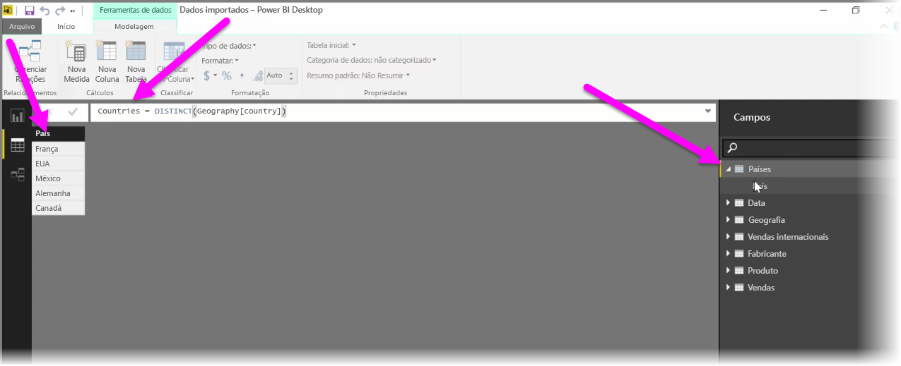

Tabelas calculadas são uma função no DAX que permite expressar uma grande variedade de novas funcionalidades de modelagem. Por exemplo, se você quiser executar diferentes tipos de junções de mesclagem ou criar novas tabelas em pouco tempo com base nos resultados de uma fórmula funcional, as tabelas calculadas serão a maneira de fazer isso.

Para criar uma tabela calculada, vá para **Modo de exibição de dados** no Power BI Desktop, que pode ser ativado no lado esquerdo da tela do relatório.

Selecione **Nova Tabela** na guia Modelagem para abrir a barra de fórmulas.

Digite o nome da nova tabela no lado esquerdo do sinal de igual e o cálculo que você deseja usar para formar a tabela à direita. Ao concluir o cálculo, a nova tabela será exibida no painel Campos do modelo.

Depois de criada, é possível usar a tabela calculada como você faria com qualquer outra tabela em relações, fórmulas e relatórios.

