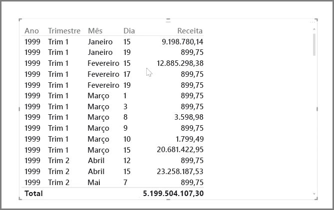
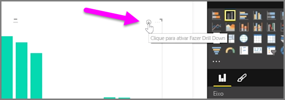
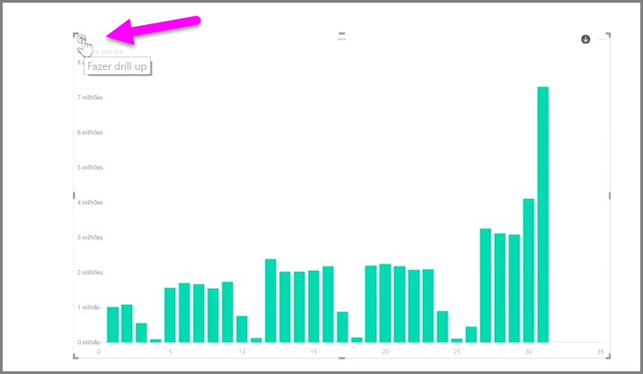
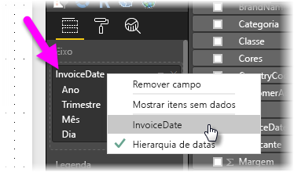

É fácil analisar dados baseados em tempo com o Power BI. As ferramentas de modelagem no Power BI Desktop incluem automaticamente os campos gerados que permitem fazer drill down em anos, trimestres, meses e dias com um único clique.  

Quando você cria uma visualização de tabela no relatório usando um campo de data, o Power BI Desktop inclui automaticamente divisões por período. Por exemplo, o campo de data única na tabela **Data** foi separado automaticamente em Ano, Trimestre, Mês e Dia pelo Power BI, como mostrado na imagem a seguir.

As visualizações exibem os dados no nível *ano* por padrão, mas é possível alterar esse comportamento ativando **Fazer Drill Down** no canto superior direito do visual.

Agora, quando você clica nas barras ou nas linhas do gráfico, ele faz drill down até o próximo nível de hierarquia de tempo, por exemplo, de *anos* para *trimestres*. Você pode continuar fazendo drill down até alcançar o nível mais granular da hierarquia, que neste exemplo é *dias*. Para voltar na hierarquia de tempo, clique em **Fazer Drill Up** no canto superior esquerdo do visual.

Você também pode fazer drill down em todos os dados mostrados no visual, em vez de em um período selecionado, usando o ícone de seta dupla **Analisar Todos**, também localizado no canto superior direito do visual.

Desde que seu modelo tenha um campo de data, o Power BI vai gerar automaticamente modos de exibição diferentes para diferentes hierarquias de tempo.

Para voltar para datas individuais em vez de usar a hierarquia de datas, é só clicar com o botão direito do mouse no nome de coluna na seção **Campos** (na imagem a seguir, o nome da coluna é *InvoiceDate*) e, em seguida, selecionar o nome da coluna no menu que aparece, em vez de **Hierarquia de datas**. Agora o visual mostra os dados com base nos dados dessa coluna, sem usar a hierarquia de datas. Deseja voltar a usar a hierarquia de datas? Sem problema. É só clicar novamente com o botão direito do mouse e selecionar **Hierarquia de datas** no menu.

## Próximas etapas
**Parabéns!** Você concluiu esta seção do curso **Aprendizagem interativa** sobre o Power BI. Agora que você sabe tudo sobre a *modelagem* de dados, você está pronto para aprender sobre a parte divertida que o aguarda na próxima seção: as **Visualizações**.

Como mencionamos anteriormente, este curso constrói seu conhecimento seguindo o fluxo de trabalho comum no Power BI:

* Inserir dados no **Power BI Desktop** e criar um relatório.
* Publicar no serviço do Power BI, em que você cria novas **visualizações** e dashboards
* **Compartilhar** seus dashboards com outras pessoas, especialmente as que estiverem viajando
* Exibir e interagir com relatórios e dashboards compartilhados nos aplicativos **Power BI para Celulares**

Embora você não possa fazer todo o trabalho por conta própria, você *entenderá* como esses dashboards foram criados e como eles estão conectados aos dados... E quando você concluir este curso, estará apto a criar seus próprios.

Vejo vocês na próxima seção!

