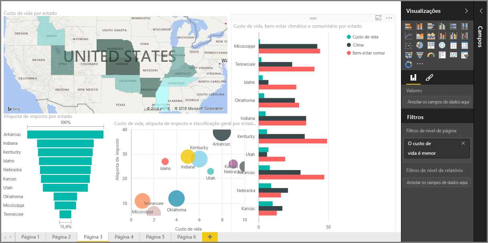

Bem-vindo à seção **Visualizações** do curso **Aprendizagem interativa** sobre o Power BI. Prepare-se para um tour divertido, interessante e esclarecedor das inúmeras visualizações que o Power BI tem a oferecer. E isso não é tudo – há mais visualizações lançadas a todo momento!

Evidentemente, os visuais são o resultado final de qualquer projeto de business intelligence... Queremos usar os dados, apresentá-los de forma interessante e informativa e *mostrar* os destaques. E o Power BI tem todos os tipos de visuais atraentes – e maneiras praticamente ilimitadas de personalizá-los – por isso, esta é uma seção importante!

Pode parecer que há muitos tópicos nesta seção, mas não se preocupe: todos eles são curtos e repletos de – você acertou! – visuais, além de serem fáceis de assimilar. Provavelmente, você vai perceber que está dando uma olhada nesta seção e imaginando como fará com que esses visuais apresentem seus dados.

Vamos começar com os fundamentos das visualizações – os visuais simples que todos nós já conhecemos – e garantir que você conhece todas as suas peculiaridades. Em seguida, vamos avançar mais ou, pelo menos, ir para um território um pouco menos comum, e preencher sua caixa de ferramentas de criação de relatórios.

Divirta-se – há muito a aprender aqui!

## Introdução aos visuais no Power BI
A visualização de dados é uma das partes principais do Power BI – um bloco de construção básico, como definimos anteriormente no curso – e criar visuais é a maneira mais fácil de encontrar e compartilhar suas informações.

O Power BI tem uma grande variedade de visualizações disponíveis por padrão, que vão desde gráficos de barras simples, gráficos de pizza e de mapa até ofertas ainda mais confidenciais, como cascatas, funis, medidores e muito mais. O Power BI Desktop também oferece uma variedade de ferramentas de formatação de páginas, tais como formas e imagens, que ajudam a dar vida ao seu relatório.

