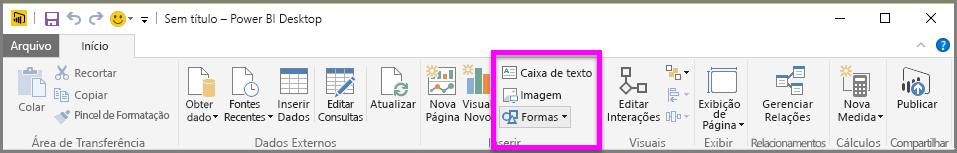
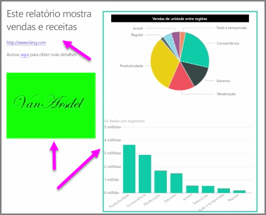

Juntamente com os visuais associados aos dados, você também pode adicionar elementos estáticos, tais como caixas de texto, imagens e formas, para aprimorar o design visual de seus relatórios. Para adicionar um elemento visual, selecione **Caixa de Texto**, **Imagem** ou **Formas** na guia **Página Inicial**.

**Caixas de texto** são uma maneira ideal de exibir títulos grandes, legendas ou parágrafos curtos de informações junto com as visualizações. As caixas de texto podem incluir links, por meio de uma URL escrita ou realçando uma frase de ancoragem e selecionando o símbolo de link na barra de opções da caixa de texto. Você pode incluir URLs nas caixas de texto e o Power BI detectará automaticamente o link e o tornará dinâmico.

A seleção de **Imagem** abrirá um navegador de arquivo, em que você poderá selecionar a imagem do computador ou de outra fonte em rede. Por padrão, o redimensionamento de uma imagem no relatório manterá sua taxa de proporção, mas isso poderá ser desabilitado nas opções de formatação do visual.

**Formas** traz cinco opções diferentes, incluindo retângulos e setas. As formas podem ser opacas ou transparentes com uma borda colorida. (O último é útil para a criação de bordas em torno de grupos de visualizações.)

