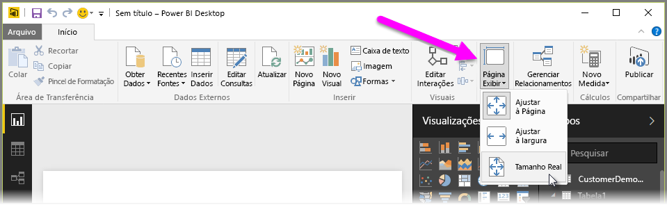
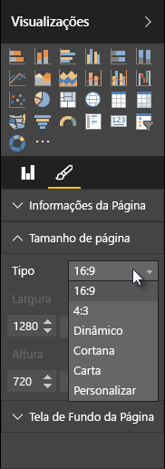

O Power BI Desktop possibilita controlar o layout e a formatação das páginas do relatório, como tamanho e orientação.

Use o menu **Modo de Exibição de Página** na guia Página Inicial para alterar a forma de escalar as páginas do relatório. As opções disponíveis incluem **Ajustar à Página** (padrão), **Ajustar à Largura** e **Tamanho Real**.

Também é possível alterar o tamanho das páginas. Por padrão, as páginas do relatório têm a proporção de 16:9. Para alterar o tamanho da página, verifique se nenhum visual foi selecionado e selecione o ícone de pincel no painel Visualizações e selecione **Tamanho da Página** para expandir essa seção.

As opções de tamanho de página incluem 4x3 (taxa de proporção mais quadrada) e Dinâmico (a página será ampliada para preencher o espaço disponível). Há um tamanho de carta padrão para relatórios também. Tenha em mente que poderá sr necessário redimensionar os visuais depois de alterar o tamanho da página para garantir que eles ficam totalmente na tela.

Você também pode especificar um tamanho de página personalizado, definindo o tamanho em polegadas ou pixels e alterar a cor da tela de fundo do relatório inteiro.

Outra opção é selecionar Cortana, que dimensiona o relatório para que ele possa ser usado como um resultado para pesquisas que usam a Cortana.

