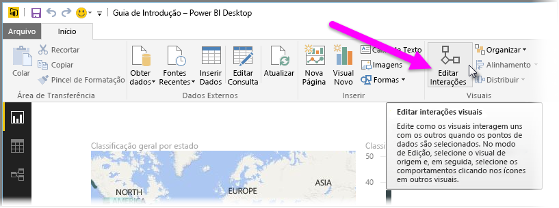
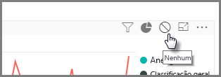
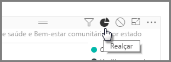
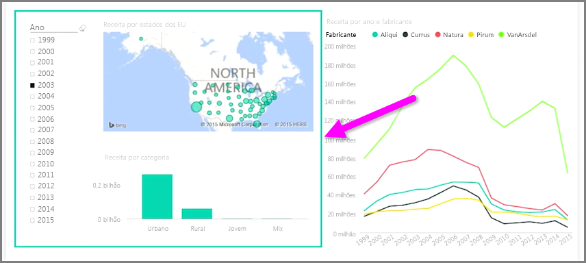

Quando você tiver várias visualizações na mesma página de relatório, a seleção de um segmento específico clicando ou usando uma segmentação afetará todos os visuais da página. No entanto, em alguns casos, convém segmentar apenas visuais específicos. Isso é especificamente aplicável ao usar elementos, como gráficos de dispersão, em que limitar os dados a um segmento específico removerá seu significado crucial. Felizmente, o Power BI Desktop permite controlar o fluxo de interações entre os visuais.

Para alterar a interação entre as visualizações, selecione **Editar** na seção Visuais da faixa de opções **Página Inicial** para ativar o **Modo de Edição**.

>[!NOTE]
>O ícone **Editar Interações** no Power BI Desktop foi alterado desde a gravação do vídeo.
> 
> 

Agora quando você seleciona um visual na tela do relatório, você verá um pequeno e opaco ícone de *filtro* no canto superior direito de todos os outros visuais que ele afetará. Para excluir um visual da interação, clique no símbolo *Nenhum* no canto superior direito, próximo ao ícone de *filtro*.

Em alguns casos, você pode ajustar o tipo de interação de filtro que acontece entre os visuais. Com o **Modo de Edição** ativado, selecione o visual que será usado para filtrar. Se você conseguir alterar o tipo de interação em outro visual, um ícone de *gráfico de pizza* aparecerá ao lado do ícone de filtro no canto superior direito.

Clique no ícone de *gráfico de pizza* para realçar os dados segmentados. Caso contrário, os dados serão filtrados. Como antes, é possível clicar no ícone *Nenhum* para remover toda a interação.

Uma dica útil de design é desenhar uma forma transparente em torno dos visuais que interagem entre si; assim, fica claro para o usuário que eles têm uma relação interativa.

