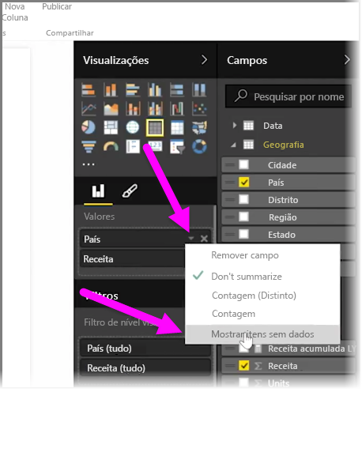
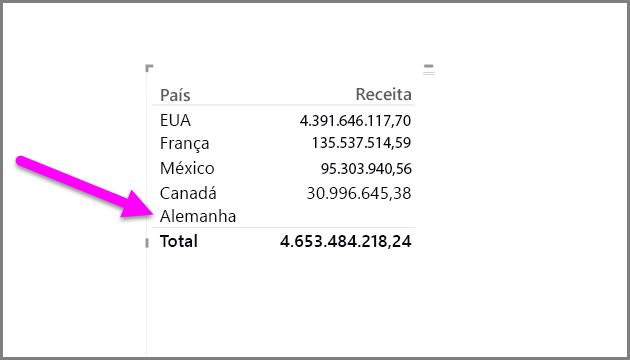
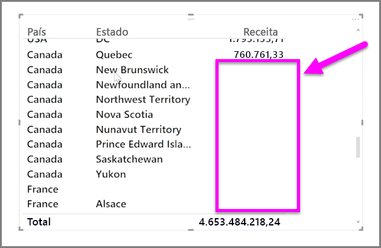

Por padrão, os cabeçalhos de coluna só serão exibidos nos relatórios se contiverem dados. Por exemplo, se você exibisse a receita por país e não houvesse vendas na Noruega, Noruega não apareceria em nenhum lugar da visualização.

Para exibir categorias vazias, clique na seta para baixo no campo que você deseja alterar no painel **Visualizações** e selecione **Mostrar itens sem dados**.

Todas as colunas vazias agora aparecem no visual com valores em branco.

Depois de selecionar **Mostrar itens sem dados** para qualquer campo no painel **Visualizações**, ele se aplicará a todos os campos exibidos no painel Visualizações. Portanto, se você adicionar outro campo, todos os itens que não têm dados também serão mostrados, sem que haja a necessidade de visitar novamente o menu suspenso.

