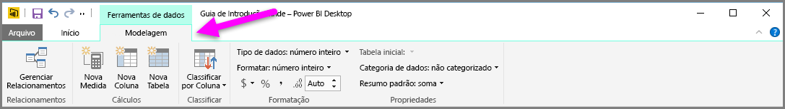
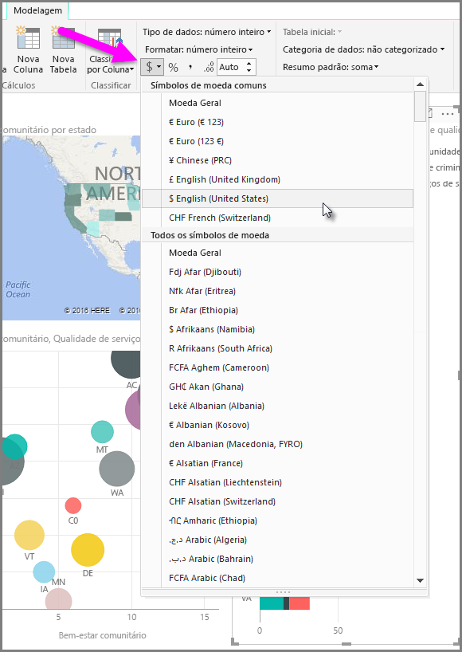
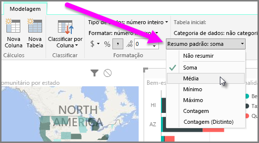
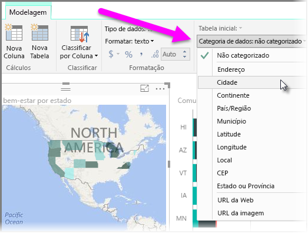

O Power BI contém propriedades que podem ser atribuídas a campos no modelo, e que podem ajudar a relatar, visualizar e apresentar dados de maneiras que proporcionam mais clareza. Por exemplo, às vezes, você deseja obter a média de uma lista de números, mas o Power BI soma automaticamente a lista. Com o Power BI, é possível ajustar como essas listas de números são resumidas.

## Controle numérico do resumo
Vamos apresentar um exemplo e demonstrar como controlar a maneira como o Power BI resume os campos de dados numéricos.

Selecione um visual na tela do relatório e um campo no painel **Campos**. A guia **Modelagem** aparece na faixa de opções e exibe as opções de formatação de dados e propriedades de dados.

É possível selecionar o tipo do símbolo da moeda usado selecionando o menu suspenso de símbolos da moeda, que é mostrado na imagem a seguir.

Há várias opções diferentes para a formatação de campos. Por exemplo, você pode alterar o formato de moeda para percentual.

Além disso, é possível alterar o modo como o Power BI resume os dados. Selecione o ícone **Resumo Padrão** para alterar como um campo é resumido, incluindo a exibição de uma soma, contagem ou média.

## Gerenciar e esclarecer os dados de local
Você pode fazer alterações semelhantes ao plotar locais em um mapa. Selecione o mapa e o campo no painel **Campos** usado para o valor *Local*. Na guia **Modelagem**, selecione **Categoria de Dados** e escolha a categoria que representa os dados de local no menu suspenso. Por exemplo, selecione o estado, o município ou a cidade.

