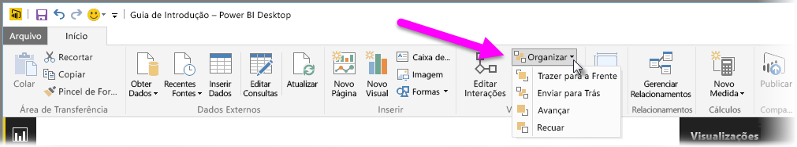
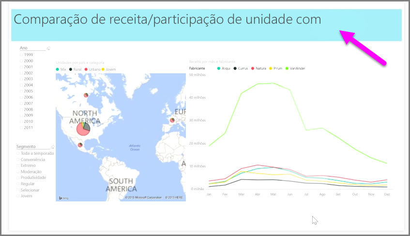

Quando você tem muitos elementos em um relatório, o Power BI permite gerenciar o modo como eles se sobrepõem uns aos outros. O modo como os itens são dispostos em camadas ou organizados em uma hierarquia é geralmente conhecido como a ordem Z.

Para gerenciar a ordem Z de elementos em um relatório, selecione um elemento e use o botão **Organizar** na guia **Página Inicial** da faixa de opções para alterar sua ordem Z.

Ao usar as opções no menu do botão **Organizar**, é possível obter a ordenação dos elementos no relatório exatamente como você deseja. Você pode mover um visual para uma camada para frente ou para trás ou enviá-la para a frente do final da ordem.

Usar o botão Organizar é particularmente útil ao usar formas como telas de fundo decorativas ou bordas ou para realçar determinadas seções de um gráfico individual. Você também pode usá-las para criar uma tela de fundo, como o retângulo azul-claro mostrado a seguir que está sendo usado para uma tela de fundo do título do relatório.

