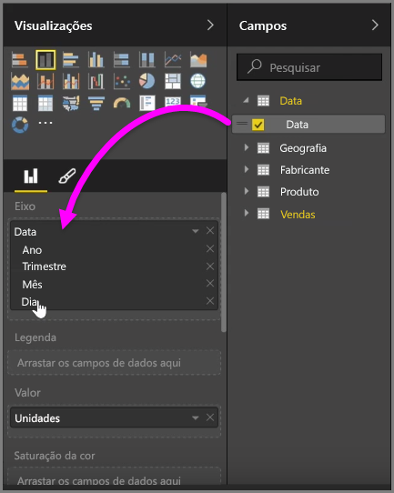
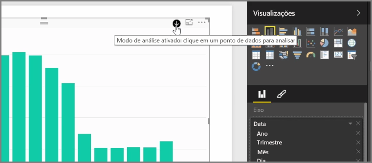
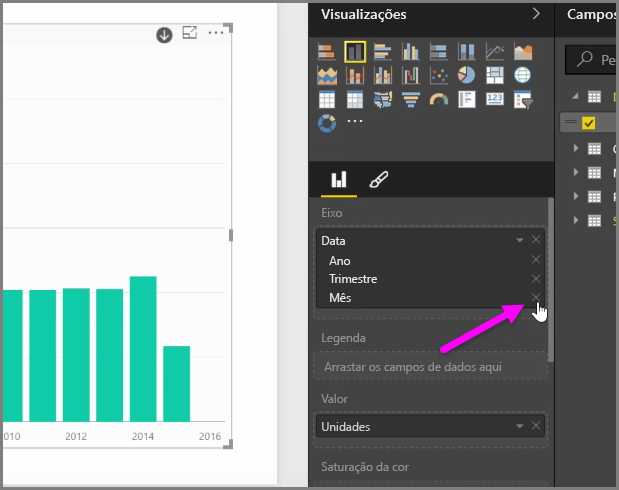
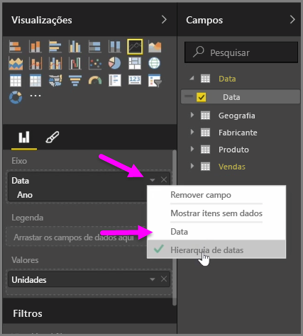
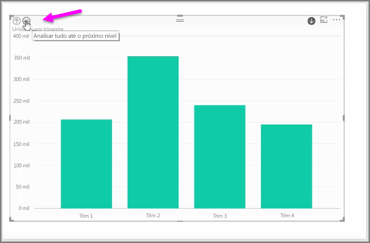

Quando você adiciona um campo de *data* a um visual no bucket do campo *Eixo*, o Power BI adiciona automaticamente uma hierarquia de tempo que inclui *Ano*, *Trimestre*, *Mês* e *Dia*. Ao fazer isso, o Power BI permite que os visuais tenham uma interação baseada em tempo com as pessoas que exibem os relatórios, permitindo que os usuários façam drill down nesses diferentes níveis de tempo.

Com uma hierarquia em vigor, você pode começar a fazer drill down na hierarquia de tempo. Por exemplo, clicar em um ano no gráfico fará drill down no próximo nível da hierarquia, neste caso, *Trimestres*, que é exibido no visual.

Nessa hierarquia criada automaticamente, também é possível gerenciar até qual nível o relatório compartilhado permite às pessoas fazer drill down. Para fazer isso, no painel Visualizações, basta clicar no X ao lado da hierarquia que você deseja remover. O nível excluído é removido do relatório e o drill down não exibe mais esse nível.

Se você precisar obter de volta esse nível da hierarquia, basta remover o campo de *data* e adicioná-lo novamente no painel **Campos**, e a hierarquia será novamente criada para você automaticamente.

Pode haver ocasiões em que você não deseja que a hierarquia seja usada para um visual. Você pode controlar isso selecionando o botão de seta para baixo ao lado do campo *Data* (depois de adicioná-lo a um visual) e selecionar **Data** em vez de **Hierarquia de Datas**. Isso solicita que o Power BI mostre os valores brutos de data no visual.

Você também pode expandir todos os elementos de dados atualmente visíveis ao mesmo tempo, em vez de selecionar um único trimestre ou ano. Para fazer isso, selecione o ícone *Fazer drill down em todos* no canto superior esquerdo do visual, que é um ícone de seta dupla para baixo.

