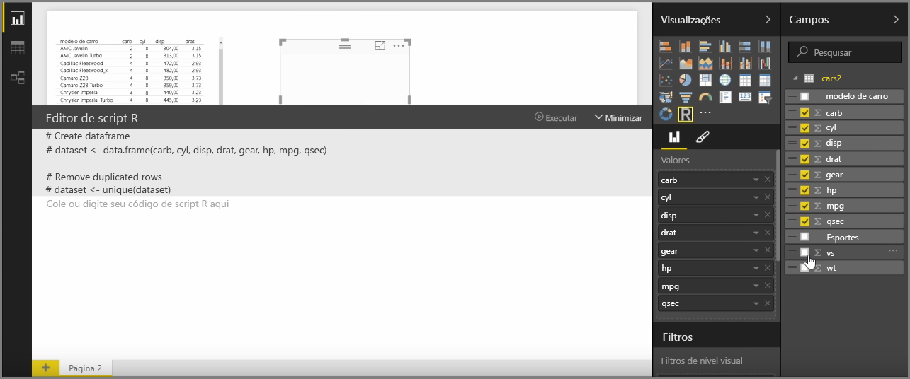
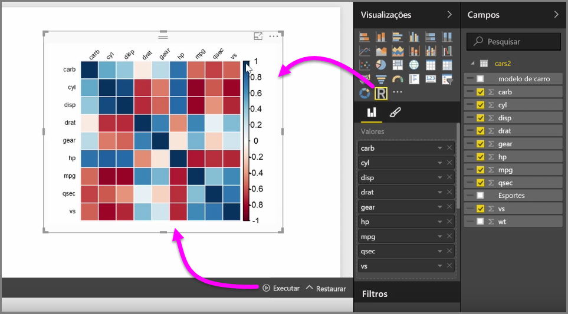
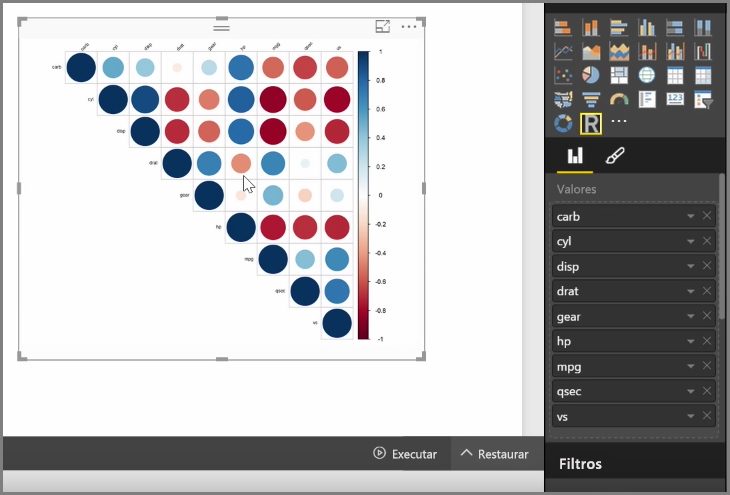
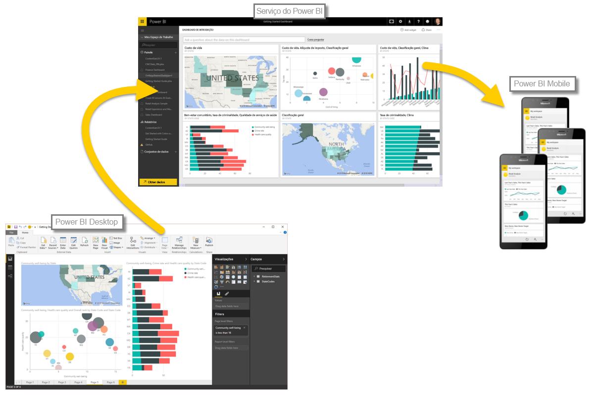

Com o Power BI Desktop, é possível executar uma análise estatística e analítica e criar visuais interessantes integrando o R. Você pode hospedar as visualizações do R no relatório do Power BI Desktop.

Quando você seleciona o ícone de **visual do R** no painel **Visualizações**, o Power BI cria um espaço reservado na tela para hospedar o visual do R e, em seguida, apresenta um editor de scripts R para uso diretamente na tela. Conforme você adiciona campos ao visual do R, o Power BI Desktop os adiciona ao painel do editor de scripts R.

Abaixo do que o Power BI gera no editor de scripts R, você pode começar a criar seu script R para gerar o visual. Quando o script for concluído, selecione **Executar** e ocorrerá o seguinte:

1. Os dados adicionados ao visual (no painel **Campos**) são enviados do Power BI Desktop à instalação local do R
2. O script criado no editor de scripts R no Power BI Desktop é executado na instalação local do R
3. Em seguida, o Power BI Desktop obtém de volta um visual da instalação do R e o exibe na tela

Tudo acontece muito rapidamente e o resultado aparece na visualização **visual do R**, na tela.

Você pode alterar o visual do R ajustando o script R e selecionando **Executar** novamente. Na imagem a seguir, alteramos o visual para exibir círculos em vez de quadrados.

E como o visual do R é exatamente como qualquer outro visual no Power BI Desktop, você pode interagir com ele e fazer conexões com outros visuais na tela também. Quando você interage com outros visuais na tela, por meio de filtragem ou realce, o visual do R reage automaticamente assim como qualquer outro visual do Power BI, sem que haja a necessidade de ajustar o script R.

É uma ótima maneira de usar a potência do R, diretamente no Power BI Desktop.

## Próximas etapas
**Parabéns!** Você concluiu esta seção **Visualizações** do curso **Aprendizagem interativa** sobre o Power BI. Considere-se bem familiarizado com as várias visualizações oferecidas no Power BI e também perito em usar, modificar e personalizá-las. E a boa notícia: as visualizações são basicamente as mesmas no Power BI Desktop e no serviço do Power BI e, portanto, o que você aprendeu se aplica a ambos.

Agora você está pronto para ir para a nuvem e se aprofundar no serviço do Power BI, no qual você pode **Explorar Dados**. Como você sabe, o fluxo de trabalho tem a seguinte aparência:

* Inserir dados no **Power BI Desktop** e criar um relatório.
* Publicar no serviço do Power BI, em que você cria novas **visualizações** e dashboards
* **Compartilhar** seus dashboards com outras pessoas, especialmente as que estiverem viajando
* Exibir e interagir com relatórios e dashboards compartilhados nos aplicativos **Power BI para Celulares**

Quer você crie relatórios ou apenas exiba e interaja com eles, agora você sabe como todos esses visuais interessantes são criados e como eles são conectados aos dados. A seguir, vamos ver esses visuais e relatórios em ação.

Vejo vocês na próxima seção!

