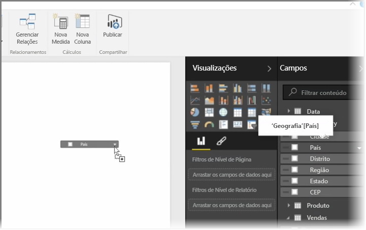
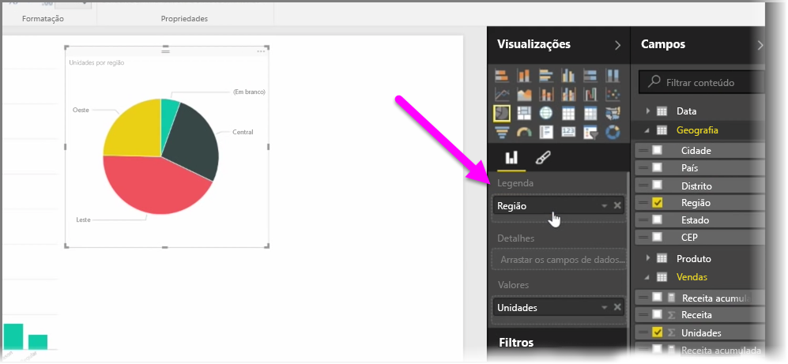
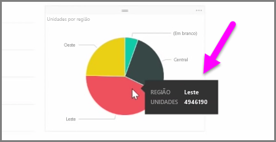
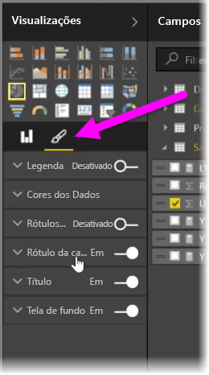

Neste artigo, você aprenderá a criar novos gráficos de barras, gráficos de pizza e mapas de árvore, bem como personalizá-los de acordo com seus relatórios.

Há duas maneiras diferentes de criar uma nova visualização no Power BI Desktop:

* Você pode arrastar os nomes de campo do painel **Campos** e soltá-los na tela do relatório. Por padrão, a visualização é exibida como uma tabela de dados.
  
  
* Também é possível clicar no tipo de visualização que você deseja criar no painel **Visualizações**. Com esse método, o visual padrão é um espaço reservado em branco que se parece com o tipo de visual selecionado.
  
  

Depois de criar o gráfico ou mapa, você pode começar a arrastar os campos de dados para a parte inferior do painel **Visualização** para criar e organizar seu visual. Os campos disponíveis serão alterados de acordo com o tipo de visualização selecionado. À medida que você arrasta e solta os campos de dados, a visualização será atualizada automaticamente para refletir as alterações.

É possível redimensionar a visualização selecionando-a e arrastando as alças para dentro ou para fora. Você também pode mover a visualização para qualquer lugar na tela clicando e arrastando-a. Se desejar converter entre diferentes tipos de visualizações, selecione o visual que deseja alterar e selecione apenas um visual diferente nos ícones, no painel **Visualização**. O Power BI tenta converter os campos selecionados para o novo tipo de visual da forma mais aproximada possível.

À medida que você focalizar partes das visualizações, você obterá uma dica de ferramenta que contém detalhes sobre esse segmento, como rótulos e o valor total.

Selecione o ícone de **pincel** no painel **Visualizações** para fazer alterações superficiais ao visual, como alinhamento da tela de fundo, texto do título e cores de dados.

As opções disponíveis para as alterações superficiais ao visual variam de acordo com o tipo de visual selecionado.

