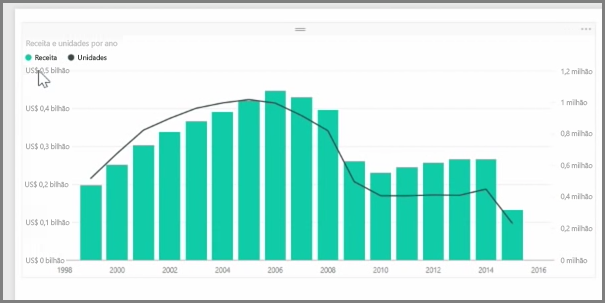
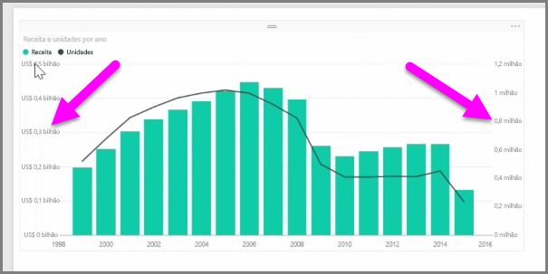
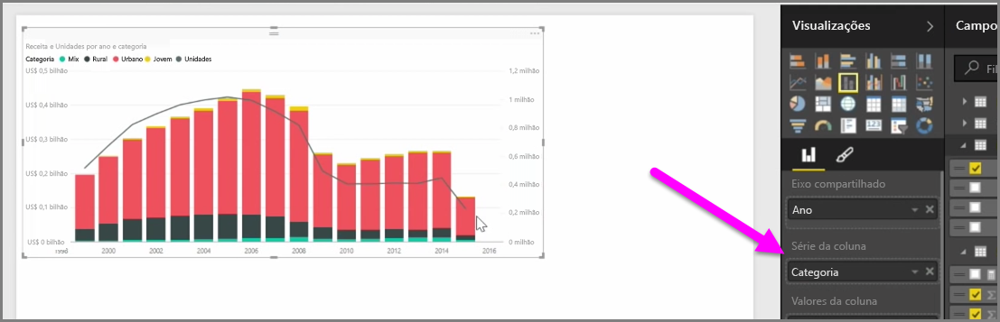

Quando você deseja visualizar duas medidas que têm escalas muito diferentes, como receita e unidades, um **gráfico de combinação** que mostra uma linha e uma barra com escalas de eixo diferentes é muito útil. O Power BI dá suporte a vários tipos diferentes de gráficos de combinação por padrão, incluindo os populares gráficos de **Linhas** e de **Colunas Empilhadas**.

Ao criar um gráfico de combinação, você verá um campo para **Eixo Compartilhado** (o eixo x) e, em seguida, valores para os dois campos, neste caso, uma coluna e uma linha. As duas legendas do eixo y aparecem em um dos lados da visualização.

Você também pode dividir cada coluna por categoria, arrastando uma categoria para o campo Série da Colunas no painel Visualizações. Ao fazer isso, cada barra é colorida proporcionalmente com base nos valores em cada categoria.

Os gráficos de combinação são uma maneira eficaz de visualizar várias medidas que têm escalas muito diferentes em uma única visualização.

