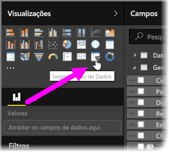
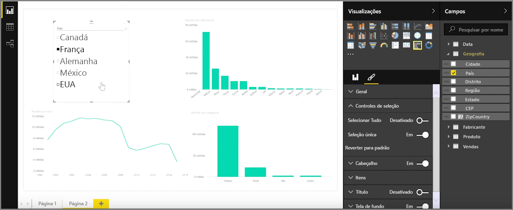
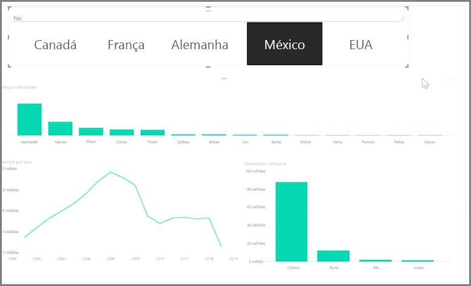

As segmentações são um dos tipos mais eficientes de visualizações, principalmente, como parte de um relatório de ocupação. Uma **segmentação** é um filtro de elemento visual na tela no **Power BI Desktop** que permite a qualquer pessoa que observa o relatório segmentar os dados por determinado valor, como por ano ou por localização geográfica.

Para adicionar uma segmentação ao relatório, selecione **Segmentação** no painel **Visualizações**.

Arraste o campo pelo qual você deseja segmentar e solte-o na parte superior do espaço reservado para segmentação. A visualização se transforma em uma lista de elementos com caixas de seleção. Esses elementos são os filtros – selecione a caixa ao lado de um para segmentar e todas as outras visualizações na mesma página do relatório são filtradas, ou *segmentadas*, por sua seleção.

Há algumas opções diferentes disponíveis para formatar a segmentação. Você pode defini-la para aceitar várias entradas de uma vez ou ativar/desativar o modo **Seleção Único** para usar uma de cada vez. Também é possível adicionar uma opção **Selecionar Tudo** para os elementos da segmentação, o que é útil quando você tem uma lista particularmente longa. Altere a orientação da segmentação do padrão vertical para horizontal e ela se tornará uma barra de seleção em vez de uma lista de verificação.

