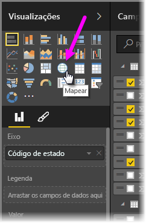
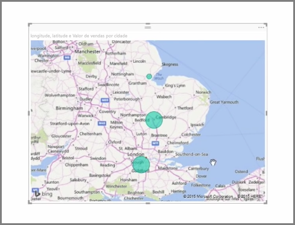
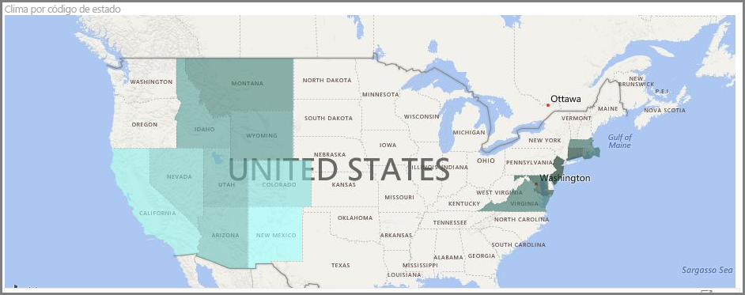
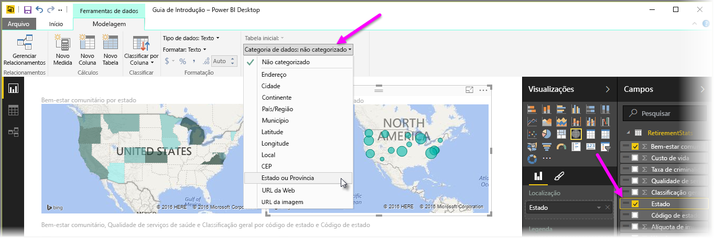

O Power BI tem dois tipos diferentes de visualizações de mapa: um mapa de bolhas que coloca uma bolha sobre um ponto geográfico e um mapa de formas que, na verdade, mostra o contorno da área que você deseja visualizar.

> [!NOTE]
> Ao trabalhar com países ou regiões, use a abreviação de três letras para garantir que o geocódigo funcione corretamente nas visualizações de mapa. *Não* use abreviações de duas letras, pois alguns países ou algumas regiões podem não ser reconhecidos corretamente.
> Caso você tenha apenas abreviações de duas letras, confira [esta postagem externa no blog](https://blog.ailon.org/how-to-display-2-letter-country-data-on-a-power-bi-map-85fc738497d6#.yudauacxp) para obter as etapas que explicam como associar abreviações de país/região de duas letras a abreviações de país/região de três letras.
> 
> 

## Criar mapas de bolhas
Para criar um mapa de bolhas, selecione a opção **Mapa** no painel **Visualização**. É necessário adicionar um valor ao bucket *Local* nas opções **Visualizações** para usar um visual de mapa.

O Power BI é flexível em relação a qual tipo de valor local ele aceita, desde detalhes mais gerais como nome da cidade ou código do aeroporto até dados de latitude e longitude bem específicos. Adicione um campo ao bucket **Tamanho** para alterar o tamanho da bolha de forma adequada a cada local do mapa.

## Criar mapas de formas
Para criar um mapa de formas, selecione a opção **Mapa Coroplético** no painel Visualização. Assim como ocorre com os mapas de bolhas, é necessário adicionar algum tipo de valor ao bucket Local para usar este visual. Adicione um campo ao bucket Tamanho para alterar a intensidade da cor de preenchimento de forma adequada.

Um ícone de aviso no canto superior esquerdo do visual indica que o mapa precisa de mais dados de local, a fim de plotar os valores com precisão. Este é um problema particularmente comum quando os dados no campo de local são ambíguos, como o uso de um nome de área como *Washington*, que poderia indicar um estado ou distrito. Uma maneira de resolver esse problema é renomear a coluna para que ela seja mais específica, como *Estado*. Outra maneira de resolver isso é redefinir manualmente a categoria de dados selecionando **Categoria de Dados** na guia Modelagem. Nela, você pode atribuir uma categoria aos dados como “Estado” ou “Cidade”.

