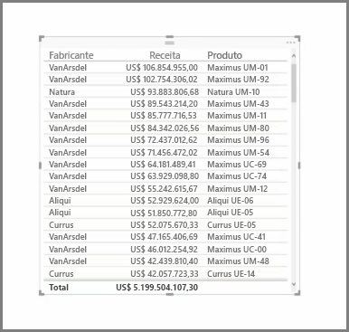
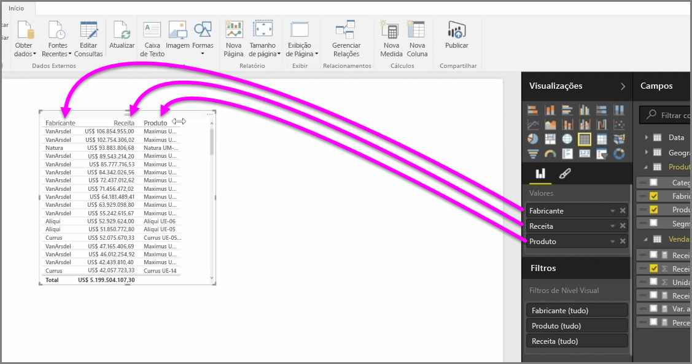
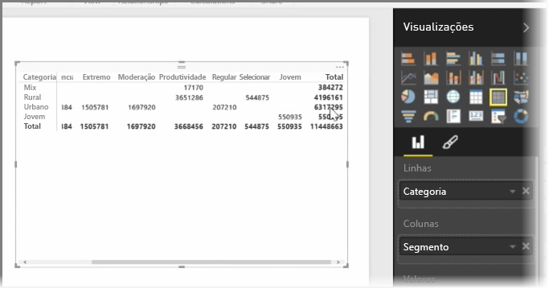

Além de uma infinidade de gráficos, o Power BI Desktop também dá suporte a visualizações mais relacionadas a tabelas. Na verdade, quando você capta um campo categórico ou um campo de texto e o arrasta para a tela do relatório, você obtém uma tabela de resultados por padrão. É possível rolar para cima e para baixo na tabela e, inicialmente, ele será classificado em ordem alfabética.

Caso você tenha informações numéricas em uma tabela, como a receita, uma soma total será exibida na parte inferior. Você pode classificar manualmente por cada coluna clicando em seu cabeçalho para ativar/desativar a ordem crescente ou decrescente. Se uma coluna não for grande o suficiente para exibir todo o conteúdo, clique e arraste o cabeçalho para as laterais para expandi-lo.

A ordem dos campos no bucket *Valores* no painel **Visualizações** determina a ordem em que eles aparecem na tabela.

Uma **matriz** é semelhante a uma tabela, mas contém cabeçalhos de categoria diferentes nas colunas e linhas. Assim como ocorre com tabelas, as informações numéricas serão somadas automaticamente ao longo da parte inferior e do lado direito da matriz.

Há muitas opções superficiais para matrizes, tais como colunas de dimensionamento automático, alternância de totais de linha e coluna, definição de cores e muito mais. Ao criar uma matriz, verifique se seus dados categóricos (dados não numéricos) estão à esquerda da matriz e se os arquivos numéricos estão à direita para garantir que a barra de rolagem horizontal seja exibida e para verificar se esse comportamento de rolagem funciona corretamente.

