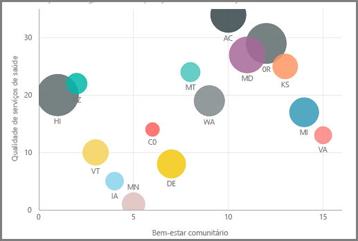
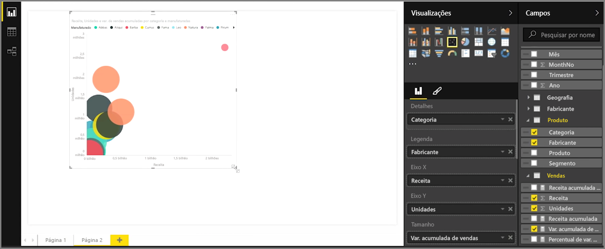
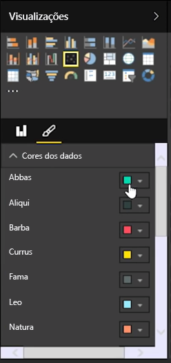
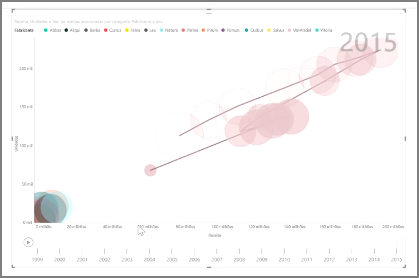

Se você deseja comparar duas medidas diferentes, como vendas da unidade versus receita, uma visualização comum a ser usada é um gráfico de dispersão.

Para criar um gráfico em branco, selecione **Gráfico de dispersão** no painel **Visualizações**. Arraste e solte os dois campos que você deseja comparar no painel **Campos** para os buckets de opções *Eixo X* e *Eixo Y*. Neste ponto, provavelmente, o gráfico de dispersão tem apenas uma pequena bolha no centro do visual – você precisa adicionar uma medida ao bucket *Detalhes* para indicar como deseja segmentar os dados. Por exemplo, se estiver comparando vendas de item e a receita, talvez você queira dividir os dados por categoria, fabricante ou mês de venda.

A inclusão de um campo adicional ao bucket *Legenda* insere um código de cores às bolhas de acordo com o valor do campo. Você também pode adicionar um campo ao bucket *Tamanho* para alterar o tamanho da bolha de acordo com esse valor.

Gráficos de dispersão contêm várias opções de formatação de visual, como ativar um contorno para cada bolha colorida e ativar/desativar rótulos individuais. Você pode alterar as cores de dados para outros tipos de gráfico também.

Você pode criar uma animação das alterações do gráfico de bolhas ao longo do tempo adicionando um campo baseado em tempo ao bucket *Eixo de Reprodução*. Clique em uma bolha durante uma animação para ver um rastreamento de seu caminho.

>[!NOTE]
>Lembre-se, caso você veja apenas uma bolha no gráfico de dispersão, é porque o Power BI está agregando dados, que é o comportamento padrão. Adicione uma categoria ao bucket *Detalhes*, no painel **Visualizações**, para obter mais bolhas.
> 
> 

