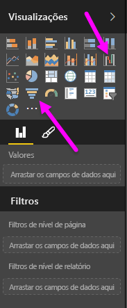
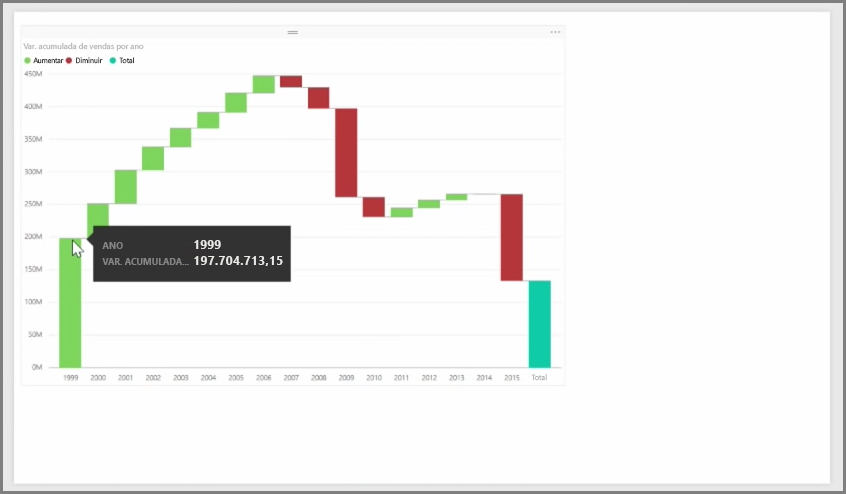
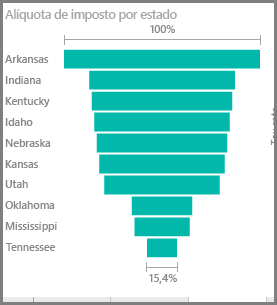

Gráficos de funil e de cascata são duas das mais interessantes (e talvez incomuns) visualizações padrão incluídas no Power BI. Para criar um gráfico em branco de um desses tipos, selecione o ícone no painel **Visualizações**.

Normalmente, os **gráficos de cascata** são usados para mostrar as alterações em determinado valor ao longo do tempo.

As cascatas tem apenas duas opções de bucket: *Categoria* e *Eixo Y*. Arraste um campo baseado em tempo como *ano* para o bucket *Categoria* e o valor que você deseja acompanhar para o bucket *Eixo Y*. Os períodos em que houve um aumento no valor são exibidos em verde por padrão, enquanto os períodos com uma redução no valor são exibidos em vermelho.

Por via de regra, os **gráficos de funil** são usados para mostrar as alterações ao longo de um processo específico, como um pipeline de vendas ou os esforços de retenção de site.

Ambos os gráficos de **Cascata** e de **Funil** podem ser segmentados e personalizados visualmente.

