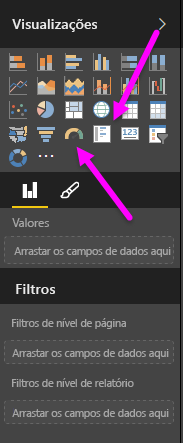
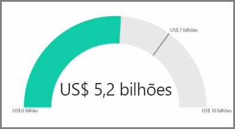
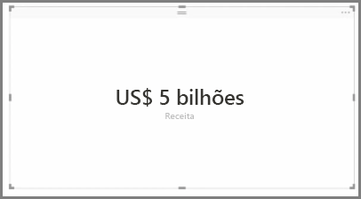
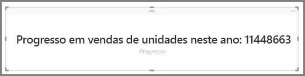

Em geral, as visualizações são usadas para comparar dois ou mais valores diferentes. No entanto, às vezes, ao criar relatórios, talvez você queira acompanhar apenas um único KPI (Indicador Chave de Desempenho) ou uma métrica ao longo do tempo. A maneira de fazer isso no Power BI Desktop é com um **Medidor** ou um visual de cartão de **único número**. Para criar um gráfico em branco de um desses tipos, selecione o ícone no painel **Visualizações**.

Medidores são especialmente úteis quando você estiver criando dashboards e desejar mostrar o progresso em direção a uma meta específica. Para criar um medidor, selecione seu ícone no painel **Visualizações** e arraste o campo que você deseja acompanhar para o bucket *Valor*.

Os medidores aparecem por padrão em 50% ou no dobro do *Valor*, e há duas maneiras de ajustar essa definição. Para definir os valores dinamicamente, arraste os campos para os buckets Valor *Mínimo*, *Máximo* e *Meta*. Como alternativa, use as opções de formatação do visual para personalizar manualmente o intervalo do medidor.

As visualizações de cartão apenas mostram uma representação numérica de um campo. Por padrão, os visuais de cartão usam unidades de exibição para manter o número curto, por exemplo, exibindo “R$5bi” em vez de “R$5.000.000.000”. Use as opções de formatação do visual para alterar a unidade usada ou desabilitá-la por completo.

Uma aplicação interessante de cartões é que eles exibem uma medida personalizada que você concatenou com o texto. Para usar o exemplo anterior, com uma medida personalizada, seu cartão poderia incluir funções DAX avançadas e exibir algo do tipo: “Receita total deste ano: R$5bi” ou “Progresso das vendas de unidade deste ano:” e, em seguida, adicionar o número que representa o progresso.

