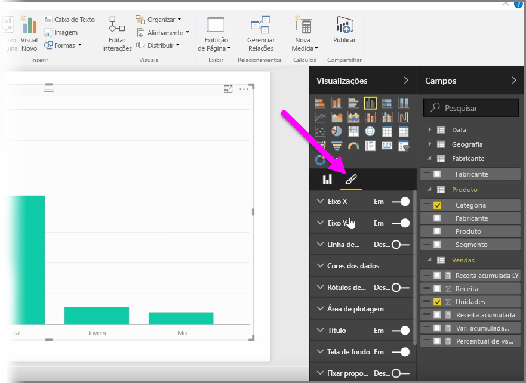
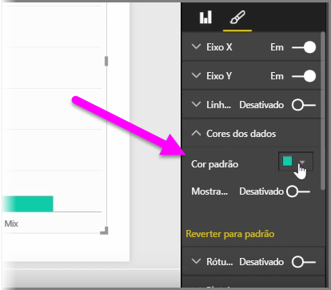
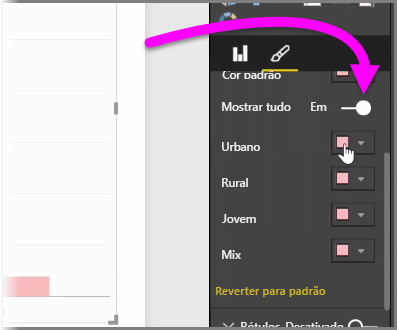
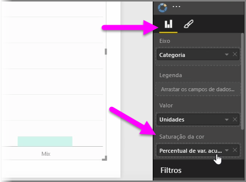
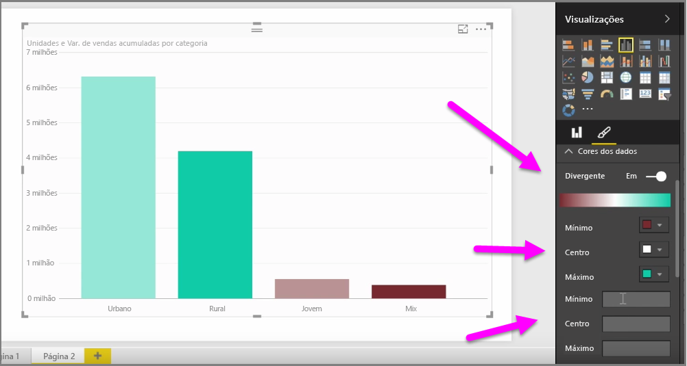
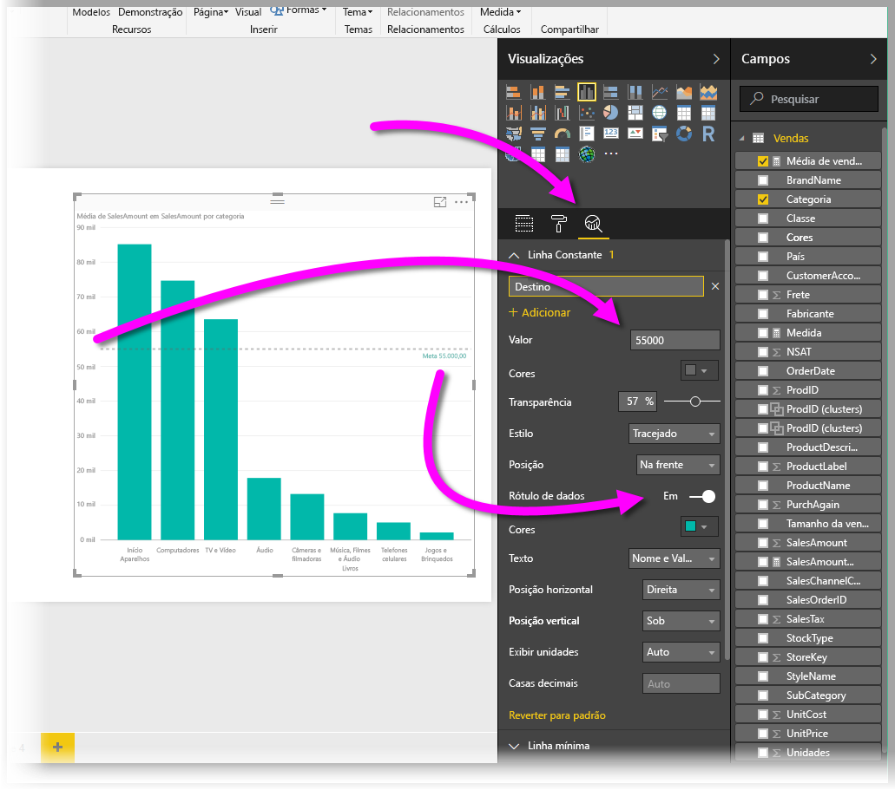
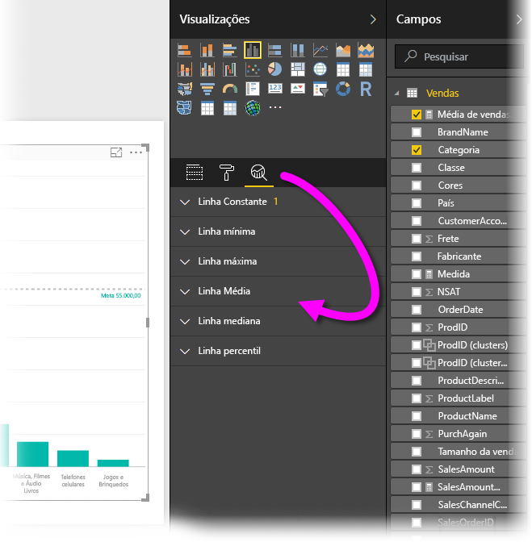

Existem várias ocasiões em que talvez você queira modificar as cores usadas em gráficos ou visuais. O Power BI lhe dá muito controle sobre como as cores são exibidas. Para começar, selecione um visual e, no painel **Visualizações**, clique no ícone de **pincel**.

Há várias opções para alteração das cores ou formatação do visual. Você pode alterar a cor de todas as barras de um visual selecionando o seletor de cor ao lado de **Cor padrão** e, em seguida, selecionando a cor escolhida.

Também é possível alterar a cor de cada barra (ou de outro elemento, dependendo do tipo de visual selecionado) ativando o controle deslizante **Mostrar tudo**. Quando você faz isso, um seletor de cor é exibido para cada elemento.

Você também pode alterar a cor com base em um valor ou uma medida. Para fazer isso, arraste um campo para o bucket **Saturação de cores** no painel Visualizações (observe que isso está disponível na seção **seção de campo**, não na seção **pincel**).

Além disso, é possível alterar a escala e as cores usadas durante o preenchimento das cores de elementos de dados. Você também pode selecionar uma escala divergente ativando o controle deslizante Divergente, que permite a escala de cores entre três cores. Além disso, também é possível definir os valores *Mínimo*, *Centro* e *Máximo* exibidos no gráfico.

Você também pode usar esses valores para criar regras, por exemplo, para definir valores acima de zero para determinada cor e valores abaixo para outra cor.

Outra ferramenta útil para o uso de cores é configurar uma *linha constante*, às vezes, também chamada de *linha de referência*. Defina o valor da linha constante, defina sua cor e até mesmo faça com que a linha de referência contenha um rótulo. Para criar uma linha constante (e outras linhas interessantes), selecione o **painel Análise** (parecido com uma lupa) e, depois, expanda a seção **Linha de Referência**.

Há várias outras linhas que você pode criar para um visual, também encontradas no **painel Análise**, como linhas Mínima, Máxima, Média, Mediana e Percentil.

Por fim, é possível criar uma borda em torno de uma visualização individual, e assim como ocorre com outros controles, você pode especificar a cor da borda também.

