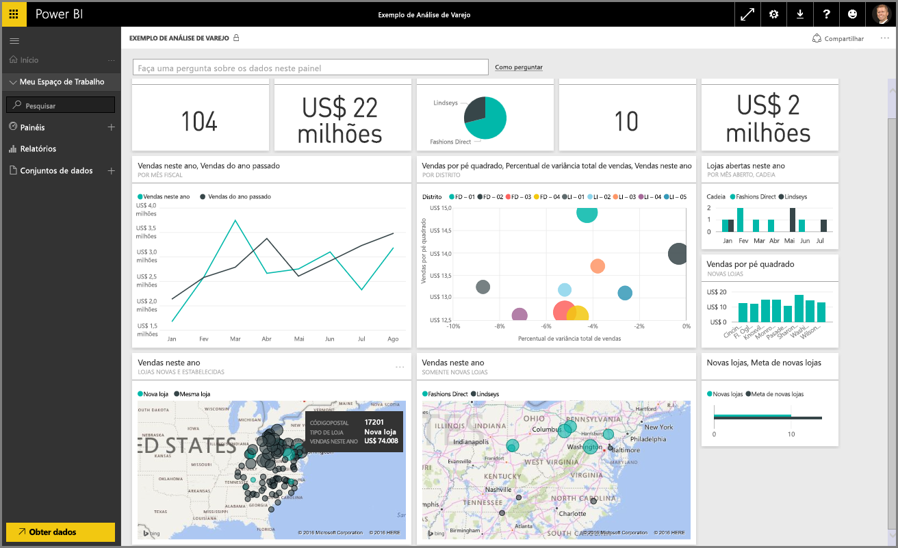

Bem-vindo à seção **Explorando dados** do curso **Aprendizagem interativa** sobre o Power BI. Agora que você conhece o Power BI Desktop e como obter e visualizar dados, você está pronto para explorar dados no serviço do Power BI.

Há inúmeras coisas para aprender nesta seção, e a interatividade e o compartilhamento interessantes do Power BI realmente são os destaques aqui. Por isso, prepare-se para uma seção interessante e envolvente.

## Introdução ao serviço do Power BI
*Veja o que o serviço do Power BI pode fazer por sua organização*

O serviço do Power BI é uma extensão natural do **Power BI Desktop**, e seus recursos incluem o upload de relatórios, a criação de dashboards e fazer perguntas sobre os dados usando a linguagem natural. Você pode usar o serviço para definir horários de atualização de dados, compartilhar dados com sua organização e criar pacotes de serviço personalizados.

Nos tópicos adiante, vamos explorar o serviço do Power BI e mostrar como ele pode transformar seus dados de business intelligence em análises de dados e em um ambiente colaborativo que orienta as decisões.

