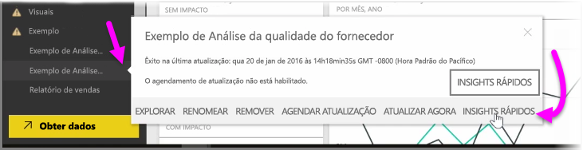
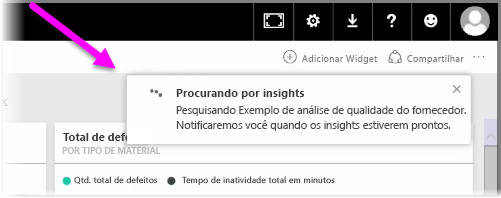
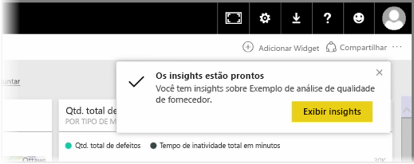
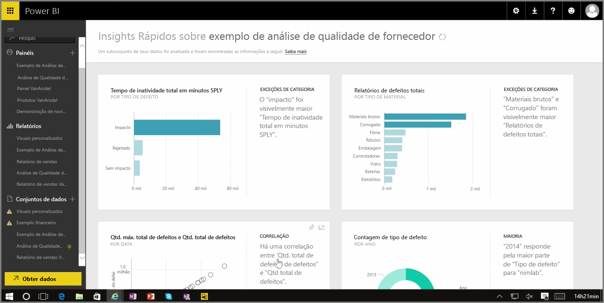

Quando você está trabalhando com um dashboard, relatório ou conjunto de dados no serviço do Power BI, é possível fazer com que o Power BI procure informações rápidas nos dados. No Power BI, na seção **Conjuntos de dados** no painel esquerdo, selecione as *reticências* (três pontos) ao lado do conjunto de dados de seu interesse. É exibido um menu de opções e, à extrema direita, você verá uma opção chamada **Quick Insights**.

Ao selecionar Quick Insights, o Power BI executa o aprendizado de máquina e pesquisa os dados, analisando-os para encontrar informações rápidas. Você verá uma notificação no canto superior direito do serviço indicando que o Power BI está trabalhando para encontrar informações.

Após cerca de 15 segundos, a notificação mudará para informá-lo que o Power BI encontrou algumas informações.

Ao selecionar o botão **Exibir informações** em uma notificação, você verá uma página de visuais que mostram as informações encontradas pelo Power BI, semelhante ao que você verá na imagem a seguir. Há várias informações, pelas quais você pode rolar na página para exibi-las e considerá-las.

Assim como ocorre com qualquer outro visual, é possível interagir com os visuais na página Quick Insights. Além disso, é possível fixar qualquer um deles em um dashboard que você poderia ter ou filtrar ainda mais um ou mais deles (ou quantos desejar) para pesquisar informações adicionais que podem estar aguardando sua curiosidade para serem descobertas.

Com o **Quick Insights**, você pode permitir que o Power BI faça o trabalho de identificar exceções e tendências em seus dados e usar estas descobertas nos dashboards, ou refinar ainda mais e filtrá-los para obter as informações mais importantes para você.

